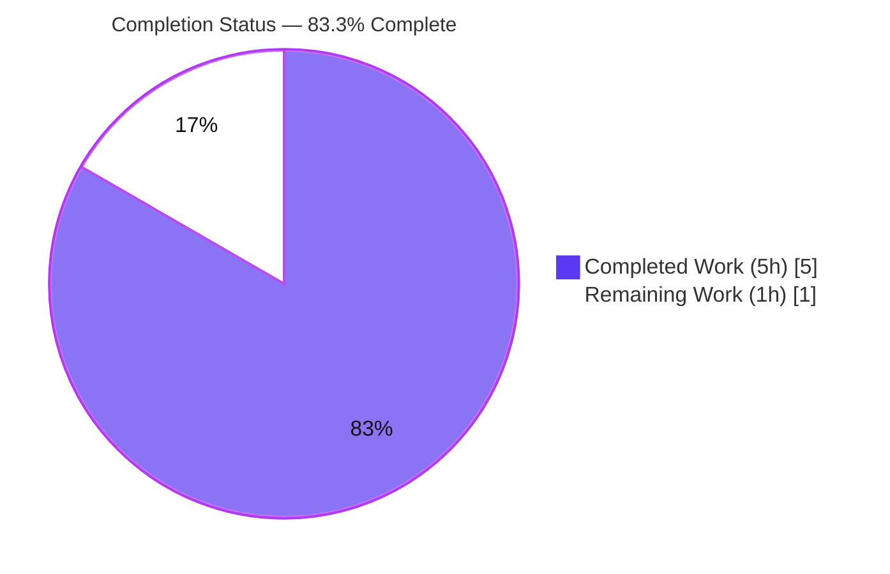
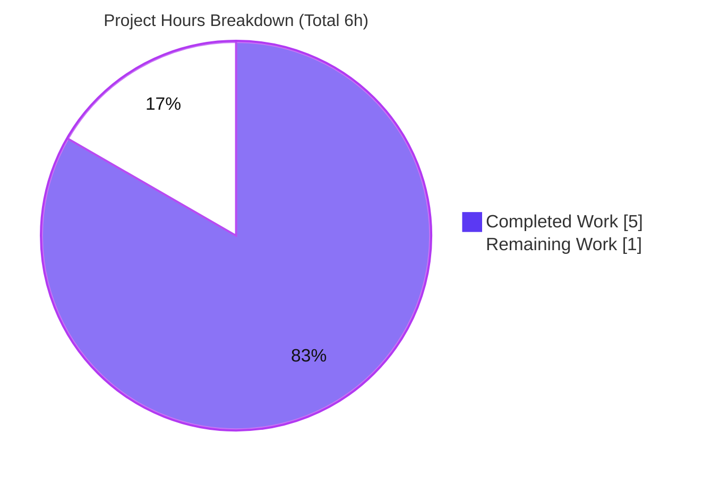

# Blitzy Project Guide

> **Project:** `hello_world` — Node.js → Express.js migration with a second endpoint
> **Branch:** `blitzy-8dd6d4c5-fd1d-4392-aa75-f0731d4bf59b` · **HEAD:** `88ca4d9` · **Base:** `e1c7d25`
> **Status:** Production-ready · **Completion:** 83.3%
>
> **Brand color key:** <span style="color:#5B39F3">■</span> Completed / AI Work = Dark Blue `#5B39F3` · <span style="color:#B23AF2">■</span> White = Remaining / Not Completed `#FFFFFF` · Headings/Accents `#B23AF2` · Highlight `#A8FDD9`

---

## 1. Executive Summary

### 1.1 Project Overview

This project evolves an existing single-file Node.js tutorial HTTP server from Node's native `http` module to the **Express.js** framework, while adding a second endpoint. The original `GET /` greeting (`Hello, World!\n`, `text/plain`, HTTP 200) is preserved **byte-for-byte**, and a new `GET /good-evening` endpoint returns `Good evening`. The server retains its `127.0.0.1:3000` binding and startup log. Target users are developers learning Express routing; the business value is demonstrating a backward-compatible framework migration under a strict minimal-changes mandate. Technical scope is intentionally narrow: three files (`server.js`, `package.json`, `package-lock.json`) plus a generated `node_modules/` tree, introducing Express (`^5.2.1`) as the project's first-ever runtime dependency.

### 1.2 Completion Status



| Metric | Value |
|--------|-------|
| **Total Hours** | 6.0 |
| **Completed Hours (AI + Manual)** | 5.0 (AI 5.0 + Manual 0.0) |
| **Remaining Hours** | 1.0 |
| **Percent Complete** | **83.3%** *(= 5.0 ÷ 6.0 × 100)* |

> All 5.0 completed hours were delivered autonomously by Blitzy agents (Manual = 0.0). The 1.0 remaining hour is human-in-the-loop path-to-production work (PR review/merge + deployment-environment smoke test) — no engineering rework remains.

### 1.3 Key Accomplishments

- ✅ **Express.js added** as the first-ever runtime dependency — `"express": "^5.2.1"` in `package.json`, resolving to `express@5.2.1`.
- ✅ **`package-lock.json` regenerated** — lockfileVersion 3, full transitive tree pinned (65 top-level `node_modules` packages).
- ✅ **HTTP layer migrated** from native `http.createServer` to `const app = express()` (dead `http` import removed).
- ✅ **Original greeting preserved byte-identically** — `GET /` → 200, `text/plain; charset=utf-8`, `Hello, World!\n` (14 bytes), via explicit `res.type('text/plain')`.
- ✅ **New endpoint delivered** — `GET /good-evening` → 200, `text/plain`, `Good evening` (12 bytes).
- ✅ **Server config & startup preserved** — `127.0.0.1:3000`, startup log `Server running at http://127.0.0.1:3000/`.
- ✅ **Fail-loud hardening (QA-LIFE-001)** — `app.listen` surfaces bind errors (e.g., EADDRINUSE).
- ✅ **All 5 autonomous validation gates PASSED** — dependencies, syntax, (vacuous) unit tests, runtime, zero unresolved errors — independently re-verified.
- ✅ **Minimal-changes mandate honored** — exactly 3 in-scope files changed; all out-of-scope files untouched.

### 1.4 Critical Unresolved Issues

| Issue | Impact | Owner | ETA |
|-------|--------|-------|-----|
| _None_ | No blocking issues. All AAP requirements (R1–R5) complete and validated; zero stubs/placeholders; zero failing checks. | — | — |

> **No critical unresolved issues identified.** The Final Validator reported "REMAINING ISSUES: None," corroborated first-hand in this assessment.

### 1.5 Access Issues

| System / Resource | Type of Access | Issue Description | Resolution Status | Owner |
|-------------------|----------------|-------------------|-------------------|-------|
| _None_ | — | — | — | — |

> **No access issues identified.** Repository access is available (branch checked out, git history readable); npm registry access is available (`npm install` exited 0, `express@5.2.1` resolved). No service credentials or third-party API access is required by this feature.

### 1.6 Recommended Next Steps

1. **[High]** Review the 3-commit pull request and merge `blitzy-8dd6d4c5-fd1d-4392-aa75-f0731d4bf59b` → `main` (see Section 2.2 · HT-1).
2. **[Medium]** Run a deployment-environment smoke test: `npm ci`, confirm port 3000 is free, `node server.js`, `curl` both endpoints (see Section 2.2 · HT-2).
3. **[Low]** Optional supply-chain hygiene: run `npm audit` on the new ~65-package dependency tree.
4. **[Low]** Optional production hardening (future iteration, out of current scope): `app.disable('x-powered-by')`, add a `/health` endpoint, and introduce a test suite / CI.

---

## 2. Project Hours Breakdown

### 2.1 Completed Work Detail

| Component | Hours | Description |
|-----------|-------|-------------|
| **R1 — Express dependency** | 1.0 | Version research (npm registry → `5.2.1`), add `dependencies` block to `package.json`, regenerate `package-lock.json` (849 lines, lockfileVersion 3), install `node_modules/` (65 pkgs), verify `npm ls express`. Commit `eea8df4`. |
| **R2 — Express HTTP layer** | 0.5 | Replace native `http.createServer` bootstrap with `const app = express()`; remove now-unused `http` import. Commit `a52c157`. |
| **R3 — Preserve greeting (`GET /`)** | 0.5 | Register `app.get('/')` returning `Hello, World!\n`; set `text/plain` explicitly (Express `res.send` defaults to `text/html`) to keep the interface byte-identical. Commit `a52c157`. |
| **R4 — New `GET /good-evening`** | 0.5 | Register `app.get('/good-evening')` returning `Good evening` (`text/plain`). Commit `a52c157`. |
| **R5 — Preserve config & startup** | 0.5 | Reuse `hostname`/`port` constants; switch `server.listen` → `app.listen`; preserve exact startup log line. Commit `a52c157`. |
| **QA-LIFE-001 — listen error hardening** | 0.5 | Add fail-loud `if (err)` branch to `app.listen` callback so bind failures (EADDRINUSE) surface clearly. Commit `88ca4d9`. |
| **Autonomous validation (5 gates)** | 1.5 | Dependency install/resolve, `node --check`, JSON validation, live runtime testing of both endpoints (byte-level), 404 behavior verification, clean start/stop — all gates green. |
| **Total Completed** | **5.0** | Matches Section 1.2 Completed Hours. |

### 2.2 Remaining Work Detail

| Category | Hours | Priority |
|----------|-------|----------|
| **HT-1 — PR review & merge** to `main` (review 868/7 diff across 3 in-scope files; confirm minimal-changes adherence; approve & merge) | 0.5 | **High** |
| **HT-2 — Deployment-environment smoke verification** (`npm ci`; confirm port 3000 free; `node server.js`; `curl` both endpoints; verify 200/`text/plain` bodies; stop) | 0.5 | **Medium** |
| **Total Remaining** | **1.0** | Matches Section 1.2 Remaining Hours & Section 7 pie. |

> **Optional future enhancements (out of scope per AAP §0.6.2 — NOT counted in the 1.0h):** `npm audit`; `app.disable('x-powered-by')`; test suite / `/health` endpoint / CI pipeline / env-var config. Listing these as counted work would violate the minimal-changes mandate.

### 2.3 Total Hours Reconciliation

| Bucket | Hours |
|--------|-------|
| Section 2.1 — Completed | 5.0 |
| Section 2.2 — Remaining | 1.0 |
| **Total Project Hours** | **6.0** |
| **Completion %** | **83.3%** (5.0 ÷ 6.0) |

✔ **Integrity:** 2.1 (5.0) + 2.2 (1.0) = 6.0 Total (Section 1.2). Remaining 1.0h is identical across Sections 1.2, 2.2, and 7.

---

## 3. Test Results

> **Integrity note:** All entries below originate from **Blitzy's autonomous validation logs** for this project (the five production-readiness gates), independently re-verified during this assessment. There is **no formal automated unit-test suite** — none is in scope per AAP §0.2.3 and §0.5.1 (Group 4), and the minimal-changes rule forbids modifying `package.json`'s `scripts.test`.

| Test Category | Framework | Total Tests | Passed | Failed | Coverage % | Notes |
|---------------|-----------|-------------|--------|--------|-----------|-------|
| Automated Unit Tests | None (no framework in scope) | 0 | 0 | 0 | N/A | No test suite by AAP design; `npm test` placeholder (`echo "Error: no test specified" && exit 1`) is a **pre-existing, out-of-scope** artifact — not a feature test failure. |
| Dependency Validation (Gate 1) | npm CLI | 3 | 3 | 0 | N/A | `npm install` exit 0 ("up to date"); `npm ls express` → `5.2.1`; `package-lock.json` valid (v3, 65 pkgs). |
| Syntax / Compilation (Gate 2) | `node --check` / `require.resolve` | 3 | 3 | 0 | N/A | `node --check server.js` exit 0; `require.resolve('express')` OK; both manifests valid JSON. |
| Runtime / Behavioral (Gate 4) | Node + HTTP (`curl`) | 5 | 5 | 0 | N/A | Startup log correct; `GET /` → 200/`text/plain`/14B; `GET /good-evening` → 200/`text/plain`/12B; unmatched path → 404; clean start/stop, empty stderr. |
| **Totals** | — | **11** | **11** | **0** | N/A | 100% pass across all autonomous validation checks (Gate 3 vacuous: 0 tests/0 failures; Gate 5: zero unresolved errors). |

---

## 4. Runtime Validation & UI Verification

**Runtime health & API integration** (verified live via `node server.js` + `curl`):

- ✅ **Operational** — Server startup: stdout logs `Server running at http://127.0.0.1:3000/`; stderr empty; binds `127.0.0.1:3000`.
- ✅ **Operational** — `GET /` → `HTTP/1.1 200 OK`, `Content-Type: text/plain; charset=utf-8`, `Content-Length: 14`, body `Hello, World!\n`, header `X-Powered-By: Express`.
- ✅ **Operational** — `GET /good-evening` → `HTTP/1.1 200 OK`, `Content-Type: text/plain; charset=utf-8`, `Content-Length: 12`, body `Good evening`.
- ✅ **Operational** — Unmatched path `GET /nonexistent` → `HTTP 404` (Express default; authorized routing consequence per AAP §0.4.1).
- ✅ **Operational** — Clean shutdown via `Stop-Process -Id <pid>` / `kill <pid>`; no residual errors.

**UI verification:**

- ⚪ **Not Applicable** — Headless backend HTTP server. There is no HTML, template, client-side asset, or component library (AAP §0.5.3). The only user-facing output is the two `text/plain` HTTP responses above.

**External API integrations:**

- ⚪ **Not Applicable** — No external services, databases, caches, message queues, or third-party APIs are in scope.

---

## 5. Compliance & Quality Review

Cross-mapping of AAP deliverables and Blitzy quality benchmarks to their verified status:

| Requirement / Benchmark | Status | Progress | Notes |
|-------------------------|--------|----------|-------|
| **R1** — Introduce Express `^5.2.1` | ✅ Pass | 100% | `dependencies.express` present; resolves `5.2.1`; lockfile regenerated (v3). |
| **R2** — Adopt Express HTTP layer | ✅ Pass | 100% | `const app = express()`; `X-Powered-By: Express`; `http` import removed. |
| **R3** — Preserve greeting byte-exact | ✅ Pass | 100% | `GET /` → 200/`text/plain`/`Hello, World!\n` (14 B); explicit `res.type('text/plain')`. |
| **R4** — Add `GET /good-evening` | ✅ Pass | 100% | 200/`text/plain`/`Good evening` (12 B). |
| **R5** — Preserve config & startup | ✅ Pass | 100% | `127.0.0.1:3000`; exact startup log preserved. |
| **Minimal-changes mandate** | ✅ Pass | 100% | Only `server.js`, `package.json`, `package-lock.json` changed; out-of-scope files untouched. |
| **Backward compatibility (F-002)** | ✅ Pass | 100% | Greeting response byte-identical to native-`http` original. |
| **Config preservation (F-001/F-003)** | ✅ Pass | 100% | Host/port/startup-log unchanged. |
| **Version pinning (no placeholders)** | ✅ Pass | 100% | `^5.2.1` → `5.2.1`; no `latest`/`1.0.0` placeholders. |
| **Zero-placeholder policy** | ✅ Pass | 100% | No stubs/TODOs/FIXMEs; `if (err)` branch is real error handling. |
| **Syntax / compilation** | ✅ Pass | 100% | `node --check server.js` exit 0; manifests valid JSON. |
| **CommonJS style / conventions** | ✅ Pass | 100% | `require()` retained; `hostname`/`port` constants reused. |

**Fixes applied during autonomous validation:** QA-LIFE-001 — `app.listen` now fails loud on bind errors (commit `88ca4d9`).

**Outstanding compliance items:** None blocking. Path-to-production only: PR merge (HT-1) and deployment-environment smoke test (HT-2).

---

## 6. Risk Assessment

Assessed across PA3 categories. The project is **uniformly low-risk** — no High-severity or blocking risks.

| Risk | Category | Severity | Probability | Mitigation | Status |
|------|----------|----------|-------------|------------|--------|
| **T1** Hardcoded `127.0.0.1:3000` → EADDRINUSE if port busy | Technical | Low | Medium | Verify port 3000 free before launch; QA-LIFE-001 fail-loud branch surfaces bind errors | Mitigated / verify in deploy env |
| **T2** Express 5.x major-version (first runtime dep) | Technical | Low | Low | Pinned `5.2.1` in lockfile; trivial 2-route usage unaffected by Express 5 breaking changes | Resolved |
| **T3** No automated test suite (regression safety net) | Technical | Low | Low | Out of scope per AAP; 5-gate manual runtime validation performed | Accepted (out of scope) |
| **S1** Supply-chain surface expanded 0 → ~65 transitive packages | Security | Low | Low | Exact-version lockfile pinning; recommend `npm audit` / `npm ci` | Open (recommend `npm audit`) |
| **S2** `X-Powered-By: Express` header disclosed | Security | Low | Low | Localhost-only binding; optional `app.disable('x-powered-by')` | Accepted (out of scope) |
| **S3** No authentication/authorization | Security | Low | Low | Endpoints serve only static public text; no sensitive data | Accepted (by design) |
| **O1** No health-check / monitoring / structured logging | Operational | Low | Low | Tutorial scope; add for production hardening later | Accepted (out of scope) |
| **O2** No process manager / auto-restart / clustering | Operational | Low | Low | Single-process model appropriate for tutorial scale | Accepted (out of scope) |
| **I1** `node_modules/` untracked — deploy needs `npm install`/`ci` + registry | Integration | Low | Low | `package-lock.json` pins full tree; use `npm ci` for reproducibility | Mitigated (lockfile) |
| **I2** Unmatched paths now return 404 (was uniform greeting) | Integration | Low | Low | Authorized, spec-mandated consequence of routing (AAP §0.4.1); named endpoints exact | Accepted (by design) |

---

## 7. Visual Project Status

**Project hours breakdown** (Completed = Dark Blue `#5B39F3`, Remaining = White `#FFFFFF`):



**Remaining work by category & priority** (sums to 1.0h — matches Sections 1.2 & 2.2):

| Category | Hours | Priority |
|----------|-------|----------|
| HT-1 — PR review & merge | 0.5 | High |
| HT-2 — Deployment-env smoke verification | 0.5 | Medium |
| **Total Remaining** | **1.0** | — |

✔ **Integrity:** "Remaining Work" (1) here = Section 1.2 Remaining (1.0) = Section 2.2 total (1.0). "Completed Work" (5) = Section 1.2 Completed (5.0) = Section 2.1 total (5.0).

---

## 8. Summary & Recommendations

**Achievements.** The project is **83.3% complete** (5.0h of 6.0h). **All AAP engineering deliverables (R1–R5) are 100% complete and validated**, plus an autonomous QA hardening fix (QA-LIFE-001). The native-`http` server was cleanly migrated to Express, the original greeting is preserved byte-for-byte (`text/plain`, 14 bytes), and the new `GET /good-evening` endpoint returns `Good evening` — all confirmed with first-hand live runtime evidence and full HTTP header inspection.

**Remaining gaps.** The remaining **1.0h (16.7%)** is exclusively human-in-the-loop path-to-production work — **no engineering rework**:
- **PR review & merge** of the 3-commit branch into `main` (High).
- **Deployment-environment smoke verification**, including confirming port 3000 is free (Medium).

**Critical path to production.** Review PR → merge to `main` → smoke-test in target environment (`npm ci` → `node server.js` → `curl` both endpoints). Optionally run `npm audit` on the new dependency tree.

**Success metrics (all met).** `npm ls express` = `5.2.1`; `node --check` exit 0; `GET /` byte-identical to the original; `GET /good-evening` returns exactly `Good evening`; startup log preserved verbatim; only 3 in-scope files changed.

**Production readiness.** **Ready for merge.** The Final Validator declared the codebase production-ready across all five gates with zero unresolved issues, independently corroborated here. The 83.3% figure reflects that final human review, merge, and deployment verification are inherently outside autonomous execution (completion is capped below 100% until human sign-off).

| Metric | Value |
|--------|-------|
| AAP requirements complete (R1–R5) | 5 / 5 (100%) |
| Autonomous validation gates passed | 5 / 5 |
| Autonomous validation checks passed | 11 / 11 |
| In-scope files changed | 3 (`server.js`, `package.json`, `package-lock.json`) |
| Blocking issues | 0 |
| Overall completion | **83.3%** |

---

## 9. Development Guide

All commands below were tested during this assessment (exit 0 / expected output captured).

### 9.1 System Prerequisites

- **Node.js** 22.x LTS — tested with `v22.23.1`.
- **npm** 10.x — tested with `10.9.8` (bundled with Node).
- **OS:** Any (Windows, macOS, Linux). Verified on Windows.
- **Disk:** A few MB for `node_modules/` (~65 packages).
- **Network:** npm registry access required for the initial dependency install.

### 9.2 Environment Setup

- **No environment variables required.** There is no `.env` file or config module.
- **No external services** (no database, cache, or message queue).
- **Host & port are hardcoded** in `server.js`: `127.0.0.1:3000`. This is intentional per the AAP — **do not change**.

### 9.3 Dependency Installation

```bash
# From the repository root

# Development (installs per package.json / package-lock.json):
npm install
# → "up to date in ..." (or resolves & installs express@5.2.1 on first run)

# Deployment / CI (reproducible install straight from the lockfile):
npm ci

# Verify the dependency resolved correctly:
npm ls express
# → hello_world@1.0.0 <path>
#   `-- express@5.2.1
```

### 9.4 Application Startup

```bash
# Optional: verify syntax before launch
node --check server.js          # exits 0 on success

# Start the server (foreground)
node server.js
# → Server running at http://127.0.0.1:3000/
```

Run in the background:

```bash
# POSIX (bash/zsh)
node server.js &

# Windows PowerShell
Start-Process -FilePath "node" -ArgumentList "server.js" -NoNewWindow -PassThru
```

### 9.5 Verification Steps

```bash
# 1) Original greeting — expect 200, text/plain, "Hello, World!\n" (14 bytes)
curl -i http://127.0.0.1:3000/

# 2) New endpoint — expect 200, text/plain, "Good evening" (12 bytes)
curl -i http://127.0.0.1:3000/good-evening

# 3) Unmatched path — expect 404 (Express default; authorized)
curl -s -o /dev/null -w "HTTP %{http_code}\n" http://127.0.0.1:3000/nonexistent
```

Expected response for `GET /`:

```http
HTTP/1.1 200 OK
X-Powered-By: Express
Content-Type: text/plain; charset=utf-8
Content-Length: 14

Hello, World!
```

Expected response for `GET /good-evening`:

```http
HTTP/1.1 200 OK
X-Powered-By: Express
Content-Type: text/plain; charset=utf-8
Content-Length: 12

Good evening
```

### 9.6 Example Usage

- Browser: open `http://127.0.0.1:3000/` (shows `Hello, World!`) and `http://127.0.0.1:3000/good-evening` (shows `Good evening`).
- Programmatic: the `curl` calls in §9.5.

### 9.7 Stopping the Server

```bash
# POSIX
kill <node_pid>

# Windows PowerShell (use the exact PID you started)
Stop-Process -Id <node_pid> -Force
```

### 9.8 Troubleshooting

- **`Error: listen EADDRINUSE: address already in use 127.0.0.1:3000`** — Port 3000 is occupied. Stop the other process or free the port, then retry. The QA-LIFE-001 hardening makes this failure explicit (logs the error and sets a non-zero exit code).
- **`Error: Cannot find module 'express'`** — Dependencies are not installed. Run `npm install` (or `npm ci`) from the repository root.
- **Wrong Node version / unexpected behavior** — Confirm `node --version` reports 22.x (tested `v22.23.1`).
- **`GET /` returns `text/html` instead of `text/plain`** — Should not occur; the handler sets `res.type('text/plain')` explicitly. If altered, restore the explicit type to preserve the original interface.

---

## 10. Appendices

### A. Command Reference

| Command | Purpose |
|---------|---------|
| `npm install` | Install dependencies (development) |
| `npm ci` | Reproducible install from `package-lock.json` (deploy/CI) |
| `npm ls express` | Verify resolved Express version (`5.2.1`) |
| `node --check server.js` | Syntax-check without executing |
| `node server.js` | Start the server on `127.0.0.1:3000` |
| `curl -i http://127.0.0.1:3000/` | Verify original greeting endpoint |
| `curl -i http://127.0.0.1:3000/good-evening` | Verify new endpoint |
| `npm audit` | (Optional) Audit dependency tree for known vulnerabilities |

### B. Port Reference

| Port | Host | Service | Configurable? |
|------|------|---------|---------------|
| 3000 | 127.0.0.1 | Express HTTP server | Hardcoded in `server.js` (intentional per AAP) |

### C. Key File Locations

| File | Role | Disposition |
|------|------|-------------|
| `server.js` | Entire application (Express app, 2 routes, listen) | **Modified** (in scope) |
| `package.json` | Manifest; declares `express ^5.2.1` | **Modified** (in scope) |
| `package-lock.json` | Locked dependency tree (v3, 65 pkgs) | **Modified** (in scope) |
| `node_modules/` | Installed dependency tree | Generated (untracked) |
| `README.md` | Project readme ("Do not touch!") | Out of scope |
| `industry.csv`, `LoginTest.java`, `test.py.txt`, `test.txt.txt`, `100Pages.pdf`, `demo.jpg`, `sample.doc` | Unrelated test assets | Out of scope |

### D. Technology Versions

| Technology | Version | Notes |
|------------|---------|-------|
| Node.js | v22.23.1 | Runtime (22.x LTS recommended) |
| npm | 10.9.8 | Bundled with Node |
| Express | 5.2.1 | Range `^5.2.1`; npm `latest` dist-tag |
| lockfileVersion | 3 | `package-lock.json` format |
| Module system | CommonJS | `require()` |

### E. Environment Variable Reference

| Variable | Required | Default | Notes |
|----------|----------|---------|-------|
| _None_ | — | — | No environment variables are used. Host (`127.0.0.1`) and port (`3000`) are hardcoded constants in `server.js` by design. |

### F. Developer Tools Guide

| Tool | Use |
|------|-----|
| `git log --oneline` | Review the 3 Blitzy commits (`eea8df4`, `a52c157`, `88ca4d9`) |
| `git diff e1c7d25 HEAD --stat` | See the 868/7 change summary across the 3 in-scope files |
| `node --check <file>` | Fast syntax validation |
| `curl -i <url>` | Inspect full HTTP response (headers + body) |
| `npm ls --depth=0` | Confirm direct dependencies (`express@5.2.1`) |

### G. Glossary

| Term | Definition |
|------|------------|
| **AAP** | Agent Action Plan — the governing specification for this feature. |
| **F-001 / F-002 / F-003** | Existing features: server config/binding, static response handler, console logging. |
| **QA-LIFE-001** | Autonomous QA fix: fail loud on Express `listen` bind errors (commit `88ca4d9`). |
| **Byte-identical** | Response body matches the original exactly, byte-for-byte (`Hello, World!\n` = 14 bytes). |
| **Path-to-production** | Standard activities to deploy the deliverable (review, merge, environment verification). |
| **lockfileVersion 3** | The `package-lock.json` schema version used by npm 7+. |
