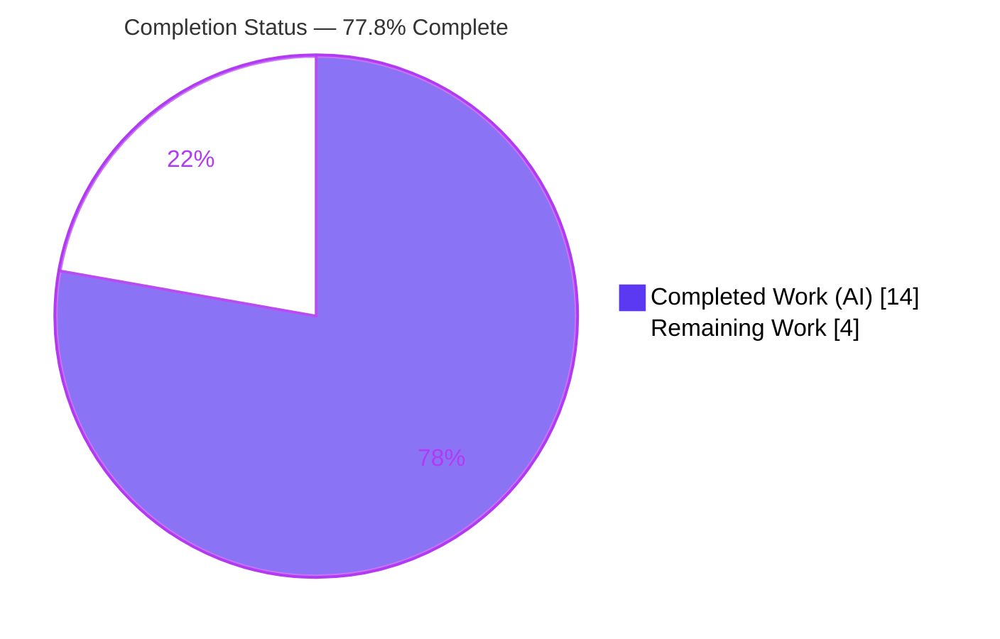
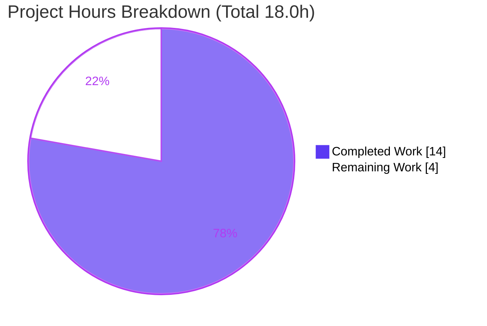
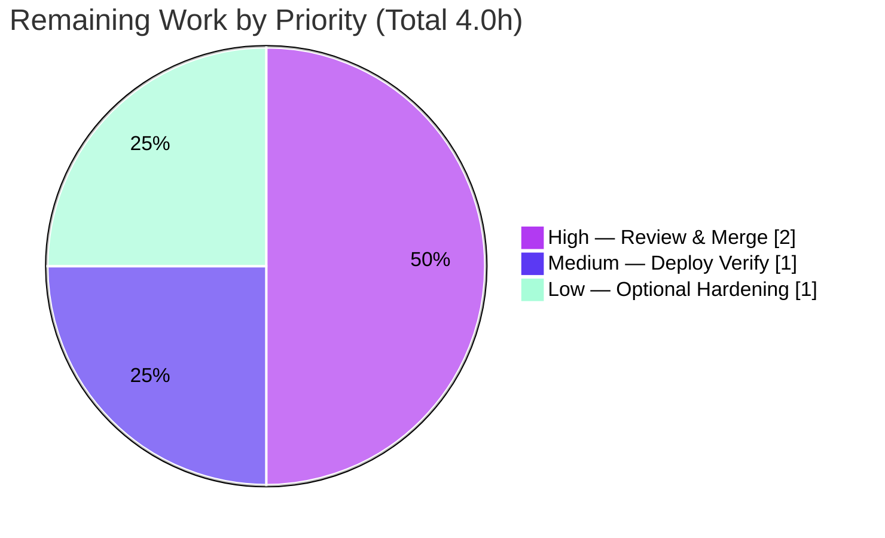

# Blitzy Project Guide — hao-backprop-test: Express.js Endpoint Addition

> Brand color legend — **Completed / AI Work:** Dark Blue `#5B39F3` · **Remaining / Not Completed:** White `#FFFFFF` · **Headings / Accents:** Violet-Black `#B23AF2` · **Highlight:** Mint `#A8FDD9`

---

## 1. Executive Summary

### 1.1 Project Overview

This project introduces the Express.js web framework into `hao-backprop-test`, a previously zero-dependency Node.js tutorial/test-fixture server, and adds a second HTTP endpoint. The server was refactored from the native `http` module to an Express application that serves two plain-text routes: the preserved `GET /` returning `Hello, World!\n` (byte-identical for backward compatibility) and a new `GET /good-evening` returning `Good evening`. The target users are developers using this Backprop integration fixture. Technical scope is deliberately minimal and self-contained within five root files. The change is headless (no UI, database, authentication, or external services) and preserves the original `127.0.0.1:3000` binding and startup behavior.

### 1.2 Completion Status



| Metric | Hours |
|--------|-------|
| **Total Hours** | 18.0 |
| **Completed Hours (AI + Manual)** | 14.0 (AI: 14.0 · Manual: 0.0) |
| **Remaining Hours** | 4.0 |
| **Percent Complete** | **77.8%** |

> **Completion formula (PA1, AAP-scoped):** `14.0 / (14.0 + 4.0) = 14.0 / 18.0 = 77.8%`. **100% of AAP feature code (FR-1..FR-4) is complete, committed, and validated end-to-end.** The remaining 4.0 h is exclusively human-gated path-to-production work (peer review, PR merge, deployment verification) — **not** unbuilt functionality.

### 1.3 Key Accomplishments

- ✅ **FR-1 — Express added:** `express@^5.2.1` declared in `package.json` and locked in `package-lock.json` (lockfileVersion 3, 68 packages) via npm, per rule `QA-13-july-rules-01`.
- ✅ **FR-2 — Multiple endpoints:** `server.js` refactored from the native `http` module to an Express application with path-based routing.
- ✅ **FR-3 — Backward compatibility:** `GET /` returns byte-identical `Hello, World!\n` (14 bytes, `text/plain`).
- ✅ **FR-4 — New endpoint:** `GET /good-evening` returns exactly `Good evening` (12 bytes, `text/plain`).
- ✅ **Startup preserved:** `127.0.0.1:3000` binding and the `Server running at ...` console message retained, with added `EADDRINUSE` bind-error handling.
- ✅ **Security hardening (beyond scope):** `X-Powered-By` disabled and `X-Content-Type-Options: nosniff` applied to all responses.
- ✅ **Docs & hygiene:** `README.md` documents both endpoints and the `npm install` / `npm start` workflow; `.gitignore` excludes `node_modules/`.
- ✅ **Validated end-to-end:** All five production-readiness gates passed; `npm audit` reports 0 vulnerabilities; both endpoints confirmed via curl and a real Chrome browser.

### 1.4 Critical Unresolved Issues

| Issue | Impact | Owner | ETA |
|-------|--------|-------|-----|
| _None identified_ — no code defects, compilation errors, or failing in-scope tests remain | None | — | — |

> There are **no critical blocking issues**. The feature is functionally complete and validated. The items in Section 1.6 are standard path-to-production steps, not defects.

### 1.5 Access Issues

| System/Resource | Type of Access | Issue Description | Resolution Status | Owner |
|-----------------|----------------|-------------------|-------------------|-------|
| _None_ | — | No access issues identified. The project requires no credentials, secrets, environment variables, databases, or third-party API access. | N/A | — |

**No access issues identified.**

### 1.6 Recommended Next Steps

1. **[High]** Peer-review the 6-commit feature branch (5 files, +917/−10) confirming FR-1..FR-4 and no scope creep.
2. **[High]** Approve and merge the PR to the target branch; ensure CI does not fail on the intentional `npm test` placeholder.
3. **[Medium]** Perform a clean-environment deployment verification (`npm ci` → `npm start` → curl both endpoints) on the target host.
4. **[Low]** Optionally review post-merge hardening (env-configurable host/port, request logging/health-check) only if the fixture is promoted beyond a localhost tutorial.

---

## 2. Project Hours Breakdown

### 2.1 Completed Work Detail

| Component | Hours | Description |
|-----------|-------|-------------|
| FR-1 — Express dependency integration | 2.0 | Declared `express@^5.2.1` in `package.json`; `npm install` regenerated `package-lock.json` (68 packages, integrity hashes); includes Express 5 vs 4 version research (Node ≥ 18 floor). |
| FR-2 — Server refactor to Express | 2.0 | Replaced native `http.createServer` bootstrap with `const app = express()`; established path-based routing while preserving CommonJS/const/arrow-function conventions. |
| FR-3 — Preserve `GET /` endpoint | 1.5 | Route returns byte-identical `Hello, World!\n` via `res.type('text/plain').send(...)`; backward compatibility guaranteed. |
| FR-4 — Add `GET /good-evening` endpoint | 1.0 | New route returning exact string `Good evening`. |
| Startup preservation + bind-error handling | 1.5 | `app.listen(3000,'127.0.0.1',cb)` retains host/port and startup log; added `EADDRINUSE`/error forwarding (exit non-zero). |
| Security hardening (QA gate) | 1.5 | `app.disable('x-powered-by')` + app-level `X-Content-Type-Options: nosniff` middleware across all responses. |
| README documentation | 1.0 | Documents Express dependency, endpoints table, Node ≥ 18 requirement, and `npm install` / `npm start` workflow. |
| `.gitignore` creation | 0.5 | Excludes `node_modules/` and npm debug logs (first dependency introduced). |
| QA validation & runtime verification | 3.0 | 11/11 functional smoke assertions, curl + Chrome browser verification, 13 screenshots, all 5 readiness gates, `npm audit` (0 vulns). |
| **Total Completed** | **14.0** | |

> Section 2.1 total (**14.0 h**) equals the Completed Hours in Section 1.2. ✓

### 2.2 Remaining Work Detail

| Category | Hours | Priority |
|----------|-------|----------|
| Code Review & PR Merge (peer review of diff; approve & merge to target branch; CI `npm test` handling) | 2.0 | High |
| Deployment & Runtime Verification (clean `npm ci` → `npm start` → curl both endpoints on target host) | 1.0 | Medium |
| Optional Post-Merge Hardening (env host/port, request logging/health-check, real test — beyond AAP scope) | 1.0 | Low |
| **Total Remaining** | **4.0** | |

> Section 2.2 total (**4.0 h**) equals the Remaining Hours in Section 1.2 and the "Remaining Work" value in the Section 7 pie chart. ✓

### 2.3 Hours Reconciliation

| Check | Result |
|-------|--------|
| Section 2.1 Completed | 14.0 h |
| Section 2.2 Remaining | 4.0 h |
| **2.1 + 2.2 = Total (Section 1.2)** | **14.0 + 4.0 = 18.0 h** ✓ |
| Completion % = 14.0 / 18.0 | **77.8%** ✓ |

---

## 3. Test Results

All results below originate from Blitzy's autonomous validation logs and were independently re-confirmed on-disk this session. By AAP design (§0.5.2, §0.6.2), **no automated unit-test framework was introduced**; functional validation served as the test of record.

| Test Category | Framework | Total Tests | Passed | Failed | Coverage % | Notes |
|---------------|-----------|-------------|--------|--------|------------|-------|
| Functional smoke (endpoints) | Node `http` client (throwaway script) | 11 | 11 | 0 | n/a | Assertions on status, headers, and byte-exact bodies for `GET /`, `GET /good-evening`, and 404 path. |
| Runtime / API (curl) | curl + `Invoke-WebRequest` | 3 | 3 | 0 | n/a | `GET /` → 200/14B; `GET /good-evening` → 200 "Good evening"; `GET /nope` → 404. |
| UI render (browser) | Google Chrome (manual + re-verify) | 2 | 2 | 0 | n/a | Both endpoints render correct plain text; zero browser console messages; 13 screenshots captured. |
| Static syntax check | `node --check` | 1 | 1 | 0 | n/a | `server.js` parses cleanly (exit 0). |
| Dependency integrity | `npm ls --all` / `npm audit` | 2 | 2 | 0 | n/a | Tree healthy (no UNMET/invalid/extraneous); 0 vulnerabilities. |
| **Totals** | — | **19** | **19** | **0** | — | 100% pass rate on all applicable functional checks. |

> **Note on `npm test`:** the `package.json` `test` script is an intentional placeholder (`echo "Error: no test specified" && exit 1`) left as-is per AAP scope. It is **not** a real test and its non-zero exit is by design — not a failure.

---

## 4. Runtime Validation & UI Verification

**Runtime health**
- ✅ **Server startup** — `npm start` / `node server.js` prints `Server running at http://127.0.0.1:3000/`; empty stderr; binds `127.0.0.1:3000`.
- ✅ **Clean install** — `npm ci` completes (exit 0, "added 67 packages in 3s") from the committed lockfile.
- ✅ **Static check** — `node --check server.js` exit 0.
- ✅ **Graceful shutdown** — port 3000 released after termination; `EADDRINUSE` handled with non-zero exit.

**API integration outcomes**
- ✅ `GET /` → **200 OK**, `Content-Type: text/plain; charset=utf-8`, 14 bytes, body `Hello, World!\n` (`X-Powered-By` absent, `X-Content-Type-Options: nosniff`).
- ✅ `GET /good-evening` → **200 OK**, `text/plain`, body `Good evening`.
- ✅ `GET /<unknown>` → **404 Not Found** (Express default; expected per AAP §0.4.1).

**UI verification** (headless plain-text service — the only "UI" is the raw HTTP response body)
- ✅ `GET /` renders `Hello, World!` in Chrome as plain monospace text on a white page (screenshot `endpoint_root_hello_world.png`).
- ✅ `GET /good-evening` renders `Good evening` identically (screenshot `endpoint_good_evening.png`).
- ✅ Zero browser console messages on either page.

---

## 5. Compliance & Quality Review

| AAP Deliverable / Benchmark | Requirement | Status | Progress |
|-----------------------------|-------------|--------|----------|
| FR-1 — Add Express | `express@^5.2.1` in `package.json` + locked in `package-lock.json` via npm | ✅ Pass | 100% |
| FR-2 — Multiple endpoints | Refactor native `http` → Express routing | ✅ Pass | 100% |
| FR-3 — Preserve original | `GET /` byte-identical `Hello, World!\n`, `text/plain` | ✅ Pass | 100% |
| FR-4 — New endpoint | `GET /good-evening` → `Good evening` | ✅ Pass | 100% |
| Rule `QA-13-july-rules-01` | npm-only (no yarn/pnpm) | ✅ Pass | 100% |
| Backward compatibility | Host/port `127.0.0.1:3000` + startup log preserved | ✅ Pass | 100% |
| Repository conventions | CommonJS `require()`, `const`, arrow handlers, single-file footprint | ✅ Pass | 100% |
| Exact response literals | `Hello, World!\n` and `Good evening` byte-exact | ✅ Pass | 100% |
| Version integrity | Pinned `^5.2.1` (no placeholders); Node ≥ 18 satisfied | ✅ Pass | 100% |
| Docs & hygiene (recommended) | `README.md` updated; `.gitignore` created | ✅ Pass | 100% |
| Scope discipline | 7 Backprop test assets untouched; `node_modules/` not committed | ✅ Pass | 100% |
| Security posture | 0 vulnerabilities; framework fingerprinting + MIME-sniffing mitigated | ✅ Pass | 100% |

**Fixes applied during autonomous validation:** Bind-error handling (commit `b3bcd33`) and HTTP response-header hardening (commit `f3e5fb5`, QA security gate) were added on top of the core refactor. **Outstanding compliance items:** none.

---

## 6. Risk Assessment

| Risk | Category | Severity | Probability | Mitigation | Status |
|------|----------|----------|-------------|------------|--------|
| `npm test` placeholder exits 1 → fails a CI `npm test` step | Technical | Low | Medium | Configure CI to skip/replace the placeholder; adding a real suite is out of AAP scope | Known / by-design |
| No automated regression test suite | Technical | Low | Low | Add tests if the project grows beyond a fixture | Accepted (AAP design) |
| Express 5 caret `^5.2.1` permits future minor/patch drift | Technical | Low | Low | `package-lock.json` pins exact tree with integrity hashes; `npm audit` clean | Mitigated |
| Transitive dependency supply chain (67 packages) | Security | Low | Low | `npm audit --omit=dev` → 0 vulnerabilities; lockfile integrity | Mitigated / Clean |
| No TLS/HTTPS or authentication | Security | Low | Low | Localhost-only bind; read-only plain-text; no user input | Accepted (by scope) |
| Framework fingerprinting / MIME sniffing | Security | Low | Low | `X-Powered-By` disabled + `nosniff` header applied | Resolved |
| Hardcoded host/port (not env-configurable) | Operational | Low | Low | `EADDRINUSE` handling added; env config is optional path-to-prod | Accepted (AAP mandates `127.0.0.1:3000`) |
| No request logging / health-check / monitoring | Operational | Low | Low | Startup log present; add observability if promoted | Accepted (by scope) |
| No process manager / auto-restart | Operational | Low | Low | Use pm2/systemd on deploy | Open (optional) |
| No CI/CD pipeline → manual merge & deploy | Integration | Low | Medium | Human review/merge covered in remaining 4.0 h | Open (path-to-prod) |
| Unmatched paths now return 404 (base returned Hello World for all) | Integration | Low | Low | Documented & expected per AAP §0.4.1; required `GET /` preserved | Accepted (intended) |

**Overall risk profile: LOW** across all four categories.

---

## 7. Visual Project Status

**Project hours breakdown** (Completed = Dark Blue `#5B39F3`, Remaining = White `#FFFFFF`):



**Remaining work by priority** (hours from Section 2.2):



> **Integrity check:** "Remaining Work" = **4.0 h** matches Section 1.2 Remaining Hours and the Section 2.2 total. "Completed Work" = **14.0 h** matches Section 1.2 Completed Hours.

---

## 8. Summary & Recommendations

**Achievements.** The project is **77.8% complete** on an AAP-scoped, hours-based basis. Every functional requirement (FR-1 through FR-4) has been implemented, committed across 6 clean agent commits, and validated end-to-end. Express 5.2.1 is integrated via npm with a healthy 68-package lockfile (0 vulnerabilities); the original `Hello, World!\n` response is preserved byte-for-byte under `GET /`; and the new `GET /good-evening` endpoint returns exactly `Good evening`. The agents additionally delivered security hardening and bind-error handling beyond the baseline requirement.

**Remaining gaps.** The remaining **4.0 h** contains **no unbuilt features** — it is entirely human-gated path-to-production: peer review, PR merge, and a clean-environment deployment verification, plus one optional (out-of-scope) hardening item.

**Critical path to production.** (1) Peer review → (2) merge to target branch (with CI configured around the intentional `npm test` placeholder) → (3) clean `npm ci` + `npm start` verification on the target host.

**Success metrics (all met):** 4/4 functional requirements delivered; 19/19 applicable functional checks passing; 0 vulnerabilities; 0 out-of-scope files touched; backward compatibility preserved byte-for-byte.

**Production readiness assessment.** The branch is **functionally production-ready** for its intended use as a localhost tutorial/test fixture. No blocking issues exist. Recommendation: **approve and merge** after standard peer review.

| Metric | Value |
|--------|-------|
| Completion | 77.8% |
| Completed / Total Hours | 14.0 / 18.0 |
| Remaining Hours | 4.0 |
| Functional Requirements Met | 4 / 4 |
| Applicable Tests Passing | 19 / 19 |
| Known Vulnerabilities | 0 |
| Blocking Issues | 0 |

---

## 9. Development Guide

### 9.1 System Prerequisites

- **Node.js ≥ 18** (required by Express 5). Validated with **v22.23.1**.
- **npm** (bundled with Node). Validated with **10.9.8**.
- **OS:** platform-independent (validated on Windows Server 2022 / PowerShell; equivalent on macOS/Linux).
- No database, cache, message queue, environment variables, or secrets are required.

Verify your toolchain:

```bash
node --version   # expect v18+ (validated v22.23.1)
npm --version    # validated 10.9.8
```

### 9.2 Environment Setup

No environment variables or external services are needed. Clone/checkout the repository and change into the project root (the directory containing `server.js` and `package.json`). Host and port are in-file constants (`127.0.0.1:3000`).

### 9.3 Dependency Installation

```bash
# Recommended for CI / clean deploys — reproducible install from package-lock.json
npm ci
# → added 67 packages (express@5.2.1 + transitive tree)

# Alternative for local development
npm install
# → up to date

# (optional) confirm a healthy, vulnerability-free tree
npm ls --all          # no UNMET/invalid/extraneous
npm audit --omit=dev  # found 0 vulnerabilities
```

### 9.4 Application Startup

```bash
npm start        # equivalent to: node server.js
```

Expected console output:

```text
Server running at http://127.0.0.1:3000/
```

### 9.5 Verification Steps

```bash
# Static syntax check (no server needed)
node --check server.js            # exit 0

# With the server running, verify each endpoint:
curl -i http://127.0.0.1:3000/                 # 200, text/plain, "Hello, World!\n" (14 bytes)
curl -i http://127.0.0.1:3000/good-evening     # 200, text/plain, "Good evening"
curl -i http://127.0.0.1:3000/anything-else    # 404 Not Found (Express default)
```

Expected response headers on success: `Content-Type: text/plain; charset=utf-8`, `X-Content-Type-Options: nosniff`, and **no** `X-Powered-By` header.

### 9.6 Example Usage

```bash
# Preserved original endpoint
$ curl http://127.0.0.1:3000/
Hello, World!

# New endpoint
$ curl http://127.0.0.1:3000/good-evening
Good evening
```

### 9.7 Troubleshooting

- **`Error: listen EADDRINUSE :::3000`** — port 3000 is occupied. The server logs `Failed to start server...` and exits non-zero. Free the port (stop the other process) and retry.
- **`npm test` prints an error and exits 1** — this is the **intentional placeholder** left as-is per AAP scope; it is not a real test. Configure CI to skip or replace this step rather than treating it as a failure.
- **`Cannot find module 'express'`** — run `npm ci` (or `npm install`) before starting; `node_modules/` is git-ignored and not committed.
- **`npm start` fails to launch from a non-shell process runner (Windows)** — `npm` is `npm.cmd`; run it inside PowerShell/cmd, or invoke `node server.js` directly.

---

## 10. Appendices

### Appendix A — Command Reference

| Command | Purpose |
|---------|---------|
| `npm ci` | Reproducible install from `package-lock.json` (CI/deploy) |
| `npm install` | Install/refresh dependencies (local dev) |
| `npm start` | Start the server (`node server.js`) |
| `node server.js` | Start the server directly |
| `node --check server.js` | Static syntax validation |
| `npm ls --all` | Inspect dependency tree health |
| `npm audit --omit=dev` | Security audit of production dependencies |
| `curl http://127.0.0.1:3000/` | Exercise the preserved endpoint |
| `curl http://127.0.0.1:3000/good-evening` | Exercise the new endpoint |

### Appendix B — Port Reference

| Port | Service | Binding |
|------|---------|---------|
| 3000 | Express HTTP server | `127.0.0.1` (localhost only) |

### Appendix C — Key File Locations

| File | Role | Disposition |
|------|------|-------------|
| `server.js` | Express app + two routes + startup | UPDATED |
| `package.json` | Manifest (`express` dep, `start` script) | UPDATED |
| `package-lock.json` | Locked dependency tree (lockfileVersion 3, 68 pkgs) | UPDATED |
| `README.md` | Endpoint & run documentation | UPDATED |
| `.gitignore` | Excludes `node_modules/` | CREATED |
| `node_modules/` | Installed dependencies | Generated (not committed) |

### Appendix D — Technology Versions

| Component | Version |
|-----------|---------|
| Node.js | v22.23.1 (requires ≥ 18) |
| npm | 10.9.8 |
| Express | 5.2.1 (declared `^5.2.1`) |
| package-lock lockfileVersion | 3 |

### Appendix E — Environment Variable Reference

_None._ The application uses in-file constants (`hostname = '127.0.0.1'`, `port = 3000`) and requires no environment variables or secrets.

### Appendix F — Developer Tools Guide

| Tool | Use |
|------|-----|
| `node --check` | No-fix static syntax check (no ESLint/Prettier configured) |
| `npm audit` | Dependency vulnerability scanning |
| Chrome | Manual endpoint render verification (screenshots in `blitzy/screenshots/`) |
| Git / Git LFS | Version control (LFS 3.7.1 present; standard hooks only) |

### Appendix G — Glossary

| Term | Definition |
|------|------------|
| AAP | Agent Action Plan — the authoritative feature specification. |
| FR-1..FR-4 | The four functional requirements (add Express; multiple endpoints; preserve `GET /`; add `GET /good-evening`). |
| Backprop test assets | Unrelated multi-format fixture files at the repo root (`.pdf`, `.java`, `.jpg`, `.csv`, `.doc`, `.txt`) — out of scope. |
| Path-to-production | Standard activities (review, merge, deploy) required to release the delivered code. |
| Byte-identical | The `GET /` body matches the original exactly, including comma, capitalization, and trailing newline. |

---

_All hour figures are consistent across Sections 1.2, 2.1, 2.2, 7, and 8: **Completed 14.0 h · Remaining 4.0 h · Total 18.0 h · 77.8% complete**._