# Technical Specification

# 1. Introduction

This Technical Specification document provides a comprehensive reference for the **hao-backprop-test** repository, a minimal Node.js server implementation designed specifically for Backprop integration testing. The documentation captures the system's purpose, technical architecture, and operational boundaries to guide developers and stakeholders involved in Backprop tool validation.

## 1.1 Executive Summary

### 1.1.1 Project Overview

The hao-backprop-test repository represents a deliberately minimal "Hello World" Node.js HTTP server created as a controlled test environment for Backprop integration. Backprop is a tool or service utilized for code analysis, refactoring, or AI-assisted development workflows. This project provides a known, simple codebase against which Backprop's capabilities can be validated and benchmarked.

| Attribute | Value |
|-----------|-------|
| Repository Name | hao-backprop-test |
| NPM Package Name | hello_world |
| Version | 1.0.0 |
| License | MIT |

> **Important Notice**: This repository is explicitly marked with "Do not touch!" in its documentation, indicating it serves as a stable reference point for testing and should not be modified outside of controlled test scenarios.

### 1.1.2 Core Problem Statement

The repository addresses the following technical needs:

1. **Integration Validation**: Provides a predictable, minimal codebase for testing Backprop's code analysis and processing capabilities
2. **Controlled Test Environment**: Offers a stable baseline with known behavior for regression testing
3. **Multi-Language Testing**: Includes intentionally varied file types (JavaScript, Java, CSV, Python placeholders) to validate Backprop's handling of heterogeneous repositories
4. **Edge Case Validation**: Contains intentional imperfections (non-functional Java code, placeholder files, configuration mismatches) to test Backprop's error handling and edge case detection

### 1.1.3 Key Stakeholders and Users

| Stakeholder Group | Role | Primary Interest |
|-------------------|------|------------------|
| Backprop Developers | Tool Maintainers | Validate tool functionality against known baseline |
| QA Engineers | Test Execution | Execute integration tests with predictable outcomes |
| DevOps Engineers | CI/CD Integration | Verify Backprop pipeline integrations |
| Technical Leads | Oversight | Assess Backprop capabilities on minimal codebase |

### 1.1.4 Value Proposition

This test project delivers value through:

- **Reproducibility**: A frozen, minimal codebase enables consistent test results across Backprop iterations
- **Simplicity**: Zero external dependencies eliminate environmental variability
- **Transparency**: Single-file server implementation allows complete code path analysis
- **Comprehensive File Type Coverage**: Inclusion of JavaScript, Java, CSV, and placeholder files tests Backprop's multi-language support

## 1.2 System Overview

### 1.2.1 Project Context

#### Business Context and Positioning

The hao-backprop-test repository exists within the Backprop development and testing ecosystem. It serves as a canonical test fixture rather than a standalone application. The project's explicit labeling as a "test project for backprop integration" in its README.md establishes its role as supporting infrastructure for Backprop tool validation.

#### Current System Context

This repository is not replacing or upgrading an existing system. It represents a purpose-built test harness designed from inception for integration testing. The intentionally minimal implementation provides:

- **Isolation**: No external service dependencies that could introduce test variability
- **Determinism**: Hardcoded configuration values ensure consistent behavior
- **Auditability**: Complete codebase visibility in a flat repository structure

#### Integration with Enterprise Landscape

As a test fixture, this project integrates with:

| Integration Point | Nature | Purpose |
|-------------------|--------|---------|
| Backprop Tool | Primary Consumer | Subject of analysis and testing |
| CI/CD Pipelines | Execution Environment | Automated test execution |
| Version Control | Git Repository | Change tracking and versioning |

### 1.2.2 High-Level Description

#### Primary System Capabilities

The system implements a single, focused capability:

**HTTP Server Functionality**
- Listens for incoming HTTP requests on a configured host and port
- Responds to all requests with a static "Hello, World!" message
- Logs server startup status to the console

#### Major System Components

The repository follows a flat structure with no subdirectories. All components reside at the repository root level.

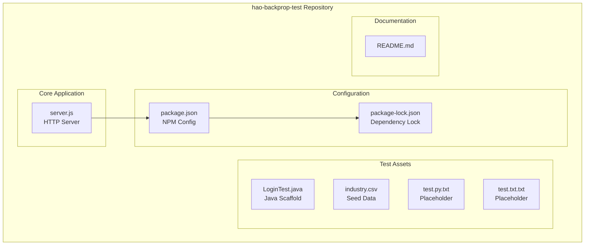

| Component | File | Purpose | Status |
|-----------|------|---------|--------|
| HTTP Server | `server.js` | Main application entry point | Functional |
| NPM Configuration | `package.json` | Package metadata and scripts | Complete |
| Dependency Lock | `package-lock.json` | Dependency version locking | Empty (no deps) |
| Documentation | `README.md` | Project overview | Minimal |
| Java Test File | `LoginTest.java` | Multi-language test scaffold | Non-functional |
| Seed Data | `industry.csv` | CSV parsing test data | Static (43 entries) |
| Python Placeholder | `test.py.txt` | File type coverage | Empty |
| Text Placeholder | `test.txt.txt` | File type coverage | Empty |

#### Core Technical Approach

The server implementation leverages Node.js built-in capabilities exclusively:

| Aspect | Implementation |
|--------|----------------|
| Runtime | Node.js |
| HTTP Module | Native `http` module (no Express/Koa) |
| Protocol | HTTP (no TLS/HTTPS) |
| Binding | localhost only (127.0.0.1) |
| Port | 3000 |
| Dependencies | Zero external packages |

**Server Configuration Values** (as defined in `server.js`):

| Parameter | Value | Line Reference |
|-----------|-------|----------------|
| hostname | `'127.0.0.1'` | Line 3 |
| port | `3000` | Line 4 |
| Response Body | `'Hello, World!\n'` | Line 7 |
| Content-Type | `'text/plain'` | Line 6 |
| Status Code | `200` | Line 6 |

### 1.2.3 Success Criteria

#### Measurable Objectives

Given the test project nature, success criteria focus on predictable, verifiable behaviors:

| Objective | Measurement Method | Expected Outcome |
|-----------|-------------------|------------------|
| Server Startup | Console output verification | "Server running at http://127.0.0.1:3000/" |
| Request Handling | HTTP response inspection | Status 200, body "Hello, World!\n" |
| Content Type | Header verification | text/plain |

#### Critical Success Factors

1. **Stability**: Server implementation must remain unchanged to provide consistent test baseline
2. **Reproducibility**: Identical behavior across execution environments
3. **Simplicity**: Codebase must remain minimal and easily comprehensible

#### Key Performance Indicators

| KPI | Target | Rationale |
|-----|--------|-----------|
| Startup Time | < 1 second | Minimal initialization overhead |
| Response Latency | < 10ms | No processing logic |
| Memory Footprint | < 50MB | No dependencies or caching |
| Code Coverage | 100% analyzable | Complete codebase visibility |

## 1.3 Scope

### 1.3.1 In-Scope Elements

#### Core Features and Functionalities

**Must-Have Capabilities:**

| Capability | Description | Implementation |
|------------|-------------|----------------|
| HTTP Listening | Accept incoming HTTP connections | `http.createServer()` in `server.js` |
| Static Response | Return fixed content for all requests | "Hello, World!\n" response |
| Console Logging | Report server startup status | `console.log()` on listen callback |

**Primary User Workflow:**

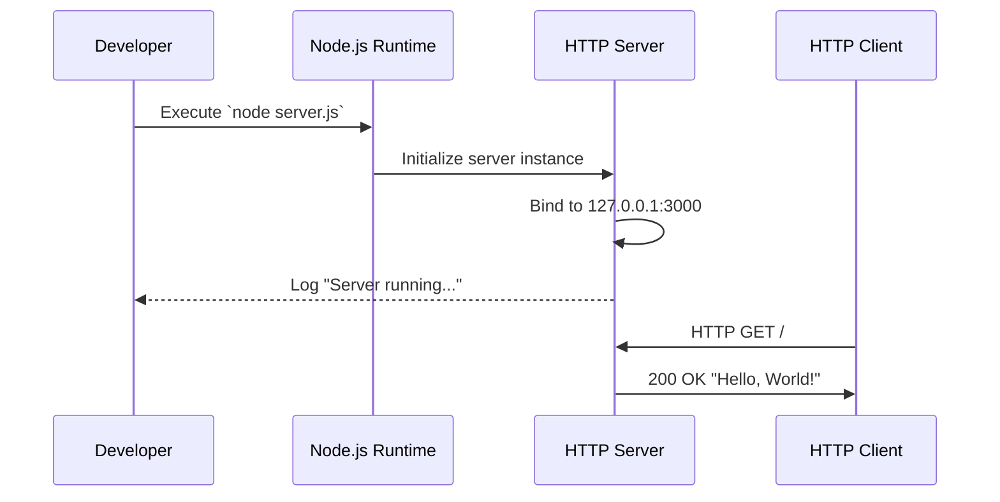

**Essential Test Data:**

The `industry.csv` file provides seed data containing 43 industry categories for testing CSV parsing capabilities:

| Category Type | Examples |
|---------------|----------|
| Professional Services | Accounting/Finance, Legal, Consulting |
| Technology | Technology, Telecommunications |
| Healthcare | Healthcare, Pharmaceuticals |
| Industrial | Manufacturing/Operations, Transportation/Logistics |
| Public Sector | Government/Military, Non-Profit |
| Fallback | Other |

#### Implementation Boundaries

**System Boundaries:**

| Boundary | Definition |
|----------|------------|
| Network Scope | localhost only (127.0.0.1) |
| Protocol Support | HTTP only (port 3000) |
| Request Handling | All routes return identical response |
| State Management | Stateless (no persistence) |

**User Groups Covered:**

- Backprop integration testers
- Developers validating Backprop tool functionality
- Automated CI/CD test pipelines

**Data Domains Included:**

| Domain | Source | Format |
|--------|--------|--------|
| Industry Categories | `industry.csv` | CSV (43 rows) |
| Server Response | `server.js` | Plain text |

### 1.3.2 Out-of-Scope Elements

#### Explicitly Excluded Features

| Feature | Exclusion Rationale | Evidence |
|---------|---------------------|----------|
| Production Deployment | Test project designation | README.md states "test project" |
| HTTPS/TLS Support | Uses http module only | `require('http')` in server.js |
| Request Routing | Single catch-all handler | No route differentiation logic |
| Error Handling | No try/catch implementation | Absent from server.js |
| Authentication | No auth middleware | No auth code present |
| Database Connectivity | No data layer | Zero database dependencies |
| Environment Configuration | Hardcoded values | Config in server.js lines 3-4 |

#### Non-Functional Components

The repository contains intentionally non-functional elements for testing purposes:

| Component | Issue | Purpose |
|-----------|-------|---------|
| `LoginTest.java` | Incomplete "Web" token prevents compilation | Tests Backprop handling of broken code |
| `test.py.txt` | Empty file | Tests empty file handling |
| `test.txt.txt` | Empty file | Tests placeholder detection |
| `index.js` reference | package.json points to non-existent file | Tests missing file detection |

#### Future Phase Considerations

As a stable test fixture, this repository is intentionally frozen. Future considerations are explicitly out of scope:

- Feature additions
- Dependency introductions
- Production hardening
- Security enhancements
- Performance optimizations

#### Integration Points Not Covered

| Integration Type | Status | Notes |
|------------------|--------|-------|
| External APIs | Not implemented | No outbound HTTP calls |
| Message Queues | Not implemented | No async messaging |
| Databases | Not implemented | No persistence layer |
| Caching Systems | Not implemented | No cache integration |
| Monitoring/APM | Not implemented | No observability tooling |

#### Unsupported Use Cases

| Use Case | Reason for Exclusion |
|----------|---------------------|
| Production traffic handling | Localhost binding only |
| Multi-user concurrency testing | No session management |
| Data processing workflows | No business logic |
| External system integration | Zero external dependencies |
| Secure communications | No TLS implementation |

#### References

- `README.md` - Project identification, purpose statement, and warning notice
- `server.js` - Complete HTTP server implementation with configuration values (lines 1-14)
- `package.json` - NPM package metadata, version, author, license, and script definitions
- `package-lock.json` - Dependency lock file confirming zero external dependencies
- `LoginTest.java` - Java scaffold file demonstrating intentional non-functional code
- `industry.csv` - Seed data file containing 43 industry category entries
- `test.py.txt` - Empty placeholder file for Python file type testing
- `test.txt.txt` - Empty placeholder file for text file type testing

# 2. Product Requirements

## 2.1 Feature Catalog

### 2.1.1 Feature Overview

The hao-backprop-test repository implements a deliberately minimal feature set designed for Backprop integration testing. Features are categorized into two domains: **Core Server Functionality** and **Test Support Assets**. This minimal footprint ensures predictable, reproducible behavior for validation scenarios.

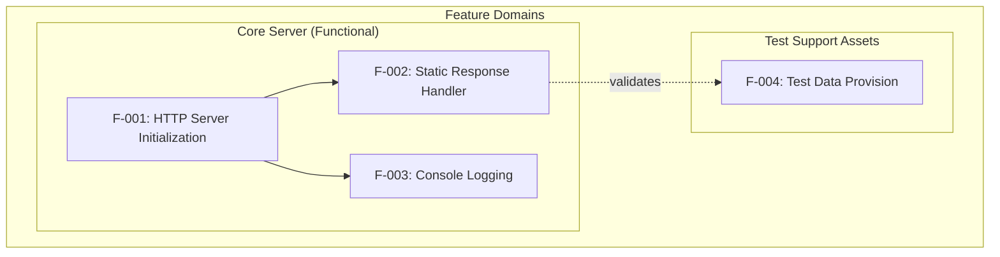

### 2.1.2 Feature F-001: HTTP Server Initialization

#### Feature Metadata

| Attribute | Value |
|-----------|-------|
| **Feature ID** | F-001 |
| **Feature Name** | HTTP Server Initialization |
| **Category** | Core Server Functionality |
| **Priority Level** | Critical |

| Attribute | Value |
|-----------|-------|
| **Status** | Completed |
| **Source File** | `server.js` (lines 1-4, 12-14) |
| **Implementation** | Node.js native `http` module |

#### Description

**Overview:**
This feature establishes the HTTP server instance using Node.js built-in capabilities. It configures the server to listen on a specified hostname and port, providing the foundational infrastructure for handling HTTP requests.

**Business Value:**
Provides the essential server infrastructure required for Backprop to analyze a functioning HTTP application. The minimal implementation creates an ideal test baseline with zero external dependencies.

**User Benefits:**
- Predictable server startup behavior
- Consistent binding to localhost for isolated testing
- Clear console feedback on successful initialization

**Technical Context:**
The implementation leverages `require('http')` to import Node.js's native HTTP module, avoiding external framework dependencies. Server binding is restricted to `127.0.0.1:3000`, ensuring the server operates only within the local environment. Configuration values are hardcoded for deterministic behavior.

#### Dependencies

| Dependency Type | Dependency | Notes |
|-----------------|------------|-------|
| Prerequisite Features | None | First feature in initialization chain |
| System Dependencies | Node.js runtime | Required for execution |
| External Dependencies | None | Zero NPM packages |
| Integration Requirements | None | Standalone operation |

---

### 2.1.3 Feature F-002: Static Response Handler

#### Feature Metadata

| Attribute | Value |
|-----------|-------|
| **Feature ID** | F-002 |
| **Feature Name** | Static Response Handler |
| **Category** | Core Server Functionality |
| **Priority Level** | Critical |

| Attribute | Value |
|-----------|-------|
| **Status** | Completed |
| **Source File** | `server.js` (lines 6-10) |
| **Implementation** | Callback in `http.createServer()` |

#### Description

**Overview:**
This feature handles all incoming HTTP requests by returning an identical static response. Every request, regardless of HTTP method, path, or headers, receives the same "Hello, World!" message.

**Business Value:**
Provides a predictable, verifiable response pattern for testing Backprop's HTTP response analysis capabilities. The uniform response eliminates variables in test assertions.

**User Benefits:**
- Guaranteed consistent response content
- Simple verification of server operation
- No complex routing logic to debug

**Technical Context:**
The request handler callback receives `req` and `res` parameters but only utilizes the response object. It sets the HTTP status code to 200, Content-Type header to `text/plain`, and writes "Hello, World!\n" to the response body.

#### Dependencies

| Dependency Type | Dependency | Notes |
|-----------------|------------|-------|
| Prerequisite Features | F-001 (HTTP Server Initialization) | Server must be created |
| System Dependencies | Node.js `http` module | Built-in module |
| External Dependencies | None | No middleware |
| Integration Requirements | None | Standalone handler |

---

### 2.1.4 Feature F-003: Console Logging

#### Feature Metadata

| Attribute | Value |
|-----------|-------|
| **Feature ID** | F-003 |
| **Feature Name** | Console Logging |
| **Category** | Core Server Functionality |
| **Priority Level** | High |

| Attribute | Value |
|-----------|-------|
| **Status** | Completed |
| **Source File** | `server.js` (lines 12-14) |
| **Implementation** | `console.log()` in listen callback |

#### Description

**Overview:**
This feature outputs server startup confirmation to the console, indicating the server is ready to accept connections. The log message includes the full URL where the server is accessible.

**Business Value:**
Provides immediate visual confirmation of successful server startup, supporting automated test validation through console output parsing.

**User Benefits:**
- Clear feedback on server availability
- URL displayed for immediate access
- Confirms successful binding without errors

**Technical Context:**
The logging occurs within the callback function passed to `server.listen()`, executing only after the server has successfully bound to the configured host and port. Output format uses template literals: `Server running at http://${hostname}:${port}/`.

#### Dependencies

| Dependency Type | Dependency | Notes |
|-----------------|------------|-------|
| Prerequisite Features | F-001 (HTTP Server Initialization) | Triggered by listen callback |
| System Dependencies | Node.js `console` global | Built-in logging |
| External Dependencies | None | No logging frameworks |
| Integration Requirements | None | Standard output stream |

---

### 2.1.5 Feature F-004: Test Data Provision

#### Feature Metadata

| Attribute | Value |
|-----------|-------|
| **Feature ID** | F-004 |
| **Feature Name** | Test Data Provision |
| **Category** | Test Support Assets |
| **Priority Level** | Medium |

| Attribute | Value |
|-----------|-------|
| **Status** | Completed |
| **Source File** | `industry.csv` (44 lines) |
| **Implementation** | Static CSV file |

#### Description

**Overview:**
This feature provides canonical seed data in CSV format for testing CSV parsing capabilities. The file contains 43 industry categories organized under a single "Industry" column header.

**Business Value:**
Supplies structured test data for validating Backprop's ability to analyze and process CSV files within a repository, ensuring multi-format file handling coverage.

**User Benefits:**
- Ready-to-use test data requiring no generation
- Comprehensive industry category coverage
- Consistent data set across test executions

**Technical Context:**
The CSV file uses a single-column format with "Industry" as the header row. Categories span multiple domains including Professional Services, Technology, Healthcare, Industrial, and Public Sector. The "Other" entry serves as a fallback/catch-all category.

#### Dependencies

| Dependency Type | Dependency | Notes |
|-----------------|------------|-------|
| Prerequisite Features | None | Standalone data asset |
| System Dependencies | None | Static file |
| External Dependencies | None | No CSV libraries required |
| Integration Requirements | CSV parser (consumer-side) | For test utilization |

---

## 2.2 Functional Requirements Tables

### 2.2.1 F-001: HTTP Server Initialization Requirements

#### Requirement Details

| Req ID | Description |
|--------|-------------|
| F-001-RQ-001 | System shall import Node.js native HTTP module |
| F-001-RQ-002 | System shall bind to hostname 127.0.0.1 |
| F-001-RQ-003 | System shall listen on port 3000 |
| F-001-RQ-004 | System shall create single server instance |

| Req ID | Priority | Complexity |
|--------|----------|------------|
| F-001-RQ-001 | Must-Have | Low |
| F-001-RQ-002 | Must-Have | Low |
| F-001-RQ-003 | Must-Have | Low |
| F-001-RQ-004 | Must-Have | Low |

#### Acceptance Criteria

| Req ID | Acceptance Criteria |
|--------|---------------------|
| F-001-RQ-001 | `require('http')` successfully loads module |
| F-001-RQ-002 | Server accepts connections only from localhost |
| F-001-RQ-003 | Server responds to requests on port 3000 |
| F-001-RQ-004 | Single process handles all requests |

#### Technical Specifications

| Specification | Value |
|---------------|-------|
| **Input Parameters** | None (configuration hardcoded) |
| **Output/Response** | Server instance object |
| **Performance Criteria** | Startup < 1 second |
| **Data Requirements** | None |

#### Validation Rules

| Rule Type | Specification |
|-----------|---------------|
| **Business Rules** | Server must bind before handling requests |
| **Data Validation** | N/A - no input data |
| **Security Requirements** | Localhost-only binding |
| **Compliance Requirements** | None |

---

### 2.2.2 F-002: Static Response Handler Requirements

#### Requirement Details

| Req ID | Description |
|--------|-------------|
| F-002-RQ-001 | Handler shall respond to all HTTP methods |
| F-002-RQ-002 | Handler shall return HTTP status 200 |
| F-002-RQ-003 | Handler shall set Content-Type to text/plain |
| F-002-RQ-004 | Handler shall return body "Hello, World!\n" |

| Req ID | Priority | Complexity |
|--------|----------|------------|
| F-002-RQ-001 | Must-Have | Low |
| F-002-RQ-002 | Must-Have | Low |
| F-002-RQ-003 | Must-Have | Low |
| F-002-RQ-004 | Must-Have | Low |

#### Acceptance Criteria

| Req ID | Acceptance Criteria |
|--------|---------------------|
| F-002-RQ-001 | GET, POST, PUT, DELETE all receive response |
| F-002-RQ-002 | Response status code equals 200 |
| F-002-RQ-003 | Content-Type header is text/plain |
| F-002-RQ-004 | Response body matches exactly |

#### Technical Specifications

| Specification | Value |
|---------------|-------|
| **Input Parameters** | HTTP request (ignored) |
| **Output/Response** | HTTP 200 with "Hello, World!\n" |
| **Performance Criteria** | Response latency < 10ms |
| **Data Requirements** | None |

#### Validation Rules

| Rule Type | Specification |
|-----------|---------------|
| **Business Rules** | All requests receive identical response |
| **Data Validation** | N/A - input ignored |
| **Security Requirements** | None implemented |
| **Compliance Requirements** | None |

---

### 2.2.3 F-003: Console Logging Requirements

#### Requirement Details

| Req ID | Description |
|--------|-------------|
| F-003-RQ-001 | System shall log on successful server bind |
| F-003-RQ-002 | Log shall include server URL |
| F-003-RQ-003 | Log shall use console.log method |

| Req ID | Priority | Complexity |
|--------|----------|------------|
| F-003-RQ-001 | Must-Have | Low |
| F-003-RQ-002 | Must-Have | Low |
| F-003-RQ-003 | Should-Have | Low |

#### Acceptance Criteria

| Req ID | Acceptance Criteria |
|--------|---------------------|
| F-003-RQ-001 | Log appears only after bind completes |
| F-003-RQ-002 | Message contains http://127.0.0.1:3000/ |
| F-003-RQ-003 | Output visible in stdout stream |

#### Technical Specifications

| Specification | Value |
|---------------|-------|
| **Input Parameters** | hostname, port variables |
| **Output/Response** | Console string to stdout |
| **Performance Criteria** | Immediate on bind |
| **Data Requirements** | None |

#### Validation Rules

| Rule Type | Specification |
|-----------|---------------|
| **Business Rules** | Log executes once per startup |
| **Data Validation** | N/A |
| **Security Requirements** | None |
| **Compliance Requirements** | None |

---

### 2.2.4 F-004: Test Data Provision Requirements

#### Requirement Details

| Req ID | Description |
|--------|-------------|
| F-004-RQ-001 | File shall contain "Industry" header row |
| F-004-RQ-002 | File shall contain 43 industry entries |
| F-004-RQ-003 | File shall use CSV format |
| F-004-RQ-004 | File shall include "Other" fallback entry |

| Req ID | Priority | Complexity |
|--------|----------|------------|
| F-004-RQ-001 | Must-Have | Low |
| F-004-RQ-002 | Should-Have | Low |
| F-004-RQ-003 | Must-Have | Low |
| F-004-RQ-004 | Should-Have | Low |

#### Acceptance Criteria

| Req ID | Acceptance Criteria |
|--------|---------------------|
| F-004-RQ-001 | First line equals "Industry" |
| F-004-RQ-002 | Line count equals 44 (header + 43 data) |
| F-004-RQ-003 | File parseable by standard CSV parsers |
| F-004-RQ-004 | "Other" entry exists as final data row |

#### Technical Specifications

| Specification | Value |
|---------------|-------|
| **Input Parameters** | N/A (static file) |
| **Output/Response** | 43 industry category strings |
| **Performance Criteria** | N/A |
| **Data Requirements** | Single-column CSV structure |

#### Validation Rules

| Rule Type | Specification |
|-----------|---------------|
| **Business Rules** | Data remains static |
| **Data Validation** | No empty entries |
| **Security Requirements** | None |
| **Compliance Requirements** | None |

---

## 2.3 Feature Relationships

### 2.3.1 Feature Dependencies Map

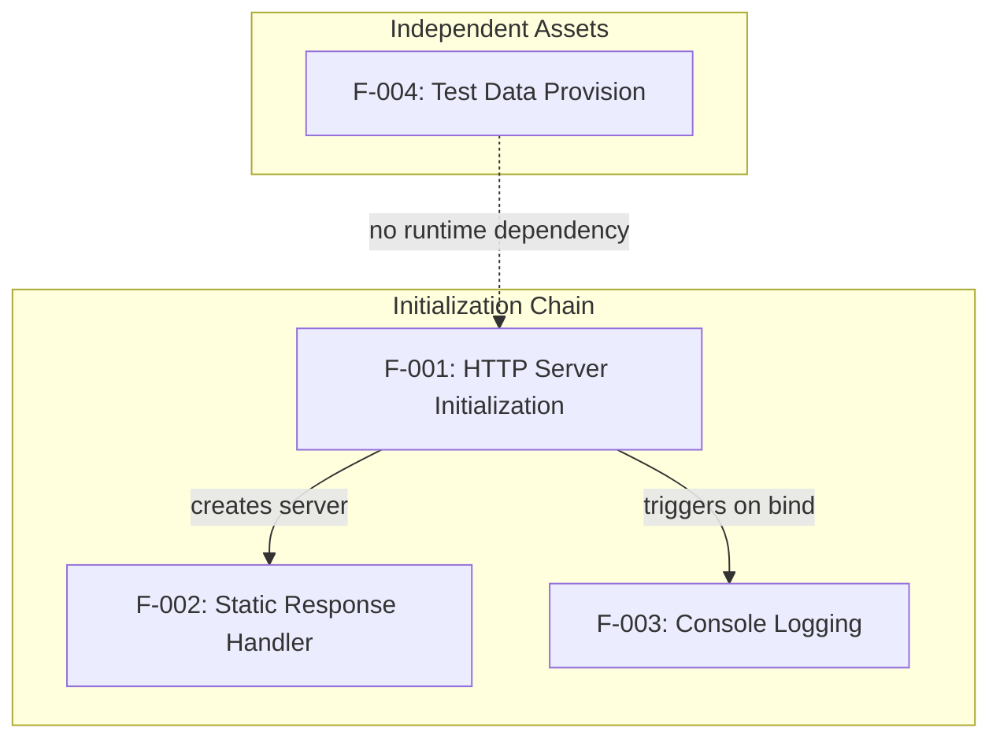

The feature dependency structure is intentionally simple:

| Feature | Depends On | Depended By |
|---------|------------|-------------|
| F-001 | None | F-002, F-003 |
| F-002 | F-001 | None |
| F-003 | F-001 | None |
| F-004 | None | None |

### 2.3.2 Integration Points

Integration points within this minimal system are limited to the internal server initialization flow:

| Integration Point | Source | Target | Nature |
|-------------------|--------|--------|--------|
| Server Creation | F-001 | F-002 | Handler passed to createServer() |
| Listen Callback | F-001 | F-003 | Logging triggered on bind |

**External Integration Points:** None. The system operates in isolation with no external service dependencies.

### 2.3.3 Shared Components

| Component | Used By | Purpose |
|-----------|---------|---------|
| `http` module | F-001, F-002 | Server creation and request handling |
| `hostname` variable | F-001, F-003 | Server binding address |
| `port` variable | F-001, F-003 | Server listening port |
| `server` instance | F-001, F-002, F-003 | Shared server object |

### 2.3.4 Common Services

This repository implements no shared services or middleware patterns. Each feature operates as a discrete, self-contained unit within the single `server.js` file.

---

## 2.4 Implementation Considerations

### 2.4.1 Technical Constraints

| Feature | Constraint | Impact |
|---------|------------|--------|
| F-001 | Localhost binding only | Cannot accept remote connections |
| F-001 | Single port (3000) | Port conflicts require manual resolution |
| F-002 | No routing | All paths return identical response |
| F-002 | No method filtering | Cannot differentiate request types |
| F-004 | Static data | No dynamic data generation |

### 2.4.2 Performance Requirements

| Feature | Requirement | Target |
|---------|-------------|--------|
| F-001 | Startup time | < 1 second |
| F-002 | Response latency | < 10ms |
| F-002 | Throughput | Not specified |
| All | Memory footprint | < 50MB |

### 2.4.3 Scalability Considerations

| Aspect | Current State | Limitation |
|--------|---------------|------------|
| Horizontal Scaling | Not supported | Single instance design |
| Vertical Scaling | Not applicable | Minimal resource usage |
| Load Balancing | Not implemented | Localhost-only binding |
| Connection Pooling | Not implemented | Native HTTP handling |

**Note:** As a test fixture, scalability is explicitly out of scope. The system is designed for single-instance, single-user testing scenarios.

### 2.4.4 Security Implications

| Feature | Security Aspect | Current Implementation |
|---------|-----------------|------------------------|
| F-001 | Network Exposure | Mitigated by localhost binding |
| F-001 | Protocol Security | HTTP only (no TLS) |
| F-002 | Input Validation | None (input ignored) |
| F-002 | Authentication | None implemented |
| F-004 | Data Sensitivity | Low (public industry names) |

**Security Summary:** The localhost-only binding provides implicit network isolation. No authentication, encryption, or input validation mechanisms are implemented, which is appropriate for this test fixture's scope.

### 2.4.5 Maintenance Requirements

| Aspect | Requirement |
|--------|-------------|
| Repository Stability | Frozen state - "Do not touch!" |
| Code Modifications | Prohibited per README.md |
| Dependency Updates | Not applicable (zero dependencies) |
| Version Control | Maintain as stable reference |

---

## 2.5 Requirements Traceability Matrix

### 2.5.1 Feature-to-Requirement Mapping

| Feature ID | Requirement IDs | Source File |
|------------|-----------------|-------------|
| F-001 | F-001-RQ-001 to F-001-RQ-004 | `server.js` lines 1-4, 12-14 |
| F-002 | F-002-RQ-001 to F-002-RQ-004 | `server.js` lines 6-10 |
| F-003 | F-003-RQ-001 to F-003-RQ-003 | `server.js` lines 12-14 |
| F-004 | F-004-RQ-001 to F-004-RQ-004 | `industry.csv` |

### 2.5.2 Requirement-to-Implementation Mapping

| Requirement ID | Implementation Evidence |
|----------------|------------------------|
| F-001-RQ-001 | `require('http')` at line 1 |
| F-001-RQ-002 | `const hostname = '127.0.0.1'` at line 3 |
| F-001-RQ-003 | `const port = 3000` at line 4 |
| F-001-RQ-004 | `http.createServer()` at line 6 |

| Requirement ID | Implementation Evidence |
|----------------|------------------------|
| F-002-RQ-001 | Callback handles all requests |
| F-002-RQ-002 | `res.statusCode = 200` at line 7 |
| F-002-RQ-003 | `setHeader('Content-Type', 'text/plain')` at line 8 |
| F-002-RQ-004 | `res.end('Hello, World!\n')` at line 9 |

| Requirement ID | Implementation Evidence |
|----------------|------------------------|
| F-003-RQ-001 | Listen callback function at lines 12-14 |
| F-003-RQ-002 | Template literal with hostname and port |
| F-003-RQ-003 | `console.log()` statement |

| Requirement ID | Implementation Evidence |
|----------------|------------------------|
| F-004-RQ-001 | First line of `industry.csv` |
| F-004-RQ-002 | 44 total lines in file |
| F-004-RQ-003 | `.csv` file extension |
| F-004-RQ-004 | "Other" as final entry |

### 2.5.3 Coverage Summary

| Category | Count | Status |
|----------|-------|--------|
| Total Features | 4 | All Completed |
| Total Requirements | 15 | All Implemented |
| Must-Have Requirements | 12 | 100% Coverage |
| Should-Have Requirements | 3 | 100% Coverage |
| Could-Have Requirements | 0 | N/A |

---

## 2.6 Non-Functional Test Assets

### 2.6.1 Intentional Test Artifacts

The repository includes intentionally non-functional components designed for Backprop edge-case validation:

| Component | File | Intentional Issue | Test Purpose |
|-----------|------|-------------------|--------------|
| Java Scaffold | `LoginTest.java` | Incomplete "Web" token | Broken code handling |
| Python Placeholder | `test.py.txt` | Empty file | Empty file detection |
| Text Placeholder | `test.txt.txt` | Empty file | Placeholder handling |
| Missing Reference | `index.js` | Referenced but absent | Missing file detection |

### 2.6.2 Edge Case Coverage

| Edge Case | Test Asset | Validation Target |
|-----------|------------|-------------------|
| Compilation Error | `LoginTest.java` | Error tolerance in analysis |
| Zero-byte Files | `test.py.txt`, `test.txt.txt` | Empty file handling |
| Configuration Mismatch | `package.json` → `index.js` | Inconsistency detection |
| Non-standard Extension | `test.py.txt` | Extension handling |

---

## 2.7 Assumptions and Constraints

### 2.7.1 Assumptions

| ID | Assumption | Impact |
|----|------------|--------|
| A-001 | Node.js runtime available | Required for execution |
| A-002 | Port 3000 available | Server binding will fail otherwise |
| A-003 | Standard console output | Logging visible to test harness |
| A-004 | Repository frozen | No features will be added |

### 2.7.2 Constraints

| ID | Constraint | Source |
|----|------------|--------|
| C-001 | No code modifications | README.md "Do not touch!" |
| C-002 | Zero external dependencies | Design decision |
| C-003 | Localhost-only binding | Security isolation |
| C-004 | Single-file implementation | Simplicity requirement |

---

## 2.8 References

### 2.8.1 Repository Files

- `server.js` - Core HTTP server implementation (14 lines); source for F-001, F-002, F-003 features and all server-related requirements
- `industry.csv` - Test seed data file (44 lines); source for F-004 feature and data provision requirements
- `package.json` - NPM package metadata; confirms project name, version, license, and zero dependencies
- `package-lock.json` - Dependency lock file; confirms empty packages object
- `README.md` - Project documentation; confirms test project purpose and frozen repository status
- `LoginTest.java` - Non-functional Java scaffold; intentional edge-case test artifact
- `test.py.txt` - Empty placeholder file; file type coverage testing
- `test.txt.txt` - Empty placeholder file; file type coverage testing

### 2.8.2 Related Technical Specification Sections

- Section 1.1 Executive Summary - Project overview and stakeholder identification
- Section 1.2 System Overview - System architecture and success criteria
- Section 1.3 Scope - In-scope and out-of-scope element definitions

# 3. Technology Stack

## 3.1 Overview

The hao-backprop-test repository employs a **deliberately minimal technology stack** designed to serve as a stable, predictable test fixture for Backprop integration validation. Unlike typical production applications, this project's technology choices prioritize simplicity, isolation, and deterministic behavior over feature richness or scalability.

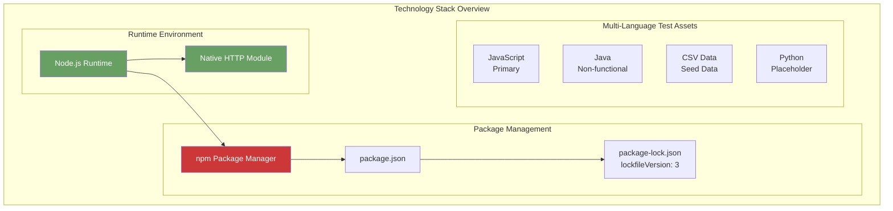

### 3.1.1 Technology Selection Rationale

The technology stack was selected based on the following principles aligned with the project's test fixture purpose:

| Principle | Implementation | Justification |
|-----------|----------------|---------------|
| **Zero Dependencies** | No external packages | Eliminates test variability from third-party code |
| **Native Modules Only** | Node.js built-in `http` module | Ensures consistent behavior across environments |
| **Minimal Footprint** | Single application file | Complete codebase visibility for Backprop analysis |
| **Deterministic Behavior** | Hardcoded configuration | Reproducible test results across iterations |
| **Multi-Language Coverage** | JavaScript, Java, CSV, Python placeholders | Tests Backprop's heterogeneous repository handling |

### 3.1.2 Technology Stack Summary

| Category | Implementation | Status |
|----------|----------------|--------|
| Primary Language | JavaScript (Node.js) | Functional |
| Runtime Environment | Node.js (LTS recommended) | Required |
| HTTP Framework | None (native `http` module) | Intentional |
| Package Manager | npm (v7+) | Configured |
| External Dependencies | **Zero** | By design |
| Database | None | Out of scope |
| Third-Party Services | None | Out of scope |
| Containerization | None | Out of scope |
| CI/CD | Not configured (test fixture for Backprop) | External |

---

## 3.2 Programming Languages

### 3.2.1 Primary Language: JavaScript (Node.js)

The project's functional code is implemented entirely in JavaScript using the Node.js runtime environment.

#### Language Specifications

| Attribute | Value | Evidence |
|-----------|-------|----------|
| Language | JavaScript (ECMAScript) | `server.js` |
| Runtime | Node.js | `require('http')` syntax |
| Module System | CommonJS | `require()` import statements |
| File Extension | `.js` | `server.js` |
| Entry Point (Declared) | `index.js` | `package.json` line 5 |
| Entry Point (Actual) | `server.js` | Core application file |

**Note:** The `package.json` declares `"main": "index.js"`, but no `index.js` file exists in the repository. This intentional mismatch serves as an edge case for testing Backprop's handling of missing file references.

## Node.js Runtime Requirements

| Requirement | Specification | Rationale |
|-------------|---------------|-----------|
| Minimum Version | Node.js 14.x+ | CommonJS and native `http` module support |
| Recommended Version | Node.js 22.x LTS "Jod" or Node.js 24.x LTS "Krypton" | Long-term support with security updates |
| Version Constraint | None specified | No `engines` field in `package.json` |

The project does not specify a required Node.js version via the `engines` field in `package.json`, allowing flexibility for test environments. However, the `package-lock.json` with `lockfileVersion: 3` indicates the project was created or last modified using npm v7 or later (typically bundled with Node.js 16+).

#### JavaScript Features Used

| Feature | Usage | Location |
|---------|-------|----------|
| `require()` | Module import | `server.js` line 1 |
| `const` declaration | Variable binding | `server.js` lines 1, 3-5 |
| Arrow functions | Callback handlers | `server.js` lines 6, 12 |
| Template literals | Not used | N/A |
| `async/await` | Not used | N/A |

### 3.2.2 Secondary Languages (Test Assets)

The repository includes non-JavaScript files to test Backprop's multi-language analysis capabilities:

#### Java (Non-Functional)

| Attribute | Value | Purpose |
|-----------|-------|---------|
| File | `LoginTest.java` | Multi-language coverage testing |
| Status | **Non-functional** | Intentionally incomplete |
| Issue | Incomplete "Web" token | Tests error handling |
| Framework | WebDriver/Selenium (implied) | Scaffold structure |

The `LoginTest.java` file contains an intentionally malformed Java class that will not compile due to an incomplete string or class reference ("Web" token). This tests Backprop's ability to handle broken code gracefully.

#### Python (Placeholder)

| Attribute | Value | Purpose |
|-----------|-------|---------|
| File | `test.py.txt` | File type coverage testing |
| Status | **Empty placeholder** | Tests empty file handling |
| Extension | `.py.txt` (non-standard) | Tests file type detection |

#### Selection Justification

| Language | Justification |
|----------|---------------|
| **JavaScript/Node.js** | Native HTTP server capabilities without framework overhead; built-in module system provides all required functionality |
| **Java (test artifact)** | Validates Backprop's handling of statically-typed languages and compilation errors |
| **Python (placeholder)** | Tests Backprop's multi-language detection and empty file handling |

---

## 3.3 Frameworks & Libraries

### 3.3.1 Framework Strategy: Zero External Frameworks

A critical design decision for this test fixture is the **complete absence of external frameworks**. This approach ensures:

- **Test Isolation:** No framework-specific behaviors that could introduce test variability
- **Complete Visibility:** All code paths are explicitly defined in the repository
- **Minimal Attack Surface:** No third-party code vulnerabilities to manage
- **Deterministic Analysis:** Backprop can analyze the complete codebase without external references

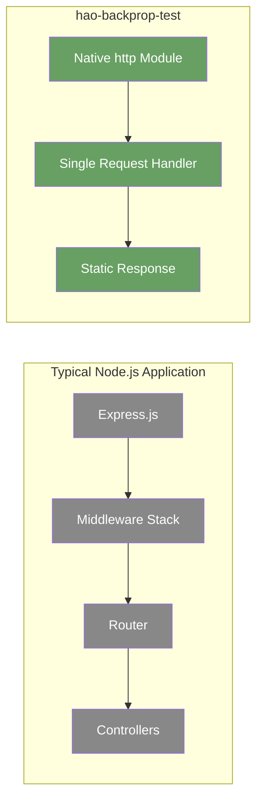

### 3.3.2 Native Module Implementation

| Module | Source | Version | Purpose |
|--------|--------|---------|---------|
| `http` | Node.js built-in | Runtime-dependent | HTTP server creation and request handling |

The native `http` module provides:

| Capability | Implementation | Evidence |
|------------|----------------|----------|
| Server Creation | `http.createServer()` | `server.js` line 5 |
| Request Handling | Callback function | `server.js` lines 6-10 |
| Response Writing | `res.writeHead()`, `res.end()` | `server.js` lines 7-9 |
| Port Binding | `server.listen()` | `server.js` line 12 |

### 3.3.3 Explicitly Excluded Frameworks

The following common Node.js frameworks are intentionally **not used**:

| Framework | Category | Exclusion Rationale |
|-----------|----------|---------------------|
| Express.js | Web Framework | Adds routing complexity unnecessary for test fixture |
| Koa | Web Framework | Modern async middleware not required |
| Fastify | Web Framework | Performance optimizations not relevant |
| Hapi | Web Framework | Enterprise features exceed scope |
| NestJS | Application Framework | TypeScript and architecture patterns not needed |
| Socket.io | Real-time | WebSocket functionality out of scope |
| Mongoose/Sequelize | ORM | No database integration |
| Jest/Mocha | Testing | No test framework configured |

### 3.3.4 Compatibility Requirements

| Aspect | Requirement | Status |
|--------|-------------|--------|
| Node.js API Stability | Stable | Native `http` module is mature |
| Breaking Changes Risk | Low | Core APIs rarely change |
| Cross-Platform | Full | Node.js runs on all major platforms |
| Version Lock | Not required | No external dependencies to lock |

---

## 3.4 Open Source Dependencies

### 3.4.1 Dependency Strategy: Zero Dependencies

The repository maintains a **strict zero-dependency policy** as documented in the configuration files.

## package.json Analysis

```
Package Name: hello_world
Version: 1.0.0
Description: Hello world in Node.js
Author: hxu
License: MIT
Dependencies: None
DevDependencies: None
```

The `package.json` file (11 lines) contains no `dependencies` or `devDependencies` fields, confirming the zero-dependency design.

## package-lock.json Analysis

| Attribute | Value | Implication |
|-----------|-------|-------------|
| lockfileVersion | 3 | Created with npm v7+ (likely npm v9) |
| packages | Empty object (`{}`) | Confirms zero installed packages |
| dependencies | Not present | No legacy dependency data |

The `lockfileVersion: 3` format indicates the project was created or modified with npm v7 or later. According to npm documentation, "lockfileVersion: 3" is "the lockfile version used by npm v7, without backwards compatibility affordances."

### 3.4.2 Package Registry Configuration

| Aspect | Configuration |
|--------|---------------|
| Registry | npm (implicit default) |
| Registry URL | https://registry.npmjs.org |
| Private Packages | None |
| Scoped Packages | None |

### 3.4.3 Dependency Audit Status

| Check | Status | Notes |
|-------|--------|-------|
| Known Vulnerabilities | N/A | No dependencies to audit |
| Outdated Packages | N/A | No dependencies to update |
| License Compliance | MIT (project only) | No third-party licenses |
| SBOM Generation | Trivial | Single package (self) |

### 3.4.4 Justification for Zero Dependencies

| Benefit | Description |
|---------|-------------|
| **Security** | No supply chain attack vectors from third-party packages |
| **Reproducibility** | Identical behavior across all environments regardless of package versions |
| **Auditability** | Complete codebase inspection without external code review |
| **Test Isolation** | Backprop analyzes only repository code without framework abstractions |
| **Maintenance** | No dependency updates or vulnerability patches required |

---

## 3.5 Third-Party Services

### 3.5.1 Service Integration Strategy: None

The hao-backprop-test repository operates in **complete isolation** without any third-party service integrations.

| Integration Category | Status | Rationale |
|----------------------|--------|-----------|
| External APIs | Not implemented | No outbound HTTP calls in codebase |
| Authentication Services | Not implemented | No auth middleware or tokens |
| Cloud Platforms | Not implemented | Localhost-only binding |
| Monitoring/APM | Not implemented | Test fixture doesn't require observability |
| Analytics | Not implemented | No telemetry collection |
| CDN/Asset Delivery | Not implemented | No static assets served |
| Email/SMS | Not implemented | No notification features |
| Payment Processing | Not implemented | No commerce functionality |

### 3.5.2 Explicitly Excluded Services

Per Section 1.3.2 of the Technical Specification, the following integration points are explicitly out of scope:

| Integration Type | Exclusion Reason |
|------------------|------------------|
| External APIs | No business logic requiring external data |
| Message Queues | No async messaging patterns needed |
| Caching Systems | No cache integration (stateless design) |
| Monitoring/APM | No observability tooling for test fixture |

### 3.5.3 Network Architecture

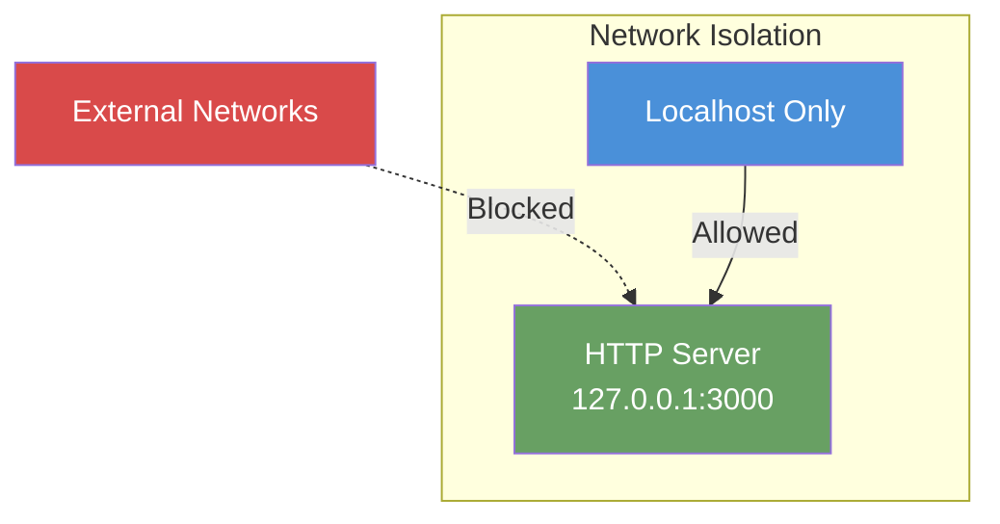

The server is bound exclusively to `127.0.0.1` (localhost), preventing any network exposure to external services or clients.

---

## 3.6 Databases & Storage

### 3.6.1 Persistence Strategy: Stateless Design

The application implements a **completely stateless architecture** with no database or persistent storage.

| Storage Category | Implementation | Status |
|------------------|----------------|--------|
| Primary Database | None | Not implemented |
| Secondary Database | None | Not implemented |
| Caching Layer | None | Not implemented |
| Session Storage | None | Stateless requests |
| File Storage | None (read-only CSV only) | Static test data |
| Object Storage | None | Not implemented |

### 3.6.2 Static Data Asset

The repository contains one static data file:

| Attribute | Value |
|-----------|-------|
| File | `industry.csv` |
| Size | 44 lines (1 header + 43 data rows) |
| Format | Single-column CSV |
| Header | "Industry" |
| Purpose | Test seed data for CSV parsing validation |
| Modification | Read-only (frozen repository) |

#### Industry Categories Sample

The CSV file contains 43 industry classification entries covering domains such as:

| Category Type | Examples |
|---------------|----------|
| Professional Services | Accounting/Finance, Legal, Consulting |
| Technology | Technology, Telecommunications |
| Healthcare | Healthcare, Pharmaceuticals |
| Industrial | Manufacturing/Operations, Transportation/Logistics |
| Public Sector | Government/Military, Non-Profit |
| Fallback | Other |

### 3.6.3 Data Flow Architecture

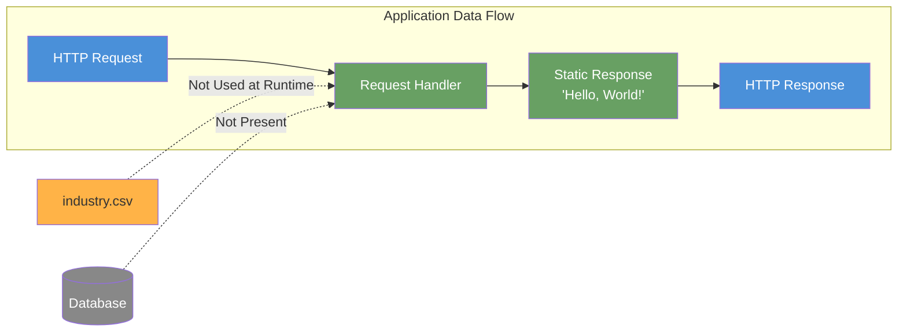

The application does not read `industry.csv` at runtime—it exists purely as a test artifact for Backprop's file type handling validation.

### 3.6.4 Excluded Storage Technologies

| Technology | Category | Exclusion Reason |
|------------|----------|------------------|
| MongoDB | Document Database | Zero dependencies policy |
| PostgreSQL | Relational Database | No data persistence needed |
| Redis | In-Memory Cache | Stateless design |
| SQLite | Embedded Database | No storage requirements |
| S3/Blob Storage | Object Storage | No file upload functionality |
| LocalStorage | Browser Storage | Server-side only |

---

## 3.7 Development & Deployment

### 3.7.1 Development Environment

#### Package Management

| Tool | Version | Configuration |
|------|---------|---------------|
| npm | v7+ (lockfileVersion 3 indicates v9+) | Default configuration |
| yarn | Not used | npm preferred |
| pnpm | Not used | npm preferred |

#### npm Scripts

The `package.json` defines minimal npm scripts:

| Script | Command | Purpose |
|--------|---------|---------|
| `test` | `echo "Error: no test specified" && exit 1` | Placeholder (no tests implemented) |
| `start` | Not defined | Manual execution required |

#### Server Execution

To run the server:

```bash
node server.js
```

Expected output:
```
Server running at http://127.0.0.1:3000/
```

### 3.7.2 Build System

| Aspect | Status | Notes |
|--------|--------|-------|
| Transpilation | Not required | Pure JavaScript (no TypeScript/Babel) |
| Bundling | Not required | Single-file application |
| Minification | Not required | Development/test environment only |
| Asset Compilation | Not required | No static assets |
| Type Checking | Not configured | No TypeScript integration |

The project requires **no build process**—the source code runs directly via the Node.js runtime.

### 3.7.3 Containerization

| Technology | Status | Rationale |
|------------|--------|-----------|
| Docker | Not implemented | Localhost binding incompatible with container networking |
| Kubernetes | Not applicable | No containerization base |
| Docker Compose | Not applicable | Single process, no orchestration needed |

The localhost-only binding (`127.0.0.1`) prevents containerization without code modification, which is prohibited per the "Do not touch!" directive in `README.md`.

### 3.7.4 CI/CD Integration

| Aspect | Configuration |
|--------|---------------|
| CI/CD Pipeline | Not defined in repository |
| GitHub Actions | No workflow files present |
| Test Automation | None (test script is placeholder) |
| Deployment Automation | None |

**Note:** While the repository does not contain CI/CD configuration, it serves as a **test fixture for Backprop CI/CD validation**. The Backprop tool itself consumes this repository during its CI/CD pipeline testing.

### 3.7.5 Development Constraints

Per Section 2.7.2 of the Technical Specification:

| ID | Constraint | Source | Implication |
|----|------------|--------|-------------|
| C-001 | No code modifications | README.md "Do not touch!" | Frozen repository state |
| C-002 | Zero external dependencies | Design decision | No package additions allowed |
| C-003 | Localhost-only binding | Security isolation | Cannot bind to 0.0.0.0 |
| C-004 | Single-file implementation | Simplicity requirement | No refactoring to multiple files |

### 3.7.6 Version Control

| Attribute | Value |
|-----------|-------|
| VCS | Git |
| Repository Status | Frozen (stable test baseline) |
| Branching Strategy | Not specified (test fixture) |
| Protected Files | All (no modifications permitted) |

---

## 3.8 Server Configuration

### 3.8.1 Hardcoded Configuration Values

All configuration is embedded directly in `server.js` with no external configuration files or environment variable support:

| Parameter | Value | Line | Modifiable |
|-----------|-------|------|------------|
| `hostname` | `'127.0.0.1'` | 3 | No (frozen) |
| `port` | `3000` | 4 | No (frozen) |
| Content-Type | `'text/plain'` | 8 | No (frozen) |
| HTTP Status | `200` | 7 | No (frozen) |
| Response Body | `'Hello, World!\n'` | 9 | No (frozen) |

### 3.8.2 Protocol Configuration

| Aspect | Configuration | Security Implication |
|--------|---------------|----------------------|
| Protocol | HTTP only | No encryption (acceptable for localhost test) |
| TLS/HTTPS | Not implemented | Not required for localhost |
| HTTP/2 | Not implemented | Basic HTTP/1.1 only |

### 3.8.3 Performance Targets

| KPI | Target | Rationale |
|-----|--------|-----------|
| Startup Time | < 1 second | Minimal initialization overhead |
| Response Latency | < 10ms | No processing logic |
| Memory Footprint | < 50MB | Zero dependencies, no caching |
| Code Coverage | 100% analyzable | Complete codebase visibility |

---

## 3.9 Security Considerations

### 3.9.1 Security Posture

| Security Aspect | Implementation | Assessment |
|-----------------|----------------|------------|
| Network Exposure | Localhost-only binding | **Mitigated** |
| Protocol Security | HTTP (no TLS) | Acceptable for test fixture |
| Input Validation | None (all input ignored) | N/A (static responses) |
| Authentication | None | Not required |
| Authorization | None | Not required |
| Data Sensitivity | Low (public industry names) | No PII or secrets |

### 3.9.2 Supply Chain Security

| Risk Factor | Status | Notes |
|-------------|--------|-------|
| Third-party Vulnerabilities | **None** | Zero dependencies |
| Dependency Confusion | **Not applicable** | No dependencies |
| Malicious Packages | **Not applicable** | No packages installed |
| License Compliance | MIT only | Self-contained |

### 3.9.3 Security Limitations

The following security measures are explicitly **not implemented** (appropriate for test fixture scope):

- TLS/SSL encryption
- Authentication mechanisms
- Authorization controls
- Rate limiting
- Input sanitization
- CORS configuration
- Security headers
- Logging/audit trails

---

## 3.10 License Information

### 3.10.1 Project License

| Attribute | Value | Source |
|-----------|-------|--------|
| License | MIT | `package.json` line 10 |
| Author | hxu | `package.json` line 9 |
| Package Name | hello_world | `package.json` line 2 |
| Version | 1.0.0 | `package.json` line 3 |

### 3.10.2 Dependency Licenses

| Category | Count | Notes |
|----------|-------|-------|
| Direct Dependencies | 0 | No dependencies |
| Transitive Dependencies | 0 | No dependencies |
| License Conflicts | None | Self-contained project |

---

## 3.11 References

### 3.11.1 Repository Files Examined

| File | Relevance to Technology Stack |
|------|-------------------------------|
| `server.js` | Core application implementation; confirms Node.js runtime, native HTTP module usage, and configuration values |
| `package.json` | NPM package metadata; confirms version 1.0.0, MIT license, author hxu, and zero dependencies |
| `package-lock.json` | Dependency lock file; confirms lockfileVersion 3 and empty packages object |
| `LoginTest.java` | Non-functional Java test artifact; demonstrates multi-language support testing |
| `README.md` | Project identification and "Do not touch!" constraint |
| `industry.csv` | Static test seed data file |
| `test.py.txt` | Empty Python placeholder file |
| `test.txt.txt` | Empty text placeholder file |

### 3.11.2 Technical Specification Sections Referenced

- Section 1.1 Executive Summary - Project overview and stakeholder context
- Section 1.2 System Overview - Technical architecture and configuration values
- Section 1.3 Scope - In-scope and out-of-scope elements
- Section 2.4 Implementation Considerations - Technical constraints and performance requirements
- Section 2.7 Assumptions and Constraints - Runtime assumptions and frozen repository constraints
- Section 2.8 References - Complete file reference list

### 3.11.3 External Resources Consulted

- Node.js Release Schedule (nodejs.org) - LTS version information for Node.js 22 "Jod" and Node.js 24 "Krypton"
- npm Documentation (docs.npmjs.com) - package-lock.json lockfileVersion specifications
- Node.js Previous Releases (nodejs.org) - LTS lifecycle and support timeline information

# 4. Process Flowchart

## 4.1 Overview

### 4.1.1 Introduction to System Workflows

The hao-backprop-test repository implements a deliberately minimal set of workflows designed to support Backprop integration testing. As a test fixture, the system prioritizes predictability and simplicity over complexity, resulting in straightforward, linear process flows with minimal decision points and no error handling branches.

This section documents all workflows present in the system, providing visual representations through Mermaid.js diagrams that illustrate the complete operational behavior of the HTTP server and its supporting components.

### 4.1.2 Workflow Characteristics

The system's workflows exhibit the following intentional characteristics:

| Characteristic | Description | Rationale |
|----------------|-------------|-----------|
| **Linear Flow** | All processes follow single-path execution | Ensures deterministic behavior for testing |
| **No Branching Logic** | No conditional routing or method differentiation | Simplifies test validation |
| **Stateless Operation** | No persistence or session management | Eliminates state-related complexity |
| **Zero Error Handling** | No try/catch blocks or recovery mechanisms | Appropriate for controlled test environment |
| **Single Response Pattern** | All requests return identical response | Provides consistent test baseline |

### 4.1.3 Workflow Inventory

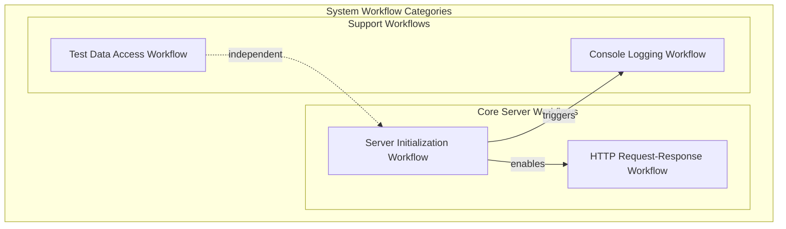

| Workflow ID | Name | Features Involved | Complexity |
|-------------|------|-------------------|------------|
| WF-001 | Server Initialization | F-001, F-003 | Low |
| WF-002 | HTTP Request-Response | F-002 | Low |
| WF-003 | Console Logging | F-003 | Low |
| WF-004 | Test Data Provision | F-004 | Low |

---

## 4.2 High-Level System Workflow

### 4.2.1 End-to-End System Flow

The following diagram illustrates the complete end-to-end system workflow from process start to request handling:

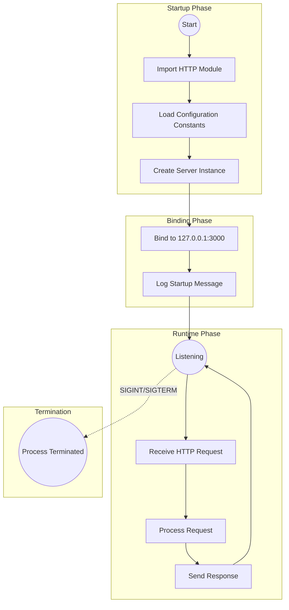

### 4.2.2 Actor Interaction Overview

The system involves three primary actors across the complete workflow:

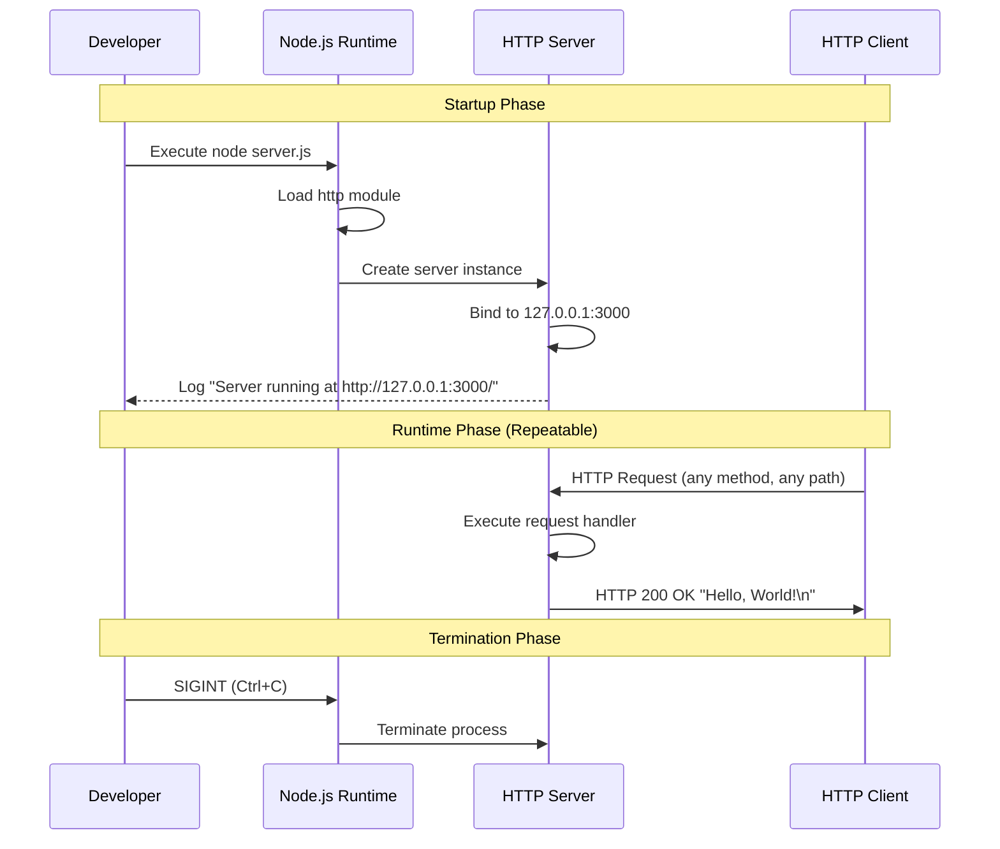

### 4.2.3 System Boundaries

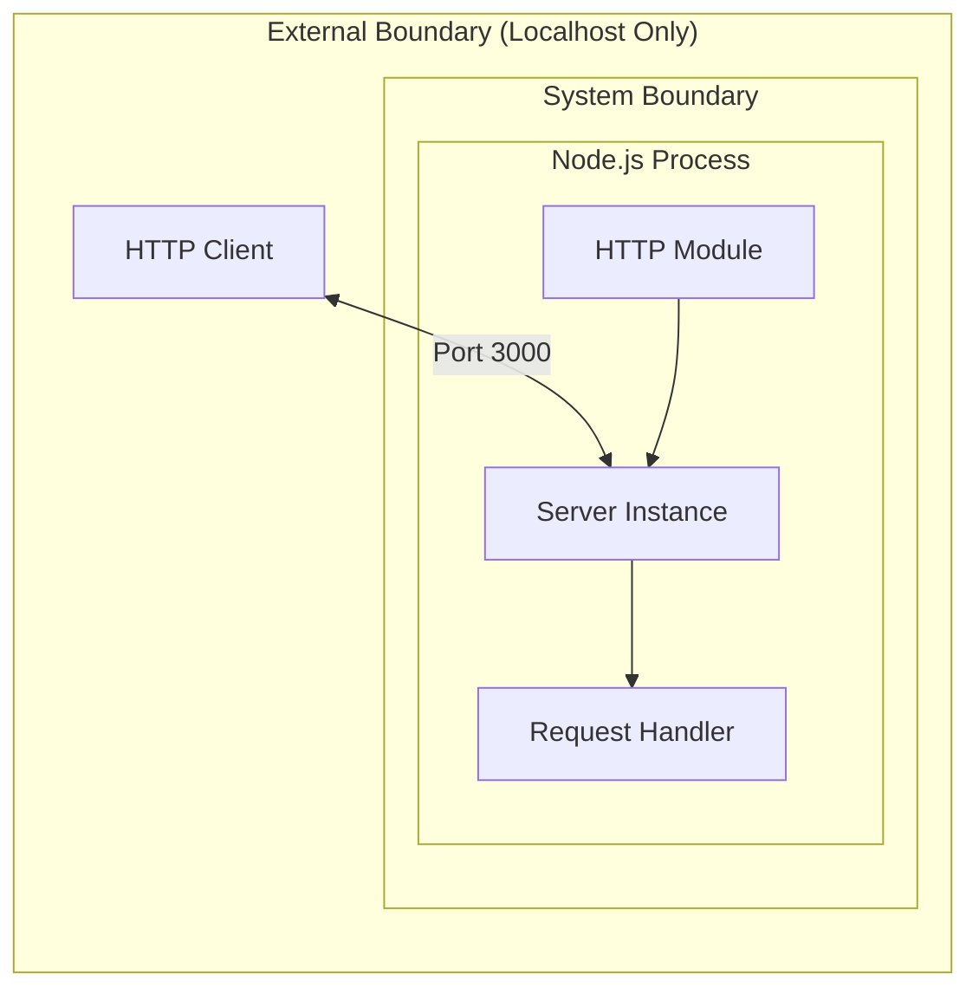

| Boundary Type | Definition | Constraint |
|---------------|------------|------------|
| Network Boundary | 127.0.0.1 only | No remote connections |
| Protocol Boundary | HTTP on port 3000 | No HTTPS, no alternative ports |
| Process Boundary | Single Node.js process | No clustering or child processes |

---

## 4.3 Server Initialization Workflow

### 4.3.1 Detailed Initialization Flow

The server initialization workflow (WF-001) executes once at process startup and establishes the HTTP server infrastructure.

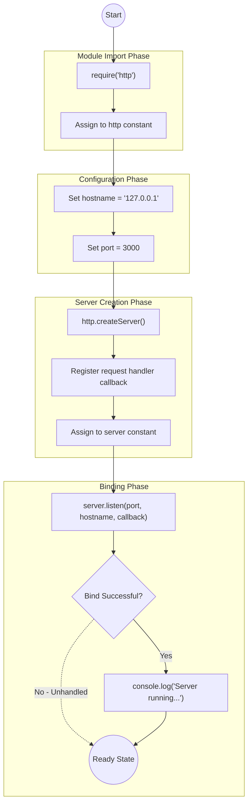

### 4.3.2 Initialization Step Details

| Step | Code Reference | Action | Output |
|------|----------------|--------|--------|
| 1 | `server.js:1` | Import HTTP module | `http` constant |
| 2 | `server.js:3` | Configure hostname | `'127.0.0.1'` |
| 3 | `server.js:4` | Configure port | `3000` |
| 4 | `server.js:6-10` | Create server with handler | `server` instance |
| 5 | `server.js:12` | Initiate listening | Port binding |
| 6 | `server.js:13` | Log success message | Console output |

### 4.3.3 Timing Specifications

```mermaid
gantt
    dateFormat ss
    axisFormat %S
    title Server Initialization Timeline
    
    section Module Loading
    Import HTTP Module       :import, 00, 01
    
    section Configuration
    Set Constants           :config, 01, 02
    
    section Server Creation
    Create Server Instance  :create, 02, 03
    
    section Binding
    Bind to Port            :bind, 03, 04
    Log Success             :log, 04, 05
```

| Phase | Target Duration | Performance Criteria |
|-------|-----------------|----------------------|
| Module Loading | < 100ms | Native module, no network |
| Configuration | < 1ms | Variable assignment only |
| Server Creation | < 50ms | Memory allocation |
| Port Binding | < 500ms | OS-level operation |
| **Total Startup** | **< 1 second** | KPI target |

---

## 4.4 HTTP Request-Response Workflow

### 4.4.1 Request Processing Flow

The HTTP request-response workflow (WF-002) executes for every incoming HTTP request, regardless of method, path, or headers.

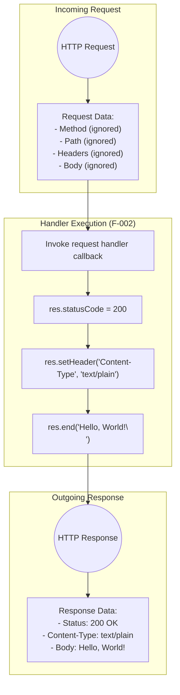

### 4.4.2 Request Handler Sequence

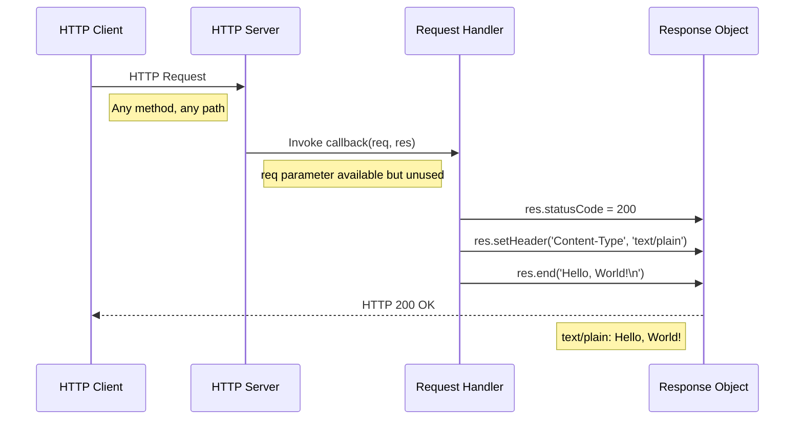

### 4.4.3 Method-Agnostic Behavior

The system treats all HTTP methods identically with no routing differentiation:

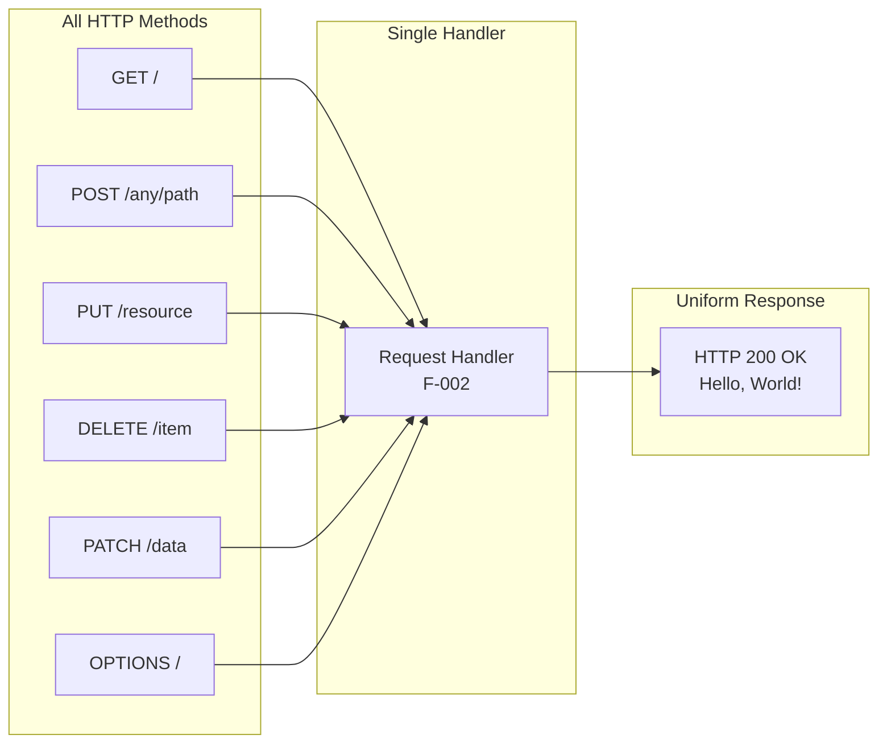

| Input Variation | Handling | Output |
|-----------------|----------|--------|
| GET / | Processed by F-002 | 200 OK "Hello, World!\n" |
| POST /api/data | Processed by F-002 | 200 OK "Hello, World!\n" |
| PUT /resource/123 | Processed by F-002 | 200 OK "Hello, World!\n" |
| DELETE /item | Processed by F-002 | 200 OK "Hello, World!\n" |
| Invalid Method | Processed by F-002 | 200 OK "Hello, World!\n" |

### 4.4.4 Response Construction

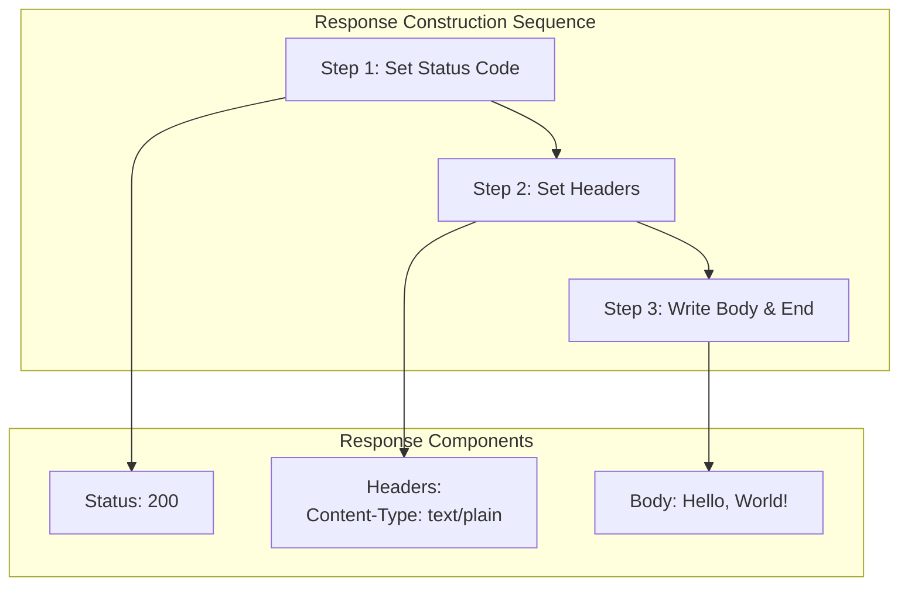

| Component | Value | Source |
|-----------|-------|--------|
| HTTP Status | 200 | `server.js:7` |
| Content-Type | text/plain | `server.js:8` |
| Response Body | Hello, World!\n | `server.js:9` |

---

## 4.5 State Transition Diagrams

### 4.5.1 Server State Machine

The HTTP server operates as a simple state machine with four distinct states:

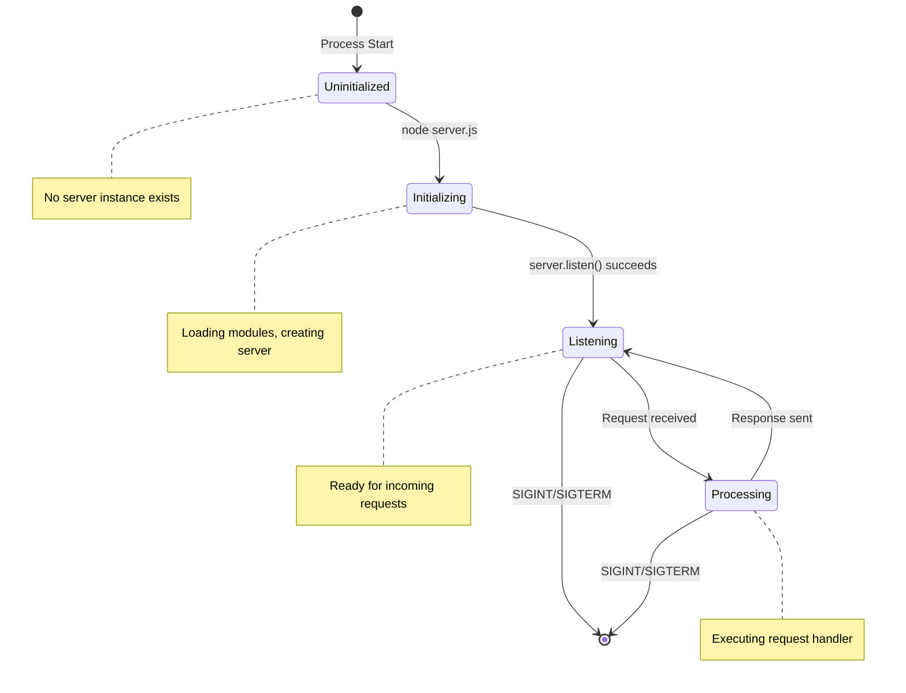

### 4.5.2 State Definitions

| State | Description | Entry Condition | Exit Condition |
|-------|-------------|-----------------|----------------|
| **Uninitialized** | Process not yet started | N/A | `node server.js` executed |
| **Initializing** | Loading modules, creating server | Execution begins | `server.listen()` callback fires |
| **Listening** | Ready to accept HTTP requests | Port binding complete | Request received or termination signal |
| **Processing** | Executing request handler | HTTP request arrives | `res.end()` called |
| **Terminated** | Process ended | SIGINT/SIGTERM received | N/A |

### 4.5.3 State Persistence

**Critical Note:** This system implements **no state persistence**. All state is ephemeral and exists only in memory during process execution.

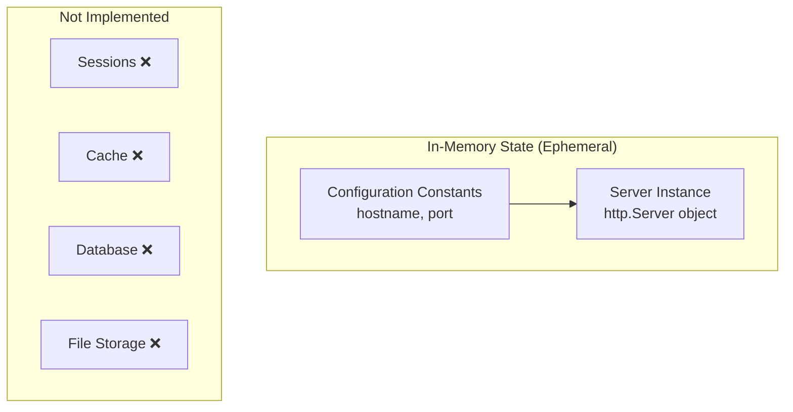

| State Aspect | Implementation | Notes |
|--------------|----------------|-------|
| Session Management | Not implemented | Stateless request handling |
| Caching | Not implemented | Fresh response per request |
| Data Persistence | Not implemented | No database or file storage |
| Request Context | Not preserved | Each request independent |

---

## 4.6 Integration Workflows

### 4.6.1 Integration Architecture

The system implements **no external integrations** by design. The following diagram documents this intentional absence:

```mermaid
flowchart TB
    subgraph SystemBoundary["hao-backprop-test Boundary"]
        SERVER[HTTP Server<br/>server.js]
    end
    
    subgraph NotImplemented["Integration Points - Not Implemented"]
        API["External APIs ❌"]
        MQ["Message Queues ❌"]
        DB["Databases ❌"]
        CACHE["Caching Systems ❌"]
        MON["Monitoring/APM ❌"]
        AUTH["Auth Services ❌"]
    end
    
    SERVER -.->|No Connection| API
    SERVER -.->|No Connection| MQ
    SERVER -.->|No Connection| DB
    SERVER -.->|No Connection| CACHE
    SERVER -.->|No Connection| MON
    SERVER -.->|No Connection| AUTH
```

### 4.6.2 Backprop Integration Context

While the system has no runtime integrations, it serves as a test subject for Backprop tool analysis:

```mermaid
sequenceDiagram
    participant Backprop as Backprop Tool
    participant Repo as Repository
    participant Server as HTTP Server
    
    Note over Backprop,Server: Static Analysis Phase
    Backprop->>Repo: Scan repository contents
    Repo-->>Backprop: Return file inventory
    Backprop->>Repo: Analyze server.js
    Repo-->>Backprop: Return code structure
    
    Note over Backprop,Server: Optional Runtime Phase
    Backprop->>Server: Execute node server.js
    Server-->>Backprop: Console output
    Backprop->>Server: HTTP GET request
    Server-->>Backprop: 200 OK response
```

| Integration Type | Status | Evidence |
|------------------|--------|----------|
| External APIs | Not implemented | No outbound HTTP calls in `server.js` |
| Message Queues | Not implemented | No messaging dependencies |
| Databases | Not implemented | No database drivers |
| Caching Systems | Not implemented | No cache integration |
| Monitoring/APM | Not implemented | No observability tooling |
| Authentication | Not implemented | No auth middleware |

---

## 4.7 Error Handling Flowcharts

### 4.7.1 Error Handling Architecture

**Critical Note:** This system implements **no error handling mechanisms**. This is intentional for the test fixture scope.

```mermaid
flowchart TB
    subgraph CurrentImplementation["Current Implementation"]
        REQUEST[HTTP Request]
        HANDLER[Request Handler]
        RESPONSE[HTTP Response]
        
        REQUEST --> HANDLER
        HANDLER --> RESPONSE
    end
    
    subgraph NotImplemented["Error Handling - Not Implemented"]
        TRY["try/catch Blocks ❌"]
        ERR_EVENT["server.on('error') ❌"]
        RETRY["Retry Logic ❌"]
        FALLBACK["Fallback Responses ❌"]
        NOTIFY["Error Notification ❌"]
        RECOVERY["Recovery Procedures ❌"]
    end
```

### 4.7.2 Unhandled Error Scenarios

The following scenarios have no explicit handling and rely on Node.js default behavior:

```mermaid
flowchart TB
    subgraph ErrorScenarios["Potential Error Scenarios"]
        E1["Port 3000 Already in Use"]
        E2["Permission Denied on Bind"]
        E3["Network Interface Unavailable"]
        E4["Process Memory Exhaustion"]
    end
    
    subgraph Behavior["Default Node.js Behavior"]
        CRASH["Process Crash<br/>No graceful handling"]
        STDERR["Error to stderr"]
    end
    
    E1 --> CRASH
    E2 --> CRASH
    E3 --> CRASH
    E4 --> CRASH
    CRASH --> STDERR
```

| Error Scenario | Handling Status | Expected Behavior |
|----------------|-----------------|-------------------|
| Port in use (EADDRINUSE) | Not handled | Process crash with error |
| Permission denied (EACCES) | Not handled | Process crash with error |
| Network unavailable | Not handled | Process crash with error |
| Invalid request | Not applicable | All requests succeed |
| Malformed headers | Not applicable | Parsed by Node.js HTTP module |

### 4.7.3 Error State Diagram

```mermaid
stateDiagram-v2
    [*] --> Normal: Process Start
    
    Normal --> Normal: Successful Request
    Normal --> Crashed: Unhandled Exception
    
    Crashed --> [*]: Process Exit
    
    note right of Normal: All requests return 200 OK
    note right of Crashed: No recovery mechanism
```

---

## 4.8 Decision Points Analysis

### 4.8.1 Decision Point Inventory

**Critical Finding:** The system contains **no decision points** in its request handling logic. All execution follows a single deterministic path.

```mermaid
flowchart TB
    subgraph NoDecisions["Absent Decision Points"]
        D1["Route Selection ❌<br/>All paths → same handler"]
        D2["Method Filtering ❌<br/>All methods → same response"]
        D3["Authentication ❌<br/>No auth checks"]
        D4["Authorization ❌<br/>No permission checks"]
        D5["Input Validation ❌<br/>Input ignored"]
        D6["Feature Flags ❌<br/>No conditional features"]
    end
```

### 4.8.2 Comparison: Typical vs. Implemented

```mermaid
flowchart TB
    subgraph TypicalFlow["Typical HTTP Server Flow"]
        T_REQ[Request]
        T_AUTH{Authenticated?}
        T_ROUTE{Route Match?}
        T_VALID{Valid Input?}
        T_PROCESS[Process]
        T_RES[Response]
        T_ERR[Error Response]
        
        T_REQ --> T_AUTH
        T_AUTH -->|Yes| T_ROUTE
        T_AUTH -->|No| T_ERR
        T_ROUTE -->|Yes| T_VALID
        T_ROUTE -->|No| T_ERR
        T_VALID -->|Yes| T_PROCESS
        T_VALID -->|No| T_ERR
        T_PROCESS --> T_RES
    end
    
    subgraph ImplementedFlow["Implemented Flow (This System)"]
        I_REQ[Request]
        I_PROCESS[Process]
        I_RES[Response: 200 OK]
        
        I_REQ --> I_PROCESS
        I_PROCESS --> I_RES
    end
```

---

## 4.9 Validation Rules Workflow

### 4.9.1 Server Initialization Validation

```mermaid
flowchart TB
    subgraph F001Validation["F-001 Validation Rules"]
        V1["Rule: Server must bind before handling requests"]
        V2["Enforcement: listen() callback fires only on success"]
        V3["Validation: Localhost-only binding (127.0.0.1)"]
    end
    
    subgraph Outcome["Validation Outcome"]
        SUCCESS["Bind successful → Log message → Accept requests"]
        FAIL["Bind failed → Process crash (unhandled)"]
    end
    
    V1 --> SUCCESS
    V2 --> SUCCESS
    V3 --> SUCCESS
    V1 -.-> FAIL
```

### 4.9.2 Request Handling Validation

```mermaid
flowchart TB
    subgraph F002Validation["F-002 Validation Rules"]
        R1["Business Rule: All requests receive identical response"]
        R2["Data Validation: N/A - Input ignored"]
        R3["Security: None implemented"]
    end
    
    subgraph Application["Rule Application"]
        ALWAYS["Always returns HTTP 200"]
        NEVER["Never returns error codes"]
    end
    
    R1 --> ALWAYS
    R2 --> ALWAYS
    R3 --> ALWAYS
    ALWAYS --> NEVER
```

### 4.9.3 Validation Rules Summary

| Feature | Rule Type | Specification | Enforcement |
|---------|-----------|---------------|-------------|
| F-001 | Business Rule | Server binds before handling | Built-in to server.listen() |
| F-001 | Security | Localhost-only binding | Hardcoded hostname |
| F-002 | Business Rule | Uniform response | No conditional logic |
| F-002 | Data Validation | N/A | Input ignored |
| F-003 | Business Rule | Log once per startup | Callback execution |
| F-004 | Data Validation | No empty entries | Static file content |

---

## 4.10 Performance and Timing Workflow

### 4.10.1 Request Latency Flow

```mermaid
flowchart LR
    subgraph Timing["Request Processing Timeline"]
        direction LR
        T1["Request<br/>Received"]
        T2["Handler<br/>Invoked"]
        T3["Status<br/>Set"]
        T4["Headers<br/>Set"]
        T5["Body<br/>Written"]
        T6["Response<br/>Sent"]
    end
    
    T1 -->|< 1ms| T2
    T2 -->|< 1ms| T3
    T3 -->|< 1ms| T4
    T4 -->|< 1ms| T5
    T5 -->|< 1ms| T6
    
    T1 -.->|Total: < 10ms| T6
```

### 4.10.2 Performance Targets

| Workflow | Metric | Target | Rationale |
|----------|--------|--------|-----------|
| Server Initialization | Startup Time | < 1 second | Minimal initialization overhead |
| Request Processing | Response Latency | < 10ms | No processing logic |
| Memory Usage | Footprint | < 50MB | Zero dependencies |

---

## 4.11 Complete System Workflow Summary

### 4.11.1 Consolidated Workflow Diagram

```mermaid
flowchart TB
    subgraph Lifecycle["Complete Server Lifecycle"]
        START((Start))
        
        subgraph Init["Initialization (WF-001)"]
            I1[Load HTTP Module]
            I2[Configure Constants]
            I3[Create Server]
            I4[Bind to Port]
            I5[Log Success]
        end
        
        subgraph Runtime["Runtime Loop (WF-002)"]
            LISTEN((Listening))
            R1[Receive Request]
            R2[Execute Handler]
            R3[Set Status 200]
            R4[Set Content-Type]
            R5[Send Body]
        end
        
        TERMINATE((Terminated))
    end
    
    START --> I1
    I1 --> I2
    I2 --> I3
    I3 --> I4
    I4 --> I5
    I5 --> LISTEN
    LISTEN --> R1
    R1 --> R2
    R2 --> R3
    R3 --> R4
    R4 --> R5
    R5 --> LISTEN
    LISTEN -.->|Signal| TERMINATE
```

### 4.11.2 Workflow Characteristics Matrix

| Workflow | Decision Points | Error Handling | State Changes | External Calls |
|----------|-----------------|----------------|---------------|----------------|
| WF-001: Init | 0 | None | Uninitialized → Listening | None |
| WF-002: Request | 0 | None | Listening ↔ Processing | None |
| WF-003: Logging | 0 | None | None | None |
| WF-004: Test Data | 0 | None | None | None |

### 4.11.3 Design Philosophy

The workflow architecture reflects the system's purpose as a test fixture:

- **Deterministic**: Every execution produces identical results
- **Transparent**: Simple flows enable clear test validation
- **Isolated**: No external dependencies introduce variability
- **Minimal**: Only essential workflows implemented

---

## 4.12 References

### 4.12.1 Source Files Examined

- `server.js` (lines 1-14) - Complete HTTP server implementation containing all workflow logic
- `package.json` - NPM configuration confirming zero runtime dependencies
- `industry.csv` - Static test data file (43 entries) for F-004 workflow

### 4.12.2 Technical Specification Sections Referenced

- Section 1.2 System Overview - High-level architecture and component diagram
- Section 1.3 Scope - In-scope/out-of-scope workflow boundaries
- Section 2.1 Feature Catalog - Feature definitions (F-001 through F-004)
- Section 2.2 Functional Requirements Tables - Validation rules and acceptance criteria
- Section 2.3 Feature Relationships - Feature dependency mapping
- Section 2.4 Implementation Considerations - Technical constraints and limitations
- Section 2.7 Assumptions and Constraints - Operating assumptions
- Section 3.8 Server Configuration - Hardcoded configuration values
- Section 3.9 Security Considerations - Security posture documentation

### 4.12.3 Design Decisions

| Decision | Rationale | Evidence |
|----------|-----------|----------|
| No routing logic | Test fixture simplicity | Single handler in `server.js:6-10` |
| No error handling | Controlled test environment | No try/catch blocks present |
| Stateless operation | Deterministic test behavior | No persistence mechanisms |
| Single-path execution | Reproducible test outcomes | No conditional statements |

# 5. System Architecture

## 5.1 High-Level Architecture

### 5.1.1 System Overview

#### Architectural Style and Rationale

The hao-backprop-test repository implements a **minimal monolithic architecture** using a single-file, zero-dependency design pattern. This architectural style was deliberately selected to serve the system's primary purpose as a controlled test fixture for Backprop integration testing.

The architecture follows these core principles:

| Principle | Implementation | Rationale |
|-----------|----------------|-----------|
| **Simplicity** | Single 14-line `server.js` file | Enables complete codebase visibility for analysis tools |
| **Determinism** | Hardcoded configuration values | Ensures consistent, reproducible behavior across test executions |
| **Zero Dependencies** | Native Node.js `http` module only | Eliminates environmental variability and supply chain risks |
| **Statelessness** | No session, cache, or database | Each request is independent, simplifying test assertions |
| **Linear Flow** | No branching logic | All requests receive identical treatment |

**Architectural Justification:**
The system intentionally avoids common enterprise patterns (microservices, layered architecture, event-driven design) because they would introduce complexity that contradicts the test fixture's purpose. The flat, transparent architecture allows Backprop to perform comprehensive code analysis with complete visibility into all execution paths.

#### Key Architectural Patterns

| Pattern | Application | Evidence |
|---------|-------------|----------|
| **Event-Driven I/O** | Node.js event loop handles HTTP requests | `http.createServer()` callback pattern |
| **Request-Response** | Synchronous HTTP request handling | Single callback processes all requests |
| **Callback Pattern** | Native Node.js callback conventions | Arrow functions in `server.js` lines 6, 12 |

#### System Boundaries

The system operates within clearly defined boundaries that restrict its scope and exposure:

```mermaid
flowchart TB
    subgraph ExternalBoundary["External Boundary"]
        subgraph NetworkBoundary["Network Boundary: localhost only"]
            subgraph ProcessBoundary["Process Boundary: Single Node.js Process"]
                subgraph ApplicationBoundary["Application Boundary"]
                    HTTP_MODULE["Node.js http Module"]
                    SERVER["HTTP Server Instance"]
                    HANDLER["Request Handler"]
                end
            end
        end
    end
    
    CLIENT["HTTP Client<br/>(Test Consumer)"]
    
    CLIENT -->|"HTTP Request<br/>127.0.0.1:3000"| NetworkBoundary
    HTTP_MODULE --> SERVER
    SERVER --> HANDLER
    HANDLER -->|"HTTP 200 OK"| CLIENT
```

| Boundary Type | Definition | Enforcement Mechanism |
|---------------|------------|----------------------|
| **Network** | Localhost only (127.0.0.1) | Hardcoded hostname in `server.js` line 3 |
| **Protocol** | HTTP on port 3000 | Hardcoded port in `server.js` line 4 |
| **Process** | Single Node.js runtime | No clustering or child processes |
| **Application** | Single-file server | All logic contained in `server.js` |

### 5.1.2 Core Components

The system consists of three logical components contained within a single source file:

| Component Name | Primary Responsibility | Key Dependencies | Integration Points |
|----------------|------------------------|------------------|-------------------|
| **HTTP Server Instance** | Creates and binds HTTP server to localhost:3000 | Node.js native `http` module | Request Handler, Console Logger |
| **Request Handler (F-002)** | Processes all HTTP requests with uniform response | HTTP Server Instance | HTTP response stream |
| **Console Logger (F-003)** | Outputs startup confirmation message | HTTP Server Instance (listen callback) | Standard output (stdout) |

#### Component Interaction Diagram

```mermaid
flowchart TB
    subgraph ServerJS["server.js (14 lines)"]
        subgraph Initialization["Initialization Phase"]
            IMPORT["require('http')<br/>Line 1"]
            CONFIG["Configuration<br/>hostname, port<br/>Lines 3-4"]
        end
        
        subgraph ServerCreation["Server Creation Phase"]
            CREATE["http.createServer()<br/>Line 6"]
            HANDLER["Request Handler Callback<br/>Lines 6-10"]
        end
        
        subgraph Binding["Binding Phase"]
            LISTEN["server.listen()<br/>Line 12"]
            LOG["console.log()<br/>Line 13"]
        end
    end
    
    subgraph Runtime["Runtime Phase"]
        REQUEST["Incoming HTTP Request"]
        RESPONSE["HTTP 200 Response<br/>Hello, World!"]
    end
    
    IMPORT --> CONFIG
    CONFIG --> CREATE
    CREATE --> HANDLER
    CREATE --> LISTEN
    LISTEN --> LOG
    REQUEST --> HANDLER
    HANDLER --> RESPONSE
```

### 5.1.3 Data Flow Architecture

#### Primary Data Flow

The system implements a single, deterministic data flow path for all HTTP requests:

```mermaid
sequenceDiagram
    participant Client as HTTP Client
    participant Server as Node.js HTTP Server
    participant Handler as Request Handler (F-002)
    participant Response as Response Object
    
    Client->>Server: HTTP Request (any method, any path)
    Note over Client,Server: Request data ignored
    
    Server->>Handler: Invoke callback(req, res)
    Note over Handler: req parameter available but unused
    
    Handler->>Response: res.statusCode = 200
    Handler->>Response: res.setHeader('Content-Type', 'text/plain')
    Handler->>Response: res.end('Hello, World!\n')
    
    Response-->>Client: HTTP 200 OK
    Note over Response,Client: Content-Type: text/plain<br/>Body: Hello, World!
```

**Data Flow Characteristics:**

| Aspect | Description |
|--------|-------------|
| **Input Processing** | All request data (method, path, headers, body) is received but ignored |
| **Transformation** | None - response is static and hardcoded |
| **Output Generation** | Fixed response: Status 200, Content-Type text/plain, Body "Hello, World!\n" |
| **Data Stores** | None - no persistence, caching, or session management |

#### Method-Agnostic Request Handling

```mermaid
flowchart LR
    subgraph AllMethods["All HTTP Methods"]
        GET["GET"]
        POST["POST"]
        PUT["PUT"]
        DELETE["DELETE"]
        PATCH["PATCH"]
        OPTIONS["OPTIONS"]
    end
    
    subgraph SingleHandler["Single Handler"]
        HANDLER["Request Handler<br/>(F-002)"]
    end
    
    subgraph UniformResponse["Uniform Response"]
        RESPONSE["HTTP 200 OK<br/>Hello, World!"]
    end
    
    GET --> HANDLER
    POST --> HANDLER
    PUT --> HANDLER
    DELETE --> HANDLER
    PATCH --> HANDLER
    OPTIONS --> HANDLER
    HANDLER --> RESPONSE
```

### 5.1.4 External Integration Points

The system is designed with **no external integrations** for runtime operations. This isolation is intentional to ensure test reproducibility.

| System Name | Integration Type | Status | Rationale |
|-------------|------------------|--------|-----------|
| **Backprop Tool** | Static Analysis Target | Primary Consumer | System exists as test subject |
| **CI/CD Pipelines** | Execution Environment | Supported | Automated test execution |
| **Version Control (Git)** | Repository Management | Active | Change tracking and versioning |
| External APIs | Outbound HTTP | **Not Implemented** | Test isolation |
| Message Queues | Async Messaging | **Not Implemented** | Test isolation |
| Databases | Data Persistence | **Not Implemented** | Test isolation |
| Caching Systems | Performance Optimization | **Not Implemented** | Test isolation |
| Monitoring/APM | Observability | **Not Implemented** | Test fixture scope |

#### Backprop Integration Context

```mermaid
sequenceDiagram
    participant Backprop as Backprop Tool
    participant Repo as Repository
    participant Server as HTTP Server
    
    Note over Backprop,Server: Static Analysis Phase
    Backprop->>Repo: Scan repository contents
    Repo-->>Backprop: Return file inventory
    Backprop->>Repo: Analyze server.js
    Repo-->>Backprop: Return code structure
    
    Note over Backprop,Server: Optional Runtime Phase
    Backprop->>Server: Execute node server.js
    Server-->>Backprop: Console output confirmation
    Backprop->>Server: HTTP GET request
    Server-->>Backprop: 200 OK "Hello, World!"
```

---

## 5.2 Component Details

### 5.2.1 HTTP Server Instance (F-001)

#### Purpose and Responsibilities

The HTTP Server Instance serves as the foundational infrastructure component, responsible for:

- Importing and utilizing the Node.js native `http` module
- Creating the HTTP server with the request handler callback
- Binding to the configured hostname and port
- Managing the server lifecycle (initialization through termination)

#### Technologies and Frameworks

| Technology | Version | Purpose |
|------------|---------|---------|
| Node.js Runtime | 14.x+ (recommended 22.x LTS) | JavaScript execution environment |
| Native `http` Module | Built-in | HTTP server creation and management |
| CommonJS Module System | Built-in | Module import via `require()` |

#### Configuration Parameters

| Parameter | Value | Source Location |
|-----------|-------|-----------------|
| hostname | `'127.0.0.1'` | `server.js` line 3 |
| port | `3000` | `server.js` line 4 |
| Protocol | HTTP (no TLS) | Implicit in `http.createServer()` |

#### Key Interfaces

| Interface | Type | Description |
|-----------|------|-------------|
| `server.listen()` | Method | Binds server to hostname:port |
| Listen Callback | Function | Executes upon successful binding |
| Request Callback | Function | Handles incoming HTTP requests |

#### Scaling Considerations

| Aspect | Current State | Notes |
|--------|---------------|-------|
| Horizontal Scaling | Not Supported | No clustering implementation |
| Vertical Scaling | Limited by Node.js | Single-threaded event loop |
| Load Balancing | Not Applicable | Localhost-only binding |
| Connection Pooling | Default Node.js | No custom configuration |

### 5.2.2 Request Handler (F-002)

#### Purpose and Responsibilities

The Request Handler processes all incoming HTTP requests with uniform treatment:

- Receives HTTP requests through the server callback
- Sets HTTP response status code to 200
- Sets Content-Type header to 'text/plain'
- Writes and terminates response with "Hello, World!\n"

#### Implementation Details

| Aspect | Implementation |
|--------|----------------|
| Handler Type | Arrow function callback |
| Parameters | `(req, res)` - request and response objects |
| Request Usage | `req` parameter available but not used |
| Response Construction | Sequential: statusCode → setHeader → end |

#### Request Processing Sequence

```mermaid
flowchart TB
    subgraph RequestProcessing["Request Handler Execution"]
        RECEIVE["Receive Request<br/>(req, res) parameters"]
        STATUS["Set Status Code<br/>res.statusCode = 200"]
        HEADER["Set Header<br/>res.setHeader('Content-Type', 'text/plain')"]
        BODY["Write Body and End<br/>res.end('Hello, World!\\n')"]
    end
    
    RECEIVE --> STATUS
    STATUS --> HEADER
    HEADER --> BODY
```

#### Response Specification

| Response Element | Value | Line Reference |
|------------------|-------|----------------|
| HTTP Status | 200 OK | `server.js` line 7 |
| Content-Type Header | text/plain | `server.js` line 8 |
| Response Body | Hello, World!\n | `server.js` line 9 |
| Content-Length | Automatically set by Node.js | Implicit |

### 5.2.3 Console Logger (F-003)

#### Purpose and Responsibilities

The Console Logger provides operational feedback during server initialization:

- Outputs startup confirmation upon successful port binding
- Displays the complete URL where the server is accessible
- Uses template literal for dynamic hostname/port insertion

#### Implementation

| Aspect | Value |
|--------|-------|
| Trigger | `server.listen()` callback execution |
| Output Method | `console.log()` |
| Output Format | `Server running at http://${hostname}:${port}/` |
| Expected Output | `Server running at http://127.0.0.1:3000/` |
| Destination | Standard output (stdout) |

---

## 5.3 Technical Decisions

### 5.3.1 Architecture Style Decisions

#### Decision: Native HTTP Module vs. Web Frameworks

| Factor | Native `http` Module | Web Frameworks (Express, Koa, Fastify) |
|--------|---------------------|----------------------------------------|
| **Chosen** | ✅ Yes | ❌ No |
| Dependencies | Zero | Multiple transitive dependencies |
| Code Visibility | 100% analyzable | Framework internals hidden |
| Test Isolation | Complete | Framework behaviors introduce variability |
| Attack Surface | Minimal | Third-party vulnerability exposure |
| Learning Curve | Direct Node.js APIs | Framework-specific patterns |

**Decision Rationale:** The native `http` module provides all required functionality (server creation, request handling, response writing) without introducing external dependencies that would compromise test fixture isolation and reproducibility.

#### Decision: Monolithic Single-File vs. Modular Structure

| Factor | Single-File Monolith | Modular Multi-File |
|--------|---------------------|-------------------|
| **Chosen** | ✅ Yes | ❌ No |
| Codebase Transparency | Maximum (14 lines) | Requires navigation |
| Analysis Complexity | Trivial | Increased |
| Maintenance Scope | Frozen (test fixture) | Not applicable |
| Refactoring Needs | None | Not applicable |

**Decision Rationale:** A single-file implementation maximizes transparency for Backprop's code analysis capabilities and provides a complete codebase view without module resolution complexity.

### 5.3.2 Communication Pattern Choices

#### Decision: HTTP Only (No HTTPS/TLS)

| Factor | HTTP | HTTPS |
|--------|------|-------|
| **Chosen** | ✅ Yes | ❌ No |
| Certificate Management | Not required | Required |
| Test Environment Setup | Simple | Complex |
| Network Scope | localhost only | May need certificates |
| Security Risk | Mitigated by localhost binding | Over-engineered for test fixture |

**Decision Rationale:** HTTP without TLS is appropriate given the localhost-only binding. The test fixture never handles sensitive data or operates on public networks.

### 5.3.3 Data Storage Decisions

#### Decision: Zero Data Persistence

```mermaid
flowchart TB
    subgraph Implemented["Implemented: Stateless Design"]
        REQUEST["Each Request"]
        HANDLER["Request Handler"]
        RESPONSE["Fresh Response"]
    end
    
    subgraph NotImplemented["Not Implemented"]
        SESSION["Sessions ❌"]
        CACHE["Cache ❌"]
        DATABASE["Database ❌"]
        FILES["File Storage ❌"]
    end
    
    REQUEST --> HANDLER
    HANDLER --> RESPONSE
    
    HANDLER -.->|No Connection| SESSION
    HANDLER -.->|No Connection| CACHE
    HANDLER -.->|No Connection| DATABASE
    HANDLER -.->|No Connection| FILES
```

**Decision Rationale:** Data persistence would introduce state that could vary between test executions. The stateless design ensures every request is processed identically, supporting deterministic test assertions.

### 5.3.4 Configuration Strategy Decisions

#### Decision: Hardcoded Configuration vs. Environment Variables

| Configuration Approach | Chosen | Rationale |
|------------------------|--------|-----------|
| Hardcoded Constants | ✅ Yes | Eliminates environment variability |
| Environment Variables | ❌ No | Would introduce configuration drift |
| Configuration Files | ❌ No | Additional complexity without benefit |
| Command Line Arguments | ❌ No | Would complicate test invocation |

**Configuration Values:**

| Parameter | Hardcoded Value | Line Reference |
|-----------|-----------------|----------------|
| hostname | '127.0.0.1' | `server.js` line 3 |
| port | 3000 | `server.js` line 4 |
| Response Body | 'Hello, World!\n' | `server.js` line 9 |
| Content-Type | 'text/plain' | `server.js` line 8 |
| Status Code | 200 | `server.js` line 7 |

### 5.3.5 Architecture Decision Summary

```mermaid
flowchart TB
    subgraph Decisions["Key Architecture Decisions"]
        D1["Use Native http Module<br/>→ Zero dependencies"]
        D2["Single-File Architecture<br/>→ Complete visibility"]
        D3["HTTP Only<br/>→ Simplified testing"]
        D4["No Data Persistence<br/>→ Deterministic behavior"]
        D5["Hardcoded Config<br/>→ No environment drift"]
        D6["Localhost Binding<br/>→ Network isolation"]
    end
    
    subgraph Outcomes["Achieved Outcomes"]
        O1["Test Fixture Suitability"]
        O2["Reproducible Results"]
        O3["Complete Analyzability"]
    end
    
    D1 --> O1
    D2 --> O3
    D3 --> O1
    D4 --> O2
    D5 --> O2
    D6 --> O1
```

---

## 5.4 Cross-Cutting Concerns

### 5.4.1 Monitoring and Observability

#### Current Implementation Status

The system implements **minimal observability** appropriate for its test fixture scope:

| Observability Aspect | Status | Implementation |
|---------------------|--------|----------------|
| Startup Logging | ✅ Implemented | Single `console.log()` on successful binding |
| Request Logging | ❌ Not Implemented | No request tracking |
| Error Logging | ❌ Not Implemented | Errors go to stderr (default behavior) |
| Performance Metrics | ❌ Not Implemented | No instrumentation |
| Health Checks | ❌ Not Implemented | No dedicated endpoints |
| APM Integration | ❌ Not Implemented | No third-party tools |

**Rationale for Limited Observability:** Comprehensive monitoring would add dependencies and complexity that contradict the test fixture's purpose of providing a minimal, transparent codebase.

### 5.4.2 Logging Strategy

| Log Type | Implementation | Output |
|----------|----------------|--------|
| Startup Confirmation | `console.log()` | `Server running at http://127.0.0.1:3000/` |
| Request Logging | Not Implemented | N/A |
| Error Logging | Default Node.js | Uncaught exceptions to stderr |
| Audit Trail | Not Implemented | N/A |

### 5.4.3 Error Handling Patterns

#### Error Handling Architecture

The system implements **no explicit error handling**, relying on Node.js default behavior:

```mermaid
flowchart TB
    subgraph CurrentDesign["Current Implementation"]
        REQUEST["HTTP Request"]
        HANDLER["Request Handler"]
        RESPONSE["HTTP Response"]
        
        REQUEST --> HANDLER
        HANDLER --> RESPONSE
    end
    
    subgraph NotImplemented["Error Handling - Not Implemented"]
        TRY["try/catch Blocks ❌"]
        ERR_EVENT["server.on('error') ❌"]
        RETRY["Retry Logic ❌"]
        FALLBACK["Fallback Responses ❌"]
        NOTIFY["Error Notification ❌"]
        RECOVERY["Recovery Procedures ❌"]
    end
```

#### Unhandled Error Scenarios

| Error Scenario | Expected Behavior | Handling Status |
|----------------|-------------------|-----------------|
| Port 3000 in use (EADDRINUSE) | Process crash with error to stderr | Not Handled |
| Permission denied (EACCES) | Process crash with error to stderr | Not Handled |
| Network interface unavailable | Process crash with error to stderr | Not Handled |
| Memory exhaustion | Process crash | Not Handled |
| Invalid HTTP request | Handled by Node.js HTTP parser | Default Behavior |

#### Error State Transitions

```mermaid
stateDiagram-v2
    [*] --> Normal: Process Start
    
    Normal --> Normal: Successful Request
    Normal --> Crashed: Unhandled Exception
    
    Crashed --> [*]: Process Exit
    
    note right of Normal: All valid requests return 200 OK
    note right of Crashed: No recovery mechanism exists
```

**Rationale for No Error Handling:** The test fixture operates in controlled environments where error conditions indicate environmental issues rather than application bugs. Complex error handling would obscure the simple codebase that Backprop needs to analyze.

### 5.4.4 Security Framework

#### Security Posture Assessment

| Security Aspect | Implementation | Risk Assessment |
|-----------------|----------------|-----------------|
| **Network Exposure** | Localhost-only binding | **Mitigated** - No external access |
| **Protocol Security** | HTTP (no TLS) | **Acceptable** - Test fixture scope |
| **Authentication** | None | **Not Required** - No protected resources |
| **Authorization** | None | **Not Required** - Single behavior |
| **Input Validation** | None | **N/A** - All input ignored |
| **Rate Limiting** | None | **Not Required** - Local testing only |
| **Security Headers** | None | **Acceptable** - Test fixture scope |

#### Supply Chain Security

| Risk Factor | Status | Evidence |
|-------------|--------|----------|
| Third-party Vulnerabilities | **None** | Zero external dependencies |
| Dependency Confusion | **Not Applicable** | No npm packages installed |
| Malicious Packages | **Not Applicable** | No packages to compromise |
| License Compliance | **MIT Only** | Self-contained repository |

#### Security Limitations (Intentional)

The following security measures are explicitly **not implemented** as appropriate for the test fixture scope:

- TLS/SSL encryption
- Authentication mechanisms
- Authorization controls
- Rate limiting
- Input sanitization
- CORS configuration
- Security headers (CSP, HSTS, etc.)
- Logging/audit trails

### 5.4.5 Performance Requirements

#### Key Performance Indicators

| KPI | Target | Rationale |
|-----|--------|-----------|
| Startup Time | < 1 second | Minimal initialization (native module only) |
| Response Latency | < 10ms | No processing logic |
| Memory Footprint | < 50MB | Zero dependencies, no caching |
| Code Coverage | 100% analyzable | Complete codebase visibility |

#### Performance Timing Flow

```mermaid
flowchart LR
    subgraph Timing["Request Processing Timeline"]
        direction LR
        T1["Request<br/>Received"]
        T2["Handler<br/>Invoked"]
        T3["Status<br/>Set"]
        T4["Headers<br/>Set"]
        T5["Body<br/>Written"]
        T6["Response<br/>Sent"]
    end
    
    T1 -->|"< 1ms"| T2
    T2 -->|"< 1ms"| T3
    T3 -->|"< 1ms"| T4
    T4 -->|"< 1ms"| T5
    T5 -->|"< 1ms"| T6
```

#### Initialization Performance

| Phase | Target Duration | Performance Factor |
|-------|-----------------|-------------------|
| Module Loading | < 100ms | Native module, no network I/O |
| Configuration | < 1ms | Variable assignment only |
| Server Creation | < 50ms | Memory allocation |
| Port Binding | < 500ms | OS-level operation |
| **Total Startup** | **< 1 second** | KPI target |

### 5.4.6 State Management

#### State Transition Diagram

```mermaid
stateDiagram-v2
    [*] --> Uninitialized: Process Start
    
    Uninitialized --> Initializing: node server.js
    
    Initializing --> Listening: server.listen() succeeds
    
    Listening --> Processing: Request received
    
    Processing --> Listening: Response sent
    
    Listening --> [*]: SIGINT/SIGTERM
    Processing --> [*]: SIGINT/SIGTERM
```

#### State Definitions

| State | Description | Entry Condition | Exit Condition |
|-------|-------------|-----------------|----------------|
| **Uninitialized** | Process not started | N/A | `node server.js` executed |
| **Initializing** | Loading modules, creating server | Execution begins | `server.listen()` callback fires |
| **Listening** | Ready to accept HTTP requests | Port binding complete | Request received or termination signal |
| **Processing** | Executing request handler | HTTP request arrives | `res.end()` called |
| **Terminated** | Process ended | SIGINT/SIGTERM received | N/A |

#### State Persistence

**Critical Note:** This system implements **no state persistence**. All state is ephemeral and exists only in memory during process execution.

| State Aspect | Implementation | Notes |
|--------------|----------------|-------|
| Session Management | Not implemented | Stateless request handling |
| Caching | Not implemented | Fresh response per request |
| Data Persistence | Not implemented | No database or file storage |
| Request Context | Not preserved | Each request is independent |

### 5.4.7 Disaster Recovery

Given the test fixture nature of this system, traditional disaster recovery procedures are not applicable:

| DR Aspect | Status | Rationale |
|-----------|--------|-----------|
| Data Backup | N/A | No persistent data |
| Failover | N/A | Single-instance test fixture |
| Recovery Point Objective | N/A | Stateless operation |
| Recovery Time Objective | ~1 second | Simply restart process |

**Recovery Procedure:** In case of process failure, restart with `node server.js`. No data loss is possible as the system maintains no persistent state.

---

## 5.5 Architectural Assumptions and Constraints

### 5.5.1 Assumptions

| Assumption | Impact | Validation |
|------------|--------|------------|
| Node.js 14+ is available | Server can execute | Check runtime version |
| Port 3000 is available | Server can bind | EADDRINUSE if not |
| localhost is resolvable | Network binding works | Standard on all platforms |
| Test fixture scope is permanent | No production deployment | README.md "Do not touch!" notice |

### 5.5.2 Constraints

| Constraint | Type | Enforcement |
|------------|------|-------------|
| Localhost-only access | Network | Hardcoded 127.0.0.1 |
| HTTP-only (no TLS) | Protocol | No certificate configuration |
| Single-threaded | Runtime | Node.js event loop |
| Zero external dependencies | Design | Empty package.json dependencies |
| Frozen codebase | Operational | "Do not touch!" documentation |

---

## 5.6 References

### 5.6.1 Source Files Examined

| File | Relevance |
|------|-----------|
| `server.js` | Core HTTP server implementation - primary architecture component (14 lines) |
| `package.json` | NPM package configuration - confirms zero dependencies |
| `package-lock.json` | Dependency lock file - confirms empty dependency tree |
| `README.md` | Project documentation - confirms test fixture purpose and "Do not touch!" directive |

### 5.6.2 Technical Specification Sections Referenced

- Section 1.1 Executive Summary - Project overview and purpose
- Section 1.2 System Overview - High-level architecture description
- Section 2.1 Feature Catalog - Feature definitions (F-001, F-002, F-003, F-004)
- Section 3.3 Frameworks & Libraries - Zero-framework rationale
- Section 3.9 Security Considerations - Security posture assessment
- Section 4.3 Server Initialization Workflow - Startup sequence details
- Section 4.4 HTTP Request-Response Workflow - Request handling flow
- Section 4.5 State Transition Diagrams - Server state machine
- Section 4.6 Integration Workflows - External integration documentation
- Section 4.7 Error Handling Flowcharts - Error handling gaps
- Section 4.8 Decision Points Analysis - Absence of decision points
- Section 4.10 Performance and Timing Workflow - Performance targets
- Section 4.11 Complete System Workflow Summary - Consolidated workflow view
- Node.js Runtime Requirements - Runtime specifications

### 5.6.3 Test Assets (Non-Architectural)

The repository includes non-functional test assets that are not part of the core architecture but support Backprop's multi-language testing capabilities:

| Asset | Purpose | Status |
|-------|---------|--------|
| `LoginTest.java` | Multi-language coverage testing | Non-functional (intentionally broken) |
| `industry.csv` | CSV parsing test data | Static data (43 industry categories) |
| `test.py.txt` | Empty file handling test | Empty placeholder |
| `test.txt.txt` | Placeholder detection test | Empty placeholder |

# 6. SYSTEM COMPONENTS DESIGN

## 6.1 Core Services Architecture

#### SERVICES ARCHITECTURE

## 6.1 Core Services Architecture

### 6.1.1 Applicability Statement

**Core Services Architecture is not applicable for this system.**

The hao-backprop-test repository is a deliberately minimal "Hello World" Node.js HTTP server designed as a controlled test fixture for Backprop integration testing. The system intentionally avoids microservices, distributed architecture, and distinct service components because such patterns would introduce complexity that contradicts the test fixture's purpose.

This section documents the rationale for non-applicability and provides a comprehensive analysis of why traditional Core Services Architecture patterns do not apply to this codebase.

### 6.1.2 Non-Applicability Rationale

#### 6.1.2.1 System Purpose and Design Intent

The system exists solely as a test subject for Backprop's code analysis capabilities. Its architecture is optimized for:

| Design Goal | Implementation | Impact on Services Architecture |
|-------------|----------------|--------------------------------|
| Maximum Transparency | Single 14-line `server.js` file | No service decomposition needed |
| Complete Codebase Visibility | Zero dependencies | No external service integrations |
| Deterministic Behavior | Hardcoded configuration | No service discovery required |
| Test Reproducibility | Stateless operation | No inter-service communication |

#### 6.1.2.2 Architectural Style Classification

The repository implements a **minimal monolithic architecture** that is fundamentally incompatible with Core Services Architecture patterns:

```mermaid
flowchart TB
    subgraph ArchitecturalComparison["Architectural Style Comparison"]
        subgraph CurrentSystem["hao-backprop-test<br/>(Current Implementation)"]
            SINGLE["Single-File Monolith<br/>server.js (14 lines)"]
            NATIVE["Native http Module<br/>Zero Dependencies"]
            LOCAL["Localhost-Only<br/>127.0.0.1:3000"]
        end
        
        subgraph CoreServicesArch["Core Services Architecture<br/>(Not Applicable)"]
            MULTI["Multiple Service Components ❌"]
            DISCOVERY["Service Discovery ❌"]
            COMM["Inter-Service Communication ❌"]
            LB["Load Balancing ❌"]
            CIRCUIT["Circuit Breakers ❌"]
        end
    end
    
    SINGLE -.->|"Precludes"| MULTI
    NATIVE -.->|"Precludes"| DISCOVERY
    LOCAL -.->|"Precludes"| LB
```

### 6.1.3 Service Components Analysis

#### 6.1.3.1 Service Boundaries Assessment

Traditional Core Services Architecture requires multiple services with distinct boundaries. This system contains a single logical service:

| Service Aspect | Required for Core Services | Current Implementation | Status |
|----------------|---------------------------|------------------------|--------|
| Multiple Services | Yes | Single HTTP server | ❌ Not Present |
| Service Boundaries | Yes | Single process boundary | ❌ Not Applicable |
| Domain Separation | Yes | Single responsibility (Hello World) | ❌ Not Applicable |
| Independent Deployment | Yes | Single deployment unit | ❌ Not Applicable |

#### 6.1.3.2 Inter-Service Communication Patterns

The system has **no inter-service communication** as there are no multiple services to communicate:

| Communication Pattern | Description | Implementation Status |
|-----------------------|-------------|----------------------|
| Synchronous REST/HTTP | Request-response between services | ❌ Not Implemented |
| Asynchronous Messaging | Event-driven communication | ❌ Not Implemented |
| gRPC/Protocol Buffers | High-performance RPC | ❌ Not Implemented |
| Message Queues | Decoupled service communication | ❌ Not Implemented |
| Service Mesh | Infrastructure-level communication | ❌ Not Implemented |

#### 6.1.3.3 Service Discovery Mechanisms

Service discovery is not applicable as the system operates as a single, localhost-bound service:

```mermaid
flowchart LR
    subgraph NotApplicable["Service Discovery - Not Applicable"]
        direction TB
        SD_CONSUL["Consul ❌"]
        SD_EUREKA["Eureka ❌"]
        SD_K8S["Kubernetes DNS ❌"]
        SD_ETCD["etcd ❌"]
    end
    
    subgraph CurrentDesign["Current Design"]
        direction TB
        HARDCODED["Hardcoded Address<br/>127.0.0.1:3000"]
        SINGLE_SVC["Single Service<br/>No Discovery Needed"]
    end
    
    CurrentDesign -->|"Reason"| NotApplicable
```

**Evidence:** Configuration values are hardcoded in `server.js` lines 3-4:
- `hostname = '127.0.0.1'`
- `port = 3000`

#### 6.1.3.4 Load Balancing Strategy

Load balancing is not applicable due to the localhost-only network binding:

| Load Balancing Aspect | Required For | Current Status | Rationale |
|-----------------------|--------------|----------------|-----------|
| Traffic Distribution | Multiple instances | ❌ N/A | Single instance only |
| Health Checks | Instance monitoring | ❌ N/A | No health endpoints |
| Session Affinity | Stateful routing | ❌ N/A | Stateless operation |
| Geographic Distribution | Global deployment | ❌ N/A | Localhost-only binding |

#### 6.1.3.5 Circuit Breaker Patterns

Circuit breaker patterns are not implemented as there are no external service dependencies:

| Circuit Breaker Element | Purpose | Implementation | Status |
|------------------------|---------|----------------|--------|
| Failure Detection | Identify failing services | Not implemented | ❌ |
| Circuit States (Open/Closed/Half-Open) | Manage failure recovery | Not implemented | ❌ |
| Fallback Mechanisms | Graceful degradation | Not implemented | ❌ |
| Timeout Configuration | Request time limits | Default Node.js behavior | ⚠️ Default Only |

#### 6.1.3.6 Retry and Fallback Mechanisms

The system implements no explicit error handling, retry logic, or fallback mechanisms:

```mermaid
flowchart TB
    subgraph ErrorHandling["Error Handling Status"]
        subgraph Implemented["✅ Implemented"]
            DEFAULT["Node.js Default Behavior"]
        end
        
        subgraph NotImplemented["❌ Not Implemented"]
            TRY["try/catch Blocks"]
            ERR_EVENT["server.on('error')"]
            RETRY["Retry Logic"]
            FALLBACK["Fallback Responses"]
            NOTIFY["Error Notification"]
            RECOVERY["Recovery Procedures"]
        end
    end
```

**Rationale:** The test fixture operates in controlled environments where error conditions indicate environmental issues rather than application bugs. Complex error handling would obscure the simple codebase that Backprop needs to analyze.

### 6.1.4 Scalability Design Analysis

#### 6.1.4.1 Horizontal/Vertical Scaling Assessment

Scalability mechanisms are not implemented by design:

| Scaling Type | Description | Current Support | Limitation |
|--------------|-------------|-----------------|------------|
| Horizontal Scaling | Add more instances | ❌ Not Supported | No clustering implementation |
| Vertical Scaling | Increase resources | ⚠️ Limited | Single-threaded Node.js event loop |
| Auto-scaling | Dynamic instance management | ❌ Not Supported | No triggers or rules defined |
| Manual Scaling | Operator-initiated scaling | ❌ Not Applicable | Localhost-only binding prevents external access |

#### 6.1.4.2 Scalability Architecture Diagram

```mermaid
flowchart TB
    subgraph ScalabilityAnalysis["Scalability Architecture - Not Applicable"]
        subgraph CurrentState["Current Implementation"]
            SINGLE_INSTANCE["Single Node.js Process<br/>127.0.0.1:3000"]
            EVENT_LOOP["Single-Threaded<br/>Event Loop"]
        end
        
        subgraph NotSupported["Scaling Features - Not Implemented"]
            CLUSTER["Node.js Cluster Module ❌"]
            PM2["Process Manager (PM2) ❌"]
            K8S_HPA["Kubernetes HPA ❌"]
            CLOUD_AUTO["Cloud Auto-scaling ❌"]
        end
        
        subgraph Constraints["Design Constraints"]
            LOCALHOST["Localhost-Only Binding"]
            ZERO_DEP["Zero Dependencies"]
            TEST_FIXTURE["Test Fixture Purpose"]
        end
    end
    
    Constraints -->|"Prevent"| NotSupported
    SINGLE_INSTANCE --> EVENT_LOOP
```

#### 6.1.4.3 Auto-Scaling Configuration

Auto-scaling is not applicable. No triggers, rules, or scaling policies are defined:

| Auto-Scaling Aspect | Status | Evidence |
|---------------------|--------|----------|
| CPU-based Triggers | Not Configured | No monitoring infrastructure |
| Memory-based Triggers | Not Configured | No resource tracking |
| Request-based Triggers | Not Configured | No metrics collection |
| Schedule-based Scaling | Not Configured | No automation in place |
| Minimum Instances | N/A | Single instance by design |
| Maximum Instances | N/A | Single instance by design |

#### 6.1.4.4 Resource Allocation Strategy

The system relies entirely on Node.js runtime defaults with no custom resource configuration:

| Resource Type | Allocation Strategy | Configuration |
|---------------|--------------------| --------------|
| Memory | Node.js default heap | No custom flags |
| CPU | Single-threaded event loop | No worker threads |
| Network | OS default socket limits | No tuning applied |
| File Descriptors | OS default limits | No configuration |

#### 6.1.4.5 Performance Characteristics

Despite the lack of scalability mechanisms, the minimal design provides efficient performance for its intended scope:

| Performance Metric | Target | Rationale |
|-------------------|--------|-----------|
| Startup Time | < 1 second | Minimal initialization (native module only) |
| Response Latency | < 10ms | No processing logic |
| Memory Footprint | < 50MB | Zero dependencies, no caching |
| Code Coverage | 100% analyzable | Complete codebase visibility |

### 6.1.5 Resilience Patterns Analysis

#### 6.1.5.1 Fault Tolerance Mechanisms

The system implements **no explicit fault tolerance mechanisms**, by intentional design:

```mermaid
flowchart TB
    subgraph FaultTolerance["Fault Tolerance Status"]
        subgraph NotImplemented["❌ Not Implemented"]
            REDUNDANCY["Service Redundancy"]
            FAILOVER["Automatic Failover"]
            GRACEFUL["Graceful Degradation"]
            HEALTH["Health Monitoring"]
            ALERTS["Alerting Systems"]
        end
        
        subgraph DefaultOnly["⚠️ Node.js Defaults Only"]
            EXCEPTION["Uncaught Exception → Process Exit"]
            STDERR["Error Output to stderr"]
        end
    end
```

#### 6.1.5.2 Unhandled Error Scenarios

The following error conditions result in process termination with no recovery:

| Error Scenario | Expected Behavior | Handling Status |
|----------------|-------------------|-----------------|
| Port 3000 in use (EADDRINUSE) | Process crash with error to stderr | ❌ Not Handled |
| Permission denied (EACCES) | Process crash with error to stderr | ❌ Not Handled |
| Network interface unavailable | Process crash with error to stderr | ❌ Not Handled |
| Memory exhaustion | Process crash | ❌ Not Handled |
| Invalid HTTP request | Handled by Node.js HTTP parser | ⚠️ Default Behavior |

#### 6.1.5.3 Disaster Recovery Procedures

Traditional disaster recovery procedures are not applicable due to the test fixture's stateless nature:

| DR Aspect | Status | Rationale |
|-----------|--------|-----------|
| Data Backup | N/A | No persistent data exists |
| Failover Configuration | N/A | Single-instance test fixture |
| Recovery Point Objective (RPO) | N/A | Stateless operation |
| Recovery Time Objective (RTO) | ~1 second | Simply restart process |
| Geographic Redundancy | N/A | Localhost-only binding |
| Backup Sites | N/A | Test fixture scope |

**Recovery Procedure:** In case of process failure, restart with `node server.js`. No data loss is possible as the system maintains no persistent state.

#### 6.1.5.4 Data Redundancy Approach

Data redundancy is not applicable as the system maintains no persistent state:

| Data Type | Storage Location | Redundancy Status |
|-----------|-----------------|-------------------|
| Application State | None | N/A - Stateless |
| Session Data | None | N/A - No sessions |
| Configuration | Hardcoded in source | Version control only |
| User Data | None | N/A - No user data |
| Logs | stdout (non-persistent) | Not preserved |

#### 6.1.5.5 Service Degradation Policies

Service degradation policies are not applicable as the system provides a single, static response:

```mermaid
flowchart LR
    subgraph DegradationAnalysis["Service Degradation - Not Applicable"]
        subgraph SingleEndpoint["Single Endpoint"]
            GET["Any HTTP Request"]
            RESPONSE["HTTP 200 OK<br/>Hello, World!"]
        end
        
        subgraph NoDegradation["No Degradation Options"]
            direction TB
            CACHE["Cached Responses ❌"]
            FEATURE["Feature Flags ❌"]
            FALLBACK["Fallback Modes ❌"]
            CIRCUIT["Circuit Breaking ❌"]
        end
    end
    
    GET --> RESPONSE
```

**Rationale:** With only one possible response ("Hello, World!"), there is no degraded state to fall back to.

### 6.1.6 System Boundaries Summary

The system operates within clearly defined boundaries that eliminate the need for Core Services Architecture:

```mermaid
flowchart TB
    subgraph SystemBoundaries["System Boundaries"]
        subgraph ExternalBoundary["External Boundary"]
            subgraph NetworkBoundary["Network Boundary: localhost only"]
                subgraph ProcessBoundary["Process Boundary: Single Node.js Process"]
                    subgraph ApplicationBoundary["Application Boundary"]
                        HTTP_MODULE["Node.js http Module"]
                        SERVER["HTTP Server Instance"]
                        HANDLER["Request Handler"]
                        LOGGER["Console Logger"]
                    end
                end
            end
        end
        
        CLIENT["HTTP Client<br/>(Test Consumer)"]
    end
    
    CLIENT -->|"HTTP Request<br/>127.0.0.1:3000"| NetworkBoundary
    HTTP_MODULE --> SERVER
    SERVER --> HANDLER
    HANDLER -->|"HTTP 200 OK"| CLIENT
    SERVER --> LOGGER
```

| Boundary Type | Definition | Enforcement Mechanism |
|---------------|------------|----------------------|
| Network | Localhost only (127.0.0.1) | Hardcoded hostname in `server.js` line 3 |
| Protocol | HTTP on port 3000 | Hardcoded port in `server.js` line 4 |
| Process | Single Node.js runtime | No clustering or child processes |
| Application | Single-file server | All logic contained in `server.js` |

### 6.1.7 Architectural Constraints Summary

The following constraints explicitly prevent Core Services Architecture patterns:

| Constraint | Type | Enforcement | Impact on Services Architecture |
|------------|------|-------------|--------------------------------|
| Localhost-only access | Network | Hardcoded 127.0.0.1 | Prevents multi-node deployment |
| HTTP-only (no TLS) | Protocol | No certificate configuration | Limits secure communication |
| Single-threaded | Runtime | Node.js event loop | Prevents parallel processing |
| Zero external dependencies | Design | Empty package.json dependencies | No service client libraries |
| Frozen codebase | Operational | "Do not touch!" documentation | No architectural evolution |

### 6.1.8 Comparison: Test Fixture vs. Production System

For reference, the following table contrasts this test fixture with a typical production system requiring Core Services Architecture:

| Aspect | This Test Fixture | Typical Production System |
|--------|-------------------|---------------------------|
| **Service Count** | 1 (single HTTP server) | Multiple domain services |
| **Communication** | None | REST, gRPC, Message Queues |
| **Discovery** | Hardcoded config | Consul, Eureka, K8s DNS |
| **Load Balancing** | Not applicable | HAProxy, NGINX, AWS ALB |
| **Scaling** | Single instance | Auto-scaling groups |
| **Resilience** | Manual restart | Circuit breakers, failover |
| **Monitoring** | Console.log only | APM, distributed tracing |
| **Data Management** | Stateless | Distributed databases |
| **Deployment** | `node server.js` | Container orchestration |

### 6.1.9 Conclusion

Core Services Architecture patterns including service decomposition, inter-service communication, service discovery, load balancing, circuit breakers, scalability mechanisms, and resilience patterns are **not applicable** to the hao-backprop-test repository.

This determination is based on:

1. **System Purpose:** Test fixture for Backprop integration, not a production service
2. **Architectural Style:** Minimal monolithic single-file implementation
3. **Design Intent:** Intentional simplicity to enable complete code analysis visibility
4. **Operational Constraints:** Localhost-only binding, frozen codebase policy
5. **Zero Dependencies:** No external service integrations or client libraries

The absence of these patterns is an intentional architectural decision that serves the system's purpose as a controlled, predictable test environment.

### 6.1.10 References

#### Source Files Examined

| File | Relevance |
|------|-----------|
| `server.js` | Complete application implementation (14 lines) demonstrating minimal architecture |
| `package.json` | Dependency configuration confirming zero external dependencies |
| `README.md` | Project documentation confirming test fixture purpose ("Do not touch!") |

#### Technical Specification Sections Referenced

| Section | Content Used |
|---------|--------------|
| 5.1 High-Level Architecture | Architectural style, system boundaries, design principles |
| 5.2 Component Details | HTTP Server Instance, Request Handler, Console Logger specifications |
| 5.4 Cross-Cutting Concerns | Error handling, monitoring, security, performance, state management |
| 5.5 Architectural Assumptions and Constraints | Design constraints preventing services architecture |

## 6.2 Database Design

### 6.2.1 Applicability Statement

**Database Design is not applicable to this system.**

The hao-backprop-test repository implements a **completely stateless architecture** with no database, persistent storage, or data management layer. This is an intentional architectural decision aligned with the system's purpose as a minimal test fixture for Backprop integration testing.

This section documents the comprehensive rationale for non-applicability and provides analysis of why traditional Database Design patterns do not apply to this codebase.

### 6.2.2 Non-Applicability Rationale

#### 6.2.2.1 System Design Intent

The system exists solely as a controlled test subject for Backprop's code analysis capabilities. The architecture is deliberately optimized for:

| Design Goal | Implementation | Impact on Database Design |
|-------------|----------------|---------------------------|
| Maximum Transparency | Single 14-line `server.js` file | No data abstraction layers |
| Complete Codebase Visibility | Zero dependencies | No ORM or database drivers |
| Deterministic Behavior | Hardcoded static response | No data retrieval variability |
| Test Reproducibility | Stateless operation | No database state to manage |

#### 6.2.2.2 Storage Implementation Evidence

The repository contains **no database implementation** of any kind:

| Storage Category | Implementation | Status |
|------------------|----------------|--------|
| Primary Database | None | Not implemented |
| Secondary Database | None | Not implemented |
| Caching Layer | None | Not implemented |
| Session Storage | None | Stateless requests |
| File Storage | None (read-only CSV only) | Static test data |
| Object Storage | None | Not implemented |

#### 6.2.2.3 Dependency Analysis

The `package.json` file confirms **zero external dependencies**, including no database drivers:

| Dependency Type | Status | Evidence |
|-----------------|--------|----------|
| `dependencies` object | Not present | Empty package.json |
| `devDependencies` object | Not present | Empty package.json |
| Database drivers | Not installed | No mongodb, pg, mysql, sqlite3 |
| ORM frameworks | Not installed | No sequelize, typeorm, prisma |
| Cache clients | Not installed | No redis, memcached clients |

### 6.2.3 Schema Design Analysis

#### 6.2.3.1 Entity Relationships

Entity relationships are **not applicable** as the system manages no data entities:

```mermaid
flowchart TB
    subgraph SchemaAnalysis["Schema Design - Not Applicable"]
        subgraph NotImplemented["❌ Not Implemented"]
            ENTITIES["Data Entities"]
            RELATIONS["Entity Relationships"]
            CONSTRAINTS["Referential Integrity"]
            INDEXES["Database Indexes"]
        end
        
        subgraph CurrentDesign["Current Implementation"]
            STATIC["Static Response Only<br/>Hello, World!"]
            NODATA["No Data Entities<br/>No Schema Required"]
        end
    end
    
    STATIC --> NODATA
```

#### 6.2.3.2 Data Models and Structures

The system implements **no data models** as all output is hardcoded:

| Model Aspect | Production System | This Test Fixture |
|--------------|-------------------|-------------------|
| Entity Definitions | ORM models, schemas | None |
| Data Types | Typed fields, constraints | N/A |
| Validation Rules | Schema validation | N/A |
| Transformations | DTOs, serializers | N/A |

#### 6.2.3.3 Indexing Strategy

Database indexing is **not applicable** as there is no database to index:

| Index Type | Purpose | Status |
|------------|---------|--------|
| Primary Key Indexes | Unique row identification | ❌ N/A |
| Foreign Key Indexes | Relationship traversal | ❌ N/A |
| Composite Indexes | Multi-column queries | ❌ N/A |
| Full-Text Indexes | Text search | ❌ N/A |
| Geospatial Indexes | Location queries | ❌ N/A |

#### 6.2.3.4 Partitioning Approach

Data partitioning is **not applicable** due to the absence of persistent data:

| Partitioning Strategy | Description | Status |
|-----------------------|-------------|--------|
| Horizontal Partitioning | Row-based distribution | ❌ N/A |
| Vertical Partitioning | Column-based distribution | ❌ N/A |
| Range Partitioning | Time/value-based splits | ❌ N/A |
| Hash Partitioning | Hash-based distribution | ❌ N/A |

#### 6.2.3.5 Replication Configuration

Database replication is **not applicable** as there is no database to replicate:

```mermaid
flowchart LR
    subgraph ReplicationAnalysis["Replication Architecture - Not Applicable"]
        subgraph NoDatabase["No Database Present"]
            PRIMARY["Primary Database ❌"]
            REPLICA1["Read Replica 1 ❌"]
            REPLICA2["Read Replica 2 ❌"]
        end
        
        subgraph CurrentState["Current Implementation"]
            STATELESS["Stateless HTTP Server"]
            NOPERSIST["No Persistent State"]
        end
    end
    
    STATELESS --> NOPERSIST
```

#### 6.2.3.6 Backup Architecture

Backup architecture is **not applicable** as there is no data to backup:

| Backup Aspect | Status | Rationale |
|---------------|--------|-----------|
| Full Backups | N/A | No database exists |
| Incremental Backups | N/A | No data changes to capture |
| Point-in-Time Recovery | N/A | Stateless operation |
| Backup Storage | N/A | No data to store |
| Backup Verification | N/A | No backups to verify |

### 6.2.4 Data Management Analysis

#### 6.2.4.1 Migration Procedures

Database migrations are **not applicable** as there is no schema to migrate:

| Migration Aspect | Production System | This Test Fixture |
|------------------|-------------------|-------------------|
| Schema Versioning | Migration files | N/A |
| Forward Migrations | DDL changes | N/A |
| Rollback Procedures | Reverse migrations | N/A |
| Migration Tools | Flyway, Liquibase | Not installed |

#### 6.2.4.2 Versioning Strategy

Data versioning is **not applicable** due to the absence of persistent data:

| Versioning Strategy | Description | Status |
|--------------------|-------------|--------|
| Schema Versioning | Track DDL changes | ❌ N/A |
| Data Versioning | Audit row changes | ❌ N/A |
| API Versioning | Version data contracts | ❌ N/A |

#### 6.2.4.3 Archival Policies

Data archival policies are **not applicable** as there is no data to archive:

| Archival Aspect | Status | Rationale |
|-----------------|--------|-----------|
| Hot/Cold Storage Tiering | N/A | No data storage |
| Archive Triggers | N/A | No aging data |
| Archive Retrieval | N/A | No archived data |
| Archive Retention | N/A | No archives |

#### 6.2.4.4 Data Storage and Retrieval Mechanisms

The system implements **no data storage or retrieval**:

```mermaid
flowchart LR
    subgraph DataFlow["Application Data Flow"]
        REQ["HTTP Request"]
        HANDLER["Request Handler"]
        STATIC["Static Response<br/>Hello, World!"]
        RES["HTTP Response"]
    end
    
    REQ --> HANDLER
    HANDLER --> STATIC
    STATIC --> RES
    
    subgraph NotUsed["Not Present in System"]
        DB[("Database ❌")]
        CACHE["Cache ❌"]
        FILE["File Storage ❌"]
    end
    
    HANDLER -.->|"No Connection"| DB
    HANDLER -.->|"No Connection"| CACHE
    HANDLER -.->|"No Connection"| FILE
```

**Data Flow Explanation:**
1. HTTP request arrives at the server
2. Request handler processes (ignores) the request
3. Static "Hello, World!" response is generated
4. Response is sent to the client
5. **No database or storage interaction occurs**

#### 6.2.4.5 Caching Policies

Caching is **not implemented** by design:

| Caching Aspect | Implementation | Notes |
|----------------|----------------|-------|
| Application Cache | Not implemented | Fresh response per request |
| Query Cache | Not implemented | No queries to cache |
| Session Cache | Not implemented | Stateless operation |
| Response Cache | Not implemented | No caching layer |

### 6.2.5 Compliance Considerations Analysis

#### 6.2.5.1 Data Retention Rules

Data retention rules are **not applicable** as the system processes no data:

| Retention Aspect | Status | Rationale |
|------------------|--------|-----------|
| Retention Periods | N/A | No data stored |
| Retention Schedules | N/A | No data aging |
| Deletion Procedures | N/A | No data to delete |
| Legal Holds | N/A | No data subject to holds |

#### 6.2.5.2 Backup and Fault Tolerance Policies

Traditional backup and fault tolerance policies are unnecessary for this stateless system:

| Policy Aspect | Status | Recovery Strategy |
|---------------|--------|-------------------|
| Data Backup | N/A | No data loss possible |
| Failover | N/A | Restart process |
| Recovery Point Objective | N/A | Stateless - no data |
| Recovery Time Objective | ~1 second | Simple process restart |

**Recovery Procedure:** In case of process failure, restart with `node server.js`. No data loss is possible as the system maintains no persistent state.

#### 6.2.5.3 Privacy Controls

Privacy controls are **not applicable** as the system collects no user data:

| Privacy Aspect | Implementation | Status |
|----------------|----------------|--------|
| PII Handling | Not applicable | No PII collected |
| Data Encryption | Not applicable | No data stored |
| Anonymization | Not applicable | No user data |
| Consent Management | Not applicable | No data collection |
| GDPR Compliance | Not applicable | No EU data subjects |

#### 6.2.5.4 Audit Mechanisms

Audit mechanisms are **not implemented** as there are no data operations to audit:

| Audit Aspect | Status | Rationale |
|--------------|--------|-----------|
| Audit Logging | Not implemented | No data changes |
| Change Tracking | Not implemented | No persistent state |
| Access Logging | Not implemented | No data access |
| Compliance Reporting | Not applicable | No regulated data |

#### 6.2.5.5 Access Controls

Database access controls are **not applicable** due to absence of a database:

| Access Control | Status | Rationale |
|----------------|--------|-----------|
| Authentication | N/A | No database credentials |
| Authorization | N/A | No data resources |
| Role-Based Access | N/A | No user roles |
| Row-Level Security | N/A | No data rows |

### 6.2.6 Performance Optimization Analysis

#### 6.2.6.1 Query Optimization Patterns

Query optimization is **not applicable** as there are no database queries:

| Optimization Pattern | Description | Status |
|---------------------|-------------|--------|
| Query Planning | Execution path optimization | ❌ N/A |
| Index Utilization | Leverage indexes | ❌ N/A |
| Query Rewriting | Transform for efficiency | ❌ N/A |
| Batch Operations | Combine operations | ❌ N/A |

#### 6.2.6.2 Caching Strategy

Caching strategy is **not implemented** as the response is already static and minimal:

```mermaid
flowchart TB
    subgraph CachingAnalysis["Caching Strategy - Not Applicable"]
        subgraph NotNeeded["Not Required"]
            L1["L1 Cache (In-Memory) ❌"]
            L2["L2 Cache (Redis) ❌"]
            CDN["CDN Cache ❌"]
        end
        
        subgraph CurrentPerformance["Current Performance"]
            FAST["Sub-10ms Response Time"]
            STATIC["Static Response<br/>No Computation"]
            NOIO["No I/O Operations"]
        end
    end
    
    FAST --> STATIC
    STATIC --> NOIO
```

**Rationale:** The system returns a hardcoded "Hello, World!" string with no database queries or file I/O. Response times are already sub-10ms without caching.

#### 6.2.6.3 Connection Pooling

Database connection pooling is **not applicable** as there are no database connections:

| Pooling Aspect | Status | Rationale |
|----------------|--------|-----------|
| Pool Configuration | N/A | No database connections |
| Pool Sizing | N/A | No connections to pool |
| Connection Lifecycle | N/A | No connections |
| Pool Monitoring | N/A | No pool to monitor |

#### 6.2.6.4 Read/Write Splitting

Read/write splitting is **not applicable** due to absence of database operations:

| Split Aspect | Description | Status |
|--------------|-------------|--------|
| Write Primary | Direct writes to primary | ❌ N/A |
| Read Replicas | Route reads to replicas | ❌ N/A |
| Replication Lag | Handle eventual consistency | ❌ N/A |

#### 6.2.6.5 Batch Processing Approach

Batch processing is **not applicable** as there is no data to process:

| Batch Aspect | Status | Rationale |
|--------------|--------|-----------|
| Bulk Inserts | N/A | No insert operations |
| Bulk Updates | N/A | No update operations |
| ETL Processes | N/A | No data transformation |
| Scheduled Jobs | N/A | No periodic tasks |

### 6.2.7 Static Data Asset Documentation

#### 6.2.7.1 Industry.csv File

The repository contains one static data file that exists **solely for Backprop testing purposes** and is **not used at runtime**:

| Attribute | Value |
|-----------|-------|
| File | `industry.csv` |
| Size | 44 lines (1 header + 43 data rows) |
| Format | Single-column CSV |
| Header | "Industry" |
| Purpose | Test seed data for CSV parsing validation |
| Runtime Usage | **Not used** |

```mermaid
flowchart TB
    subgraph CSVFileStatus["industry.csv Status"]
        CSV["industry.csv<br/>43 Industry Categories"]
        
        subgraph TestPurpose["Test Artifact Only"]
            PARSE["CSV Parsing Validation"]
            TYPE["File Type Detection"]
            CONTENT["Content Analysis Testing"]
        end
        
        subgraph Runtime["Runtime Behavior"]
            IGNORE["Not Loaded"]
            NOTUSED["Not Referenced"]
            STATIC["Static Test Data"]
        end
    end
    
    CSV --> TestPurpose
    CSV -.->|"NOT used at"| Runtime
```

#### 6.2.7.2 CSV Content Categories

The file contains industry classification entries for Backprop's picklist testing:

| Category Type | Example Industries |
|---------------|-------------------|
| Professional Services | Accounting/Finance, Legal, Consulting |
| Technology | Technology, Telecommunications |
| Healthcare | Healthcare, Pharmaceuticals |
| Industrial | Manufacturing/Operations, Transportation/Logistics |
| Public Sector | Government/Military, Non-Profit |
| Fallback | Other |

**Important:** This CSV file is a test artifact for Backprop's file type handling validation. The HTTP server (`server.js`) never reads, references, or uses this file.

### 6.2.8 Excluded Storage Technologies

The following storage technologies are **explicitly excluded** from this system:

| Technology | Category | Exclusion Reason |
|------------|----------|------------------|
| MongoDB | Document Database | Zero dependencies policy |
| PostgreSQL | Relational Database | No data persistence needed |
| MySQL | Relational Database | No data persistence needed |
| Redis | In-Memory Cache | Stateless design |
| SQLite | Embedded Database | No storage requirements |
| S3/Blob Storage | Object Storage | No file upload functionality |
| LocalStorage | Browser Storage | Server-side only |
| Elasticsearch | Search Engine | No search requirements |

### 6.2.9 Comparison: Test Fixture vs. Production Database Design

For reference, the following table contrasts this test fixture with typical production systems requiring database design:

| Aspect | This Test Fixture | Typical Production System |
|--------|-------------------|---------------------------|
| **Primary Database** | None | PostgreSQL, MySQL, MongoDB |
| **Schema Management** | None | Migrations, DDL versioning |
| **ORM Framework** | None | Sequelize, TypeORM, Prisma |
| **Connection Pooling** | None | pg-pool, mysql2 pooling |
| **Caching Layer** | None | Redis, Memcached |
| **Data Models** | None | Entity definitions, DTOs |
| **Indexing Strategy** | None | Primary, foreign, composite indexes |
| **Backup Strategy** | None | Point-in-time recovery, snapshots |
| **Replication** | None | Primary-replica architecture |
| **Query Optimization** | None | Execution plans, query tuning |

### 6.2.10 Conclusion

Database Design patterns including schema design, entity relationships, indexing strategies, data management, compliance considerations, and performance optimization are **not applicable** to the hao-backprop-test repository.

This determination is based on:

1. **System Purpose:** Minimal test fixture for Backprop integration, not a data-driven application
2. **Architectural Style:** Completely stateless HTTP server with hardcoded response
3. **Zero Dependencies:** No database drivers, ORM frameworks, or cache clients installed
4. **Design Intent:** Intentional simplicity to enable complete code analysis visibility
5. **Operational Constraints:** Frozen codebase policy ("Do not touch!") prevents adding persistence
6. **Explicit Exclusion:** Databases listed as out-of-scope in system requirements

The absence of database functionality is an **intentional architectural decision** that serves the system's purpose as a controlled, predictable test environment for Backprop's code analysis capabilities.

### 6.2.11 References

#### Source Files Examined

| File | Relevance |
|------|-----------|
| `server.js` | Complete application implementation (14 lines) confirming no database imports or connections |
| `package.json` | Dependency configuration confirming zero external dependencies including database drivers |
| `README.md` | Project documentation confirming test fixture purpose ("Do not touch!") |
| `industry.csv` | Static test data file (not used at runtime) - 43 industry categories |

#### Technical Specification Sections Referenced

| Section | Content Used |
|---------|--------------|
| 3.6 Databases & Storage | Primary source for storage implementation status, excluded technologies, and data flow |
| 1.3 Scope | Out-of-scope elements explicitly listing databases as not implemented |
| 5.4 Cross-Cutting Concerns | State management, caching status, and disaster recovery details |
| 6.1 Core Services Architecture | Stateless design confirmation and data redundancy status |

## 6.3 Integration Architecture

### 6.3.1 Applicability Statement

**Integration Architecture is not applicable for this system.**

The hao-backprop-test repository is a deliberately minimal "Hello World" Node.js HTTP server designed as a controlled test fixture for Backprop integration testing. The system intentionally avoids all external integrations, API design patterns, message processing infrastructure, and third-party service connections because such patterns would introduce complexity that contradicts the test fixture's purpose.

This section documents the comprehensive rationale for non-applicability and provides a systematic analysis of why traditional Integration Architecture patterns do not apply to this codebase.

#### 6.3.1.1 System Purpose Alignment

The repository exists solely as a test subject for Backprop's code analysis capabilities. Its architecture is optimized for:

| Design Goal | Implementation | Impact on Integration Architecture |
|-------------|----------------|-----------------------------------|
| Maximum Transparency | Single 14-line `server.js` file | No integration abstraction layers |
| Complete Codebase Visibility | Zero dependencies | No API clients or SDK libraries |
| Deterministic Behavior | Hardcoded configuration | No external service variability |
| Test Reproducibility | Stateless operation | No message queues or event streams |

#### 6.3.1.2 Architectural Style Classification

The repository implements a **minimal monolithic architecture** that is fundamentally incompatible with Integration Architecture patterns:

```mermaid
flowchart TB
    subgraph ArchitecturalComparison["Architectural Style Comparison"]
        subgraph CurrentSystem["hao-backprop-test (Current Implementation)"]
            SINGLE["Single-File Monolith<br/>server.js (14 lines)"]
            NATIVE["Native http Module<br/>Zero Dependencies"]
            LOCAL["Localhost-Only<br/>127.0.0.1:3000"]
            STATELESS["Stateless Operation<br/>No Persistence"]
        end
        
        subgraph IntegrationArch["Integration Architecture (Not Applicable)"]
            API["API Gateways ❌"]
            MQ["Message Queues ❌"]
            EXT["External APIs ❌"]
            EVENT["Event Processing ❌"]
            THIRD["Third-Party Services ❌"]
        end
    end
    
    SINGLE -.->|"Precludes"| API
    NATIVE -.->|"Precludes"| EXT
    LOCAL -.->|"Precludes"| THIRD
    STATELESS -.->|"Precludes"| MQ
```

### 6.3.2 Non-Applicability Rationale

#### 6.3.2.1 Evidence from Dependency Analysis

The `package.json` file confirms **zero external dependencies**, including no integration libraries:

| Dependency Type | Status | Evidence |
|-----------------|--------|----------|
| `dependencies` object | Not present | Empty package.json |
| `devDependencies` object | Not present | Empty package.json |
| API client libraries | Not installed | No axios, fetch, request |
| Message queue clients | Not installed | No amqplib, kafka-node, sqs |
| OAuth/Auth libraries | Not installed | No passport, jsonwebtoken |
| API framework libraries | Not installed | No express, fastify, hapi |

#### 6.3.2.2 Evidence from Network Architecture

The system is explicitly designed for network isolation:

```mermaid
flowchart TB
    subgraph NetworkIsolation["Network Isolation Architecture"]
        subgraph InternalBoundary["Internal Network Boundary"]
            SERVER["HTTP Server<br/>127.0.0.1:3000"]
            LOOPBACK["Loopback Interface Only"]
        end
        
        subgraph ExternalBlocked["External Access - Blocked"]
            INTERNET["Internet ❌"]
            CLOUD["Cloud Services ❌"]
            EXTERNAL_API["External APIs ❌"]
            MQ_SERVICE["Message Brokers ❌"]
        end
    end
    
    LOOPBACK --> SERVER
    INTERNET -.->|"Blocked by<br/>localhost binding"| SERVER
    CLOUD -.->|"No Connection"| SERVER
    EXTERNAL_API -.->|"No Connection"| SERVER
    MQ_SERVICE -.->|"No Connection"| SERVER
```

| Network Constraint | Value | Enforcement |
|-------------------|-------|-------------|
| Hostname | `127.0.0.1` | Hardcoded in `server.js` line 3 |
| Port | `3000` | Hardcoded in `server.js` line 4 |
| Protocol | HTTP only | Native `http` module, no TLS |
| External Access | Blocked | Loopback interface binding |

#### 6.3.2.3 Integration Categories Summary

The following table provides a comprehensive assessment of all integration categories:

| Integration Category | Status | Evidence |
|---------------------|--------|----------|
| External APIs | ❌ Not Implemented | No outbound HTTP calls in `server.js` |
| Message Queues | ❌ Not Implemented | No messaging dependencies in package.json |
| Databases | ❌ Not Implemented | No database drivers installed |
| Caching Systems | ❌ Not Implemented | Stateless design, no cache integration |
| Monitoring/APM | ❌ Not Implemented | No observability tooling |
| Authentication Services | ❌ Not Implemented | No auth middleware or tokens |
| Authorization Framework | ❌ Not Implemented | No access control implementation |
| Rate Limiting | ❌ Not Implemented | Local testing only |
| Event Processing | ❌ Not Implemented | No event-driven patterns |
| Stream Processing | ❌ Not Implemented | No stream handling libraries |
| Batch Processing | ❌ Not Implemented | No batch operations |
| API Gateway | ❌ Not Implemented | No gateway configuration |
| Third-Party Services | ❌ Not Implemented | Zero external service dependencies |

### 6.3.3 API Design Analysis

#### 6.3.3.1 Protocol Specifications

The system provides **no formal API design**. The HTTP server accepts all requests and returns a static response without protocol-level design:

```mermaid
flowchart LR
    subgraph APIDesignStatus["API Design - Not Implemented"]
        subgraph NotPresent["❌ Not Present"]
            ROUTES["Route Definitions"]
            METHODS["Method Handlers"]
            PARAMS["Parameter Validation"]
            SCHEMA["Request/Response Schemas"]
            SWAGGER["OpenAPI/Swagger"]
        end
        
        subgraph CurrentBehavior["Current Behavior"]
            ALL_REQ["Any HTTP Request"]
            STATIC_RES["Static Response:<br/>200 OK<br/>Hello, World!"]
        end
    end
    
    ALL_REQ --> STATIC_RES
```

| Protocol Aspect | Status | Details |
|-----------------|--------|---------|
| HTTP Methods | All accepted | GET, POST, PUT, DELETE treated identically |
| URL Paths | All ignored | No routing logic implemented |
| Request Body | Ignored | Body content never read or parsed |
| Query Parameters | Ignored | No parameter extraction logic |
| Content Negotiation | None | Static `text/plain` response only |

#### 6.3.3.2 HTTP Request-Response Behavior

All HTTP interactions follow a single, deterministic pattern:

```mermaid
sequenceDiagram
    participant Client as HTTP Client
    participant Server as HTTP Server (server.js)
    participant Handler as Request Handler
    
    Note over Client,Handler: Method-Agnostic Processing
    
    Client->>Server: HTTP Request (any method, any path)
    Note right of Client: Headers, body, query params ignored
    
    Server->>Handler: Invoke callback(req, res)
    Note right of Server: req object never accessed
    
    Handler->>Handler: res.statusCode = 200
    Handler->>Handler: res.setHeader('Content-Type', 'text/plain')
    Handler->>Handler: res.end('Hello, World!\n')
    
    Handler-->>Client: HTTP 200 OK
    Note left of Handler: Content-Type: text/plain<br/>Body: Hello, World!
```

#### 6.3.3.3 Authentication Methods

Authentication methods are **not implemented** as the system has no protected resources:

| Authentication Type | Status | Rationale |
|--------------------|--------|-----------|
| API Keys | ❌ Not Implemented | No API key validation logic |
| JWT Tokens | ❌ Not Implemented | No jsonwebtoken dependency |
| OAuth 2.0 | ❌ Not Implemented | No OAuth client/provider |
| Basic Auth | ❌ Not Implemented | No header parsing |
| Session Cookies | ❌ Not Implemented | Stateless operation |
| mTLS | ❌ Not Implemented | HTTP only, no TLS |

```mermaid
flowchart TB
    subgraph AuthStatus["Authentication Status - Not Applicable"]
        subgraph NotImplemented["❌ Authentication Not Implemented"]
            API_KEY["API Key Validation ❌"]
            JWT["JWT Token Verification ❌"]
            OAUTH["OAuth 2.0 Flow ❌"]
            BASIC["Basic Auth Header ❌"]
            SESSION["Session Management ❌"]
        end
        
        subgraph CurrentFlow["Current Request Flow"]
            REQUEST["HTTP Request"]
            NO_AUTH["No Auth Check"]
            RESPONSE["200 OK Response"]
        end
    end
    
    REQUEST --> NO_AUTH
    NO_AUTH --> RESPONSE
```

#### 6.3.3.4 Authorization Framework

Authorization controls are **not implemented** as all requests receive identical treatment:

| Authorization Aspect | Status | Evidence |
|---------------------|--------|----------|
| Role-Based Access Control | ❌ N/A | No roles defined |
| Permission Checks | ❌ N/A | No permissions system |
| Resource-Level Auth | ❌ N/A | Single static resource |
| Scope Validation | ❌ N/A | No scopes defined |
| Policy Engine | ❌ N/A | No authorization policies |

#### 6.3.3.5 Rate Limiting Strategy

Rate limiting is **not implemented** as the system operates in localhost-only test environments:

| Rate Limiting Aspect | Status | Rationale |
|---------------------|--------|-----------|
| Request Throttling | ❌ Not Implemented | Local testing only |
| IP-Based Limiting | ❌ Not Applicable | Localhost-only binding |
| Token Bucket | ❌ Not Implemented | No rate limit library |
| Sliding Window | ❌ Not Implemented | No algorithm implemented |
| Per-User Limits | ❌ Not Applicable | No user identification |

#### 6.3.3.6 Versioning Approach

API versioning is **not applicable** as the system provides a single, static endpoint:

| Versioning Strategy | Status | Evidence |
|--------------------|--------|----------|
| URL Path Versioning | ❌ N/A | No `/v1/`, `/v2/` paths |
| Header Versioning | ❌ N/A | No version headers read |
| Query Parameter | ❌ N/A | No query params parsed |
| Content Negotiation | ❌ N/A | Fixed content type |

#### 6.3.3.7 Documentation Standards

API documentation is **not implemented** as there is no formal API to document:

| Documentation Type | Status | Evidence |
|-------------------|--------|----------|
| OpenAPI/Swagger | ❌ Not Present | No `swagger.json` or `openapi.yaml` |
| AsyncAPI | ❌ Not Present | No event-driven API spec |
| GraphQL Schema | ❌ Not Present | No GraphQL implementation |
| API Blueprint | ❌ Not Present | No blueprint files |
| Postman Collection | ❌ Not Present | No collection exported |

### 6.3.4 Message Processing Analysis

#### 6.3.4.1 Event Processing Patterns

Event processing patterns are **not implemented** as the system follows a synchronous request-response model only:

```mermaid
flowchart TB
    subgraph EventProcessingStatus["Event Processing - Not Applicable"]
        subgraph NotImplemented["❌ Not Implemented"]
            PUB_SUB["Publish-Subscribe ❌"]
            EVENT_SOURCING["Event Sourcing ❌"]
            CQRS["CQRS Pattern ❌"]
            SAGA["Saga Pattern ❌"]
            EVENT_DRIVEN["Event-Driven Architecture ❌"]
        end
        
        subgraph CurrentPattern["Current Pattern"]
            SYNC["Synchronous<br/>Request-Response"]
            SINGLE["Single-Threaded<br/>Event Loop"]
            NO_EVENTS["No Application<br/>Events Emitted"]
        end
    end
    
    SYNC --> SINGLE
    SINGLE --> NO_EVENTS
```

| Event Pattern | Status | Rationale |
|--------------|--------|-----------|
| Publish-Subscribe | ❌ Not Implemented | No message broker |
| Event Sourcing | ❌ Not Implemented | No event store |
| CQRS | ❌ Not Implemented | No command/query separation |
| Domain Events | ❌ Not Implemented | No domain logic |
| Webhook Triggers | ❌ Not Implemented | No outbound calls |

#### 6.3.4.2 Message Queue Architecture

Message queue architecture is **not applicable** as no messaging infrastructure exists:

```mermaid
flowchart LR
    subgraph MessageQueueStatus["Message Queue Architecture - Not Applicable"]
        subgraph NoQueues["❌ No Queues Implemented"]
            RABBIT["RabbitMQ ❌"]
            KAFKA["Apache Kafka ❌"]
            SQS["AWS SQS ❌"]
            REDIS_Q["Redis Pub/Sub ❌"]
            BULL["Bull Queue ❌"]
        end
        
        subgraph NoDeps["Zero Dependencies"]
            PACKAGE["package.json<br/>No queue clients"]
        end
    end
    
    PACKAGE -.->|"Confirms"| NoQueues
```

| Queue Technology | Status | Evidence |
|-----------------|--------|----------|
| RabbitMQ | ❌ Not Installed | No `amqplib` dependency |
| Apache Kafka | ❌ Not Installed | No `kafkajs` dependency |
| AWS SQS | ❌ Not Installed | No `aws-sdk` dependency |
| Redis Streams | ❌ Not Installed | No `redis` dependency |
| Bull/BullMQ | ❌ Not Installed | No `bull` dependency |

#### 6.3.4.3 Stream Processing Design

Stream processing is **not implemented** as the system has no data streams to process:

| Stream Processing Aspect | Status | Rationale |
|-------------------------|--------|-----------|
| Data Stream Ingestion | ❌ N/A | No data sources |
| Real-Time Processing | ❌ N/A | Static responses only |
| Stream Aggregation | ❌ N/A | No data to aggregate |
| Windowing Functions | ❌ N/A | No time-series data |
| Stream Analytics | ❌ N/A | No analytics requirements |

#### 6.3.4.4 Batch Processing Flows

Batch processing is **not implemented** as there is no data to process in batches:

| Batch Processing Aspect | Status | Evidence |
|------------------------|--------|----------|
| Scheduled Jobs | ❌ Not Implemented | No cron or scheduler |
| ETL Processes | ❌ Not Implemented | No data transformation |
| Bulk Data Operations | ❌ Not Implemented | No bulk endpoints |
| Background Workers | ❌ Not Implemented | No worker processes |
| Job Queues | ❌ Not Implemented | No job queue library |

#### 6.3.4.5 Error Handling Strategy

Message processing error handling is **not applicable** as there is no message processing. The system's general error handling relies entirely on Node.js default behavior:

```mermaid
flowchart TB
    subgraph ErrorHandlingStatus["Error Handling Status"]
        subgraph NotImplemented["❌ Not Implemented"]
            DLQ["Dead Letter Queues ❌"]
            RETRY_Q["Retry Queues ❌"]
            POISON["Poison Message Handling ❌"]
            COMPENSATING["Compensating Transactions ❌"]
        end
        
        subgraph DefaultBehavior["⚠️ Node.js Defaults"]
            CRASH["Unhandled Exception → Process Exit"]
            STDERR["Error Output to stderr"]
        end
    end
```

| Error Scenario | Handling Status | Behavior |
|----------------|-----------------|----------|
| Port in use (EADDRINUSE) | Not handled | Process crash |
| Permission denied (EACCES) | Not handled | Process crash |
| Memory exhaustion | Not handled | Process crash |
| Unhandled rejection | Default behavior | Warning to stderr |

### 6.3.5 External Systems Analysis

#### 6.3.5.1 Integration Boundary Diagram

The system operates in complete isolation with no external system connections:

```mermaid
flowchart TB
    subgraph SystemBoundary["hao-backprop-test System Boundary"]
        SERVER["HTTP Server<br/>server.js<br/>127.0.0.1:3000"]
    end
    
    subgraph ExternalSystems["External Systems - No Integration"]
        subgraph CloudServices["Cloud Services ❌"]
            AWS["AWS Services ❌"]
            GCP["Google Cloud ❌"]
            AZURE["Azure Services ❌"]
        end
        
        subgraph DataServices["Data Services ❌"]
            DB["Databases ❌"]
            CACHE["Cache Systems ❌"]
            SEARCH["Search Engines ❌"]
        end
        
        subgraph ThirdParty["Third-Party APIs ❌"]
            AUTH_SVC["Auth Providers ❌"]
            PAYMENT["Payment Gateways ❌"]
            ANALYTICS["Analytics Services ❌"]
        end
        
        subgraph Messaging["Messaging Infrastructure ❌"]
            MQ["Message Queues ❌"]
            EVENTS["Event Buses ❌"]
            PUBSUB["Pub/Sub Services ❌"]
        end
    end
    
    SERVER -.->|"No Connection"| CloudServices
    SERVER -.->|"No Connection"| DataServices
    SERVER -.->|"No Connection"| ThirdParty
    SERVER -.->|"No Connection"| Messaging
```

#### 6.3.5.2 Third-Party Integration Patterns

Third-party integration patterns are **not implemented** as the system operates in complete isolation:

| Integration Pattern | Status | Evidence |
|--------------------|--------|----------|
| REST API Clients | ❌ Not Implemented | No HTTP client libraries |
| SDK Integration | ❌ Not Implemented | No third-party SDKs |
| Webhook Handlers | ❌ Not Implemented | No webhook endpoints |
| OAuth Integration | ❌ Not Implemented | No OAuth flows |
| Service Adapters | ❌ Not Implemented | No adapter patterns |

#### 6.3.5.3 Legacy System Interfaces

Legacy system interfaces are **not applicable** as this is a standalone test fixture:

| Legacy Interface Type | Status | Rationale |
|----------------------|--------|-----------|
| SOAP Web Services | ❌ N/A | No WSDL or SOAP client |
| FTP/SFTP Integration | ❌ N/A | No file transfer needs |
| EDI Integration | ❌ N/A | No B2B data exchange |
| Mainframe Connectors | ❌ N/A | No enterprise connectivity |
| Database Links | ❌ N/A | No database connections |

#### 6.3.5.4 API Gateway Configuration

API gateway configuration is **not applicable** as the system has no gateway layer:

```mermaid
flowchart LR
    subgraph GatewayStatus["API Gateway - Not Applicable"]
        subgraph NotConfigured["❌ No Gateway Layer"]
            KONG["Kong Gateway ❌"]
            AWS_GW["AWS API Gateway ❌"]
            NGINX["NGINX Gateway ❌"]
            APIGEE["Apigee ❌"]
        end
        
        subgraph DirectAccess["Current Architecture"]
            CLIENT["HTTP Client"]
            SERVER["HTTP Server<br/>Direct Access"]
        end
    end
    
    CLIENT --> SERVER
```

| Gateway Feature | Status | Rationale |
|----------------|--------|-----------|
| Request Routing | ❌ N/A | Single endpoint, no routing |
| Load Balancing | ❌ N/A | Single instance |
| Rate Limiting | ❌ N/A | Local testing only |
| Authentication | ❌ N/A | No auth requirements |
| API Versioning | ❌ N/A | Single static response |

#### 6.3.5.5 External Service Contracts

External service contracts are **not applicable** as there are no external service integrations:

| Contract Type | Status | Evidence |
|--------------|--------|----------|
| OpenAPI Contracts | ❌ Not Present | No API spec files |
| GraphQL Schemas | ❌ Not Present | No GraphQL implementation |
| Protocol Buffers | ❌ Not Present | No gRPC services |
| JSON Schema | ❌ Not Present | No schema validation |
| AsyncAPI | ❌ Not Present | No async messaging |

### 6.3.6 Backprop Integration Context

While the system has no runtime integrations, it serves as a **test subject** for Backprop tool analysis. This represents a design-time integration pattern rather than a runtime integration:

```mermaid
sequenceDiagram
    participant Backprop as Backprop Tool
    participant Repo as Repository
    participant Server as HTTP Server
    
    Note over Backprop,Server: Static Analysis Phase (Primary)
    Backprop->>Repo: Scan repository contents
    Repo-->>Backprop: Return file inventory (8 files)
    Backprop->>Repo: Analyze server.js
    Repo-->>Backprop: Return code structure (14 lines)
    Backprop->>Repo: Parse package.json
    Repo-->>Backprop: Return zero dependencies
    
    Note over Backprop,Server: Optional Runtime Validation Phase
    Backprop->>Server: Execute node server.js
    Server-->>Backprop: Console: Server running at http://127.0.0.1:3000/
    Backprop->>Server: HTTP GET http://127.0.0.1:3000/
    Server-->>Backprop: HTTP 200 OK - Hello, World!
```

| Integration Phase | Type | Description |
|------------------|------|-------------|
| Static Analysis | Design-Time | Backprop scans and analyzes repository contents |
| Runtime Validation | Optional | Backprop may execute server and validate responses |

### 6.3.7 Security Considerations for Integration

#### 6.3.7.1 Integration Security Assessment

Security considerations for integrations are minimal due to the complete absence of external connections:

| Security Aspect | Status | Risk Assessment |
|-----------------|--------|-----------------|
| Network Exposure | Localhost only | **Mitigated** - No external access |
| Protocol Security | HTTP (no TLS) | **Acceptable** - Test fixture scope |
| Supply Chain | Zero dependencies | **No Risk** - No vulnerable packages |
| API Security | No API exposed | **N/A** - Static response only |
| Authentication | None required | **N/A** - No protected resources |
| Authorization | None required | **N/A** - Uniform access |

#### 6.3.7.2 Explicitly Excluded Security Features

The following security features are explicitly **not implemented** as appropriate for the test fixture scope:

```mermaid
flowchart TB
    subgraph SecurityStatus["Integration Security Features - Not Implemented"]
        subgraph NotRequired["❌ Not Required for Test Fixture"]
            TLS["TLS/SSL Encryption ❌"]
            MTLS["Mutual TLS ❌"]
            API_AUTH["API Authentication ❌"]
            AUTHZ["Authorization ❌"]
            RATE["Rate Limiting ❌"]
            CORS_CFG["CORS Configuration ❌"]
            SEC_HEADERS["Security Headers ❌"]
        end
        
        subgraph Rationale["Design Rationale"]
            PURPOSE["Test Fixture Purpose"]
            LOCAL["Localhost-Only Binding"]
            SIMPLE["Intentional Simplicity"]
        end
    end
    
    PURPOSE --> NotRequired
    LOCAL --> NotRequired
    SIMPLE --> NotRequired
```

### 6.3.8 Comparison: Test Fixture vs. Production Integration Architecture

For reference, the following table contrasts this test fixture with a typical production system requiring Integration Architecture:

| Aspect | This Test Fixture | Typical Production System |
|--------|-------------------|---------------------------|
| **External APIs** | None | REST, GraphQL, gRPC clients |
| **Authentication** | None | OAuth2, JWT, API Keys |
| **Authorization** | None | RBAC, ABAC, Policy Engines |
| **Rate Limiting** | None | Token bucket, sliding window |
| **API Versioning** | None | URL path, header-based |
| **API Documentation** | None | OpenAPI, GraphQL schema |
| **Message Queues** | None | RabbitMQ, Kafka, SQS |
| **Event Processing** | None | Event sourcing, pub/sub |
| **Stream Processing** | None | Apache Kafka Streams, Flink |
| **Batch Processing** | None | Scheduled jobs, ETL |
| **API Gateway** | None | Kong, AWS API Gateway |
| **Third-Party Services** | None | Payment, Auth, Analytics |
| **Legacy Integration** | None | SOAP, FTP, EDI adapters |
| **Service Contracts** | None | OpenAPI, Protocol Buffers |

### 6.3.9 Integration Flow Diagram Summary

The following diagram summarizes the integration architecture status, showing all integration points that are explicitly not implemented:

```mermaid
flowchart TB
    subgraph IntegrationSummary["Integration Architecture Summary"]
        subgraph SystemCore["System Core"]
            HTTP_SERVER["HTTP Server<br/>server.js<br/>14 lines"]
        end
        
        subgraph APIDesign["API Design - Not Implemented"]
            AUTH["Authentication ❌"]
            AUTHZ["Authorization ❌"]
            RATE["Rate Limiting ❌"]
            VERSION["Versioning ❌"]
            DOCS["Documentation ❌"]
        end
        
        subgraph MessageProcessing["Message Processing - Not Implemented"]
            EVENTS["Event Processing ❌"]
            QUEUES["Message Queues ❌"]
            STREAMS["Stream Processing ❌"]
            BATCH["Batch Processing ❌"]
        end
        
        subgraph ExternalSystems["External Systems - Not Implemented"]
            THIRD_PARTY["Third-Party APIs ❌"]
            LEGACY["Legacy Interfaces ❌"]
            GATEWAY["API Gateway ❌"]
            CONTRACTS["Service Contracts ❌"]
        end
    end
    
    HTTP_SERVER -.->|"No Connection"| APIDesign
    HTTP_SERVER -.->|"No Connection"| MessageProcessing
    HTTP_SERVER -.->|"No Connection"| ExternalSystems
```

### 6.3.10 Conclusion

Integration Architecture patterns including API design, authentication, authorization, rate limiting, versioning, message processing, event-driven patterns, stream processing, batch processing, external system integrations, API gateways, and service contracts are **not applicable** to the hao-backprop-test repository.

This determination is based on:

1. **System Purpose:** Minimal test fixture for Backprop integration, not a production integration platform
2. **Architectural Style:** Single-file, stateless HTTP server with hardcoded response
3. **Zero Dependencies:** No API clients, message queue libraries, or integration SDKs installed
4. **Network Isolation:** Localhost-only binding prevents external service communication
5. **Design Intent:** Intentional simplicity to enable complete code analysis visibility
6. **Operational Constraints:** Frozen codebase policy ("Do not touch!") prevents adding integrations
7. **Explicit Exclusion:** Integration points listed as out-of-scope in system requirements

The absence of integration patterns is an **intentional architectural decision** that serves the system's purpose as a controlled, predictable test environment for Backprop's code analysis capabilities.

### 6.3.11 References

#### Source Files Examined

| File | Relevance |
|------|-----------|
| `server.js` | Complete 14-line HTTP server implementation confirming no external API calls, message queue connections, or integration code |
| `package.json` | Dependency configuration confirming zero external dependencies including no integration libraries |
| `package-lock.json` | Lock file confirming no transitive dependencies |
| `README.md` | Project documentation confirming test fixture purpose ("test project for backprop integration. Do not touch!") |

#### Technical Specification Sections Referenced

| Section | Content Used |
|---------|--------------|
| 1.3 Scope | In-scope/out-of-scope elements explicitly listing integration points as not implemented |
| 3.5 Third-Party Services | Complete isolation status with no third-party service integrations |
| 3.9 Security Considerations | Authentication, authorization, and rate limiting implementation status |
| 4.4 HTTP Request-Response Workflow | API behavior showing method-agnostic processing with static response |
| 4.6 Integration Workflows | Explicit documentation that system has no external integrations |
| 4.7 Error Handling Flowcharts | Error handling status and Node.js default behavior |
| 5.1 High-Level Architecture | System boundaries, network isolation, and external integration points |
| 5.4 Cross-Cutting Concerns | Security framework, monitoring, and state management status |
| 6.1 Core Services Architecture | Non-applicability analysis pattern, architectural constraints |
| 6.2 Database Design | Non-applicability analysis pattern, stateless design confirmation |

## 6.4 Security Architecture

### 6.4.1 Applicability Statement

**Detailed Security Architecture is not applicable for this system.**

The hao-backprop-test repository is a deliberately minimal "Hello World" Node.js HTTP server designed as a controlled test fixture for Backprop integration testing. The system intentionally avoids implementing authentication, authorization, encryption, and other security controls because such mechanisms would introduce complexity that contradicts the test fixture's core purpose: providing a minimal, transparent codebase for Backprop's code analysis capabilities.

This section documents the rationale for non-applicability, identifies the standard security practices that are followed despite the simplified architecture, and provides a comprehensive analysis of the security posture appropriate for this test environment.

#### 6.4.1.1 System Purpose and Security Implications

The repository exists solely as a test subject for Backprop's code analysis capabilities. Its architecture is optimized for transparency and simplicity rather than security hardening:

| Design Goal | Implementation | Security Impact |
|-------------|----------------|-----------------|
| Maximum Transparency | Single 14-line `server.js` file | No security abstraction layers |
| Complete Visibility | Zero external dependencies | No security libraries |
| Deterministic Behavior | Hardcoded configuration | No secrets management |
| Test Reproducibility | Stateless operation | No session or token handling |

#### 6.4.1.2 Security Posture Summary

| Security Aspect | Implementation | Assessment |
|-----------------|----------------|------------|
| Network Exposure | Localhost-only binding (127.0.0.1) | **Mitigated** |
| Protocol Security | HTTP (no TLS) | Acceptable for test fixture |
| Input Validation | None (all input ignored) | N/A (static responses) |
| Authentication | None | Not required |
| Authorization | None | Not required |
| Data Sensitivity | Low (public industry names only) | No PII or secrets |

---

### 6.4.2 Authentication Framework

#### 6.4.2.1 Authentication Status

Authentication mechanisms are **not implemented** as the system has no protected resources requiring identity verification. All HTTP requests receive identical treatment regardless of credentials provided.

```mermaid
flowchart TB
    subgraph AuthStatus["Authentication Framework - Not Implemented"]
        subgraph NotImplemented["❌ Not Implemented"]
            API_KEY["API Key Validation"]
            JWT["JWT Token Verification"]
            OAUTH["OAuth 2.0 Flow"]
            BASIC["Basic Auth Header"]
            MFA["Multi-Factor Auth"]
            SESSION["Session Management"]
        end
        
        subgraph CurrentFlow["Current Request Flow"]
            REQUEST["HTTP Request"]
            NO_AUTH["No Auth Check"]
            RESPONSE["200 OK Response"]
        end
    end
    
    REQUEST --> NO_AUTH
    NO_AUTH --> RESPONSE
```

#### 6.4.2.2 Identity Management

Identity management is not applicable for this system:

| Identity Aspect | Status | Evidence |
|-----------------|--------|----------|
| User Registration | ❌ Not Implemented | No user model exists |
| User Directory | ❌ Not Implemented | No directory integration |
| Profile Management | ❌ Not Implemented | No user profiles |
| Identity Federation | ❌ Not Implemented | No SSO or SAML |

#### 6.4.2.3 Multi-Factor Authentication

Multi-factor authentication is not required for this test fixture:

| MFA Method | Status | Rationale |
|------------|--------|-----------|
| SMS/Voice OTP | ❌ N/A | No user authentication |
| TOTP Apps | ❌ N/A | No user authentication |
| Hardware Tokens | ❌ N/A | No user authentication |
| Biometric | ❌ N/A | No user authentication |

#### 6.4.2.4 Session Management

Session management is not implemented due to the stateless design:

| Session Aspect | Status | Evidence |
|----------------|--------|----------|
| Session Creation | ❌ Not Implemented | No session middleware |
| Session Storage | ❌ Not Implemented | No persistent state |
| Session Timeout | ❌ N/A | No sessions to expire |
| Session Invalidation | ❌ N/A | No sessions to invalidate |

**Rationale:** The system implements a completely stateless request-response model where each HTTP request is processed independently without any session context.

#### 6.4.2.5 Token Handling

Token-based authentication is not implemented:

| Token Type | Status | Evidence |
|------------|--------|----------|
| JWT Tokens | ❌ Not Implemented | No `jsonwebtoken` dependency |
| Refresh Tokens | ❌ Not Implemented | No token refresh logic |
| API Tokens | ❌ Not Implemented | No token validation |
| Bearer Tokens | ❌ Not Implemented | No Authorization header parsing |

#### 6.4.2.6 Password Policies

Password policies are not applicable as no password-based authentication exists:

| Password Aspect | Status | Rationale |
|-----------------|--------|-----------|
| Complexity Rules | ❌ N/A | No passwords used |
| Password Hashing | ❌ N/A | No credentials stored |
| Password History | ❌ N/A | No user accounts |
| Account Lockout | ❌ N/A | No login attempts |

---

### 6.4.3 Authorization System

#### 6.4.3.1 Authorization Status

Authorization controls are **not implemented** as all HTTP requests receive identical treatment. There are no protected resources, no user roles, and no access policies to enforce.

```mermaid
flowchart TB
    subgraph AuthzStatus["Authorization System - Not Implemented"]
        subgraph NotApplicable["❌ Not Applicable"]
            RBAC["Role-Based Access Control"]
            ABAC["Attribute-Based Access Control"]
            PERMS["Permission Checks"]
            RESOURCES["Resource Authorization"]
            POLICY["Policy Engine"]
        end
        
        subgraph CurrentBehavior["Current Behavior"]
            ANY_REQ["Any HTTP Request<br/>(any method, any path)"]
            UNIFORM["Uniform Processing"]
            SAME_RES["Same Response:<br/>200 OK<br/>Hello, World!"]
        end
    end
    
    ANY_REQ --> UNIFORM
    UNIFORM --> SAME_RES
```

#### 6.4.3.2 Role-Based Access Control

RBAC is not implemented as there are no protected resources requiring role differentiation:

| RBAC Component | Status | Evidence |
|----------------|--------|----------|
| Role Definitions | ❌ Not Implemented | No roles defined |
| User-Role Assignment | ❌ Not Implemented | No user model |
| Role Hierarchy | ❌ N/A | No role structure |
| Role Permissions | ❌ N/A | No permissions defined |

#### 6.4.3.3 Permission Management

Permission management is not applicable:

| Permission Aspect | Status | Evidence |
|-------------------|--------|----------|
| Permission Model | ❌ N/A | No permissions defined |
| Permission Assignment | ❌ N/A | No users to assign |
| Permission Checking | ❌ N/A | No authorization logic |
| Permission Inheritance | ❌ N/A | No hierarchy |

#### 6.4.3.4 Resource Authorization

Resource-level authorization is not implemented:

| Resource Aspect | Status | Rationale |
|-----------------|--------|-----------|
| Resource Identification | ❌ N/A | Single static resource |
| Access Control Lists | ❌ N/A | All requests allowed |
| Resource Ownership | ❌ N/A | No resource management |
| Scope Validation | ❌ N/A | No scopes defined |

#### 6.4.3.5 Policy Enforcement Points

Policy enforcement is not implemented:

| Enforcement Point | Status | Evidence |
|-------------------|--------|----------|
| API Gateway | ❌ N/A | No gateway layer |
| Middleware | ❌ N/A | No middleware chain |
| Route Guards | ❌ N/A | No routing logic |
| Service Layer | ❌ N/A | No service architecture |

#### 6.4.3.6 Audit Logging

Audit logging is minimal, limited to server startup notification only:

| Log Type | Implementation | Output |
|----------|----------------|--------|
| Startup Confirmation | `console.log()` | `Server running at http://127.0.0.1:3000/` |
| Request Logging | ❌ Not Implemented | No request tracking |
| Authentication Events | ❌ N/A | No authentication |
| Authorization Events | ❌ N/A | No authorization |
| Security Events | ❌ Not Implemented | No security monitoring |

---

### 6.4.4 Data Protection

#### 6.4.4.1 Data Protection Status

Data protection measures are **not implemented** as the system processes no sensitive data. The only data involved is a static "Hello, World!" response and a CSV file containing publicly available industry category names.

```mermaid
flowchart TB
    subgraph DataProtection["Data Protection - Not Implemented"]
        subgraph NotRequired["❌ Not Required"]
            TLS["TLS/SSL Encryption"]
            AES["At-Rest Encryption"]
            MASK["Data Masking"]
            KEY_MGT["Key Management"]
        end
        
        subgraph CurrentData["Current Data Handling"]
            STATIC["Static Response:<br/>Hello, World!"]
            CSV["Industry CSV:<br/>Public Data"]
            NO_PII["No PII Processed"]
        end
    end
    
    STATIC --> NO_PII
    CSV --> NO_PII
```

#### 6.4.4.2 Encryption Standards

Encryption is not implemented due to the test fixture scope:

| Encryption Type | Status | Evidence |
|-----------------|--------|----------|
| In-Transit (TLS) | ❌ Not Implemented | Uses `require('http')` not `require('https')` |
| At-Rest (AES) | ❌ N/A | No data storage |
| Field-Level | ❌ N/A | No sensitive fields |
| Database | ❌ N/A | No database |

#### 6.4.4.3 Key Management

Key management is not applicable:

| Key Management Aspect | Status | Rationale |
|----------------------|--------|-----------|
| Key Generation | ❌ N/A | No encryption |
| Key Storage | ❌ N/A | No keys required |
| Key Rotation | ❌ N/A | No keys to rotate |
| Certificate Management | ❌ N/A | No TLS certificates |

#### 6.4.4.4 Data Masking Rules

Data masking is not applicable as no sensitive data exists:

| Data Category | Masking Status | Rationale |
|---------------|----------------|-----------|
| PII | ❌ N/A | No PII processed |
| Financial Data | ❌ N/A | No financial data |
| Healthcare Data | ❌ N/A | No PHI processed |
| Credentials | ❌ N/A | No credentials stored |

#### 6.4.4.5 Secure Communication

Secure communication protocols are not implemented:

| Protocol Aspect | Status | Evidence |
|-----------------|--------|----------|
| HTTPS | ❌ Not Implemented | HTTP only in `server.js` |
| TLS Version | ❌ N/A | No TLS implementation |
| Certificate Pinning | ❌ N/A | No certificates |
| mTLS | ❌ N/A | No mutual TLS |

**Protocol Configuration (from `server.js` lines 3-4):**
- Hostname: `127.0.0.1` (localhost only - mitigates external network exposure)
- Port: `3000` (standard development port)
- Protocol: HTTP only (no encryption)

#### 6.4.4.6 Compliance Controls

Compliance controls are not applicable for this test fixture:

| Compliance Standard | Status | Rationale |
|---------------------|--------|-----------|
| GDPR | ❌ N/A | No personal data processed |
| PCI-DSS | ❌ N/A | No payment data |
| HIPAA | ❌ N/A | No healthcare data |
| SOC 2 | ❌ N/A | Test fixture only |

---

### 6.4.5 Security Zone Architecture

#### 6.4.5.1 Network Isolation Diagram

The system operates in complete network isolation with localhost-only binding:

```mermaid
flowchart TB
    subgraph ExternalZone["External Network Zone - BLOCKED"]
        INTERNET["Internet ❌"]
        CLOUD["Cloud Services ❌"]
        EXTERNAL_API["External APIs ❌"]
    end
    
    subgraph DMZ["DMZ - Not Applicable"]
        LB["Load Balancer ❌"]
        WAF["WAF ❌"]
        GATEWAY["API Gateway ❌"]
    end
    
    subgraph InternalZone["Internal Network Zone - Not Applicable"]
        APP_SERVER["App Servers ❌"]
        DATABASE["Database ❌"]
        CACHE["Cache ❌"]
    end
    
    subgraph LoopbackZone["Loopback Zone - Active"]
        HTTP_SERVER["HTTP Server<br/>127.0.0.1:3000<br/>Hello, World!"]
        LOCAL_CLIENT["Local HTTP Client"]
    end
    
    INTERNET -.->|"Blocked by<br/>localhost binding"| HTTP_SERVER
    CLOUD -.->|"No Connection"| HTTP_SERVER
    LOCAL_CLIENT -->|"HTTP Request"| HTTP_SERVER
    HTTP_SERVER -->|"200 OK"| LOCAL_CLIENT
```

#### 6.4.5.2 Security Boundary Definition

| Boundary | Protection Level | Evidence |
|----------|------------------|----------|
| External Network | Fully Blocked | `127.0.0.1` binding |
| DMZ | Not Applicable | No gateway layer |
| Internal Network | Not Applicable | Single process |
| Loopback Interface | Active | Only accessible zone |

#### 6.4.5.3 Attack Surface Analysis

The attack surface is inherently minimal due to architectural constraints:

| Attack Vector | Status | Mitigation |
|---------------|--------|------------|
| Network Attacks | **Mitigated** | Localhost-only binding |
| Injection Attacks | **N/A** | No user input processed |
| Supply Chain | **Mitigated** | Zero dependencies |
| Data Exfiltration | **N/A** | No data to exfiltrate |
| Session Hijacking | **N/A** | No sessions |
| Credential Theft | **N/A** | No credentials |

---

### 6.4.6 Security Control Matrix

#### 6.4.6.1 Authentication Controls

| Control | Required | Implemented | Notes |
|---------|----------|-------------|-------|
| User Authentication | No | No | No protected resources |
| Service Authentication | No | No | No external services |
| API Authentication | No | No | Public static response |
| MFA | No | No | No user accounts |

#### 6.4.6.2 Authorization Controls

| Control | Required | Implemented | Notes |
|---------|----------|-------------|-------|
| RBAC | No | No | No roles defined |
| Permission Checks | No | No | Uniform access |
| Resource Authorization | No | No | Single resource |
| Policy Enforcement | No | No | No policies |

#### 6.4.6.3 Data Protection Controls

| Control | Required | Implemented | Notes |
|---------|----------|-------------|-------|
| TLS Encryption | No | No | Test fixture scope |
| At-Rest Encryption | No | No | No data storage |
| Data Masking | No | No | No sensitive data |
| Key Management | No | No | No encryption |

#### 6.4.6.4 Network Security Controls

| Control | Required | Implemented | Notes |
|---------|----------|-------------|-------|
| Firewall | No | Inherent | Localhost binding |
| WAF | No | No | Test fixture |
| Rate Limiting | No | No | Local testing only |
| DDoS Protection | No | No | Not network accessible |

---

### 6.4.7 Supply Chain Security

#### 6.4.7.1 Dependency Security Assessment

The system achieves **maximum supply chain security** through zero external dependencies:

| Risk Factor | Status | Evidence |
|-------------|--------|----------|
| Third-party Vulnerabilities | **None** | Zero dependencies in `package.json` |
| Dependency Confusion | **Not Applicable** | No dependencies to confuse |
| Malicious Packages | **Not Applicable** | No packages installed |
| License Compliance | **MIT Only** | Self-contained repository |
| Transitive Dependencies | **None** | Empty `package-lock.json` |

#### 6.4.7.2 Supply Chain Control Matrix

| Control | Status | Implementation |
|---------|--------|----------------|
| Dependency Scanning | N/A | Zero dependencies |
| Vulnerability Alerts | N/A | Nothing to alert on |
| License Auditing | Compliant | MIT license only |
| Package Integrity | N/A | No packages |

---

### 6.4.8 Standard Security Practices Followed

Despite the non-applicable detailed security architecture, the following standard security practices ARE implemented:

#### 6.4.8.1 Implemented Security Measures

| Practice | Status | Evidence |
|----------|--------|----------|
| Localhost-only binding | ✅ Applied | `hostname = '127.0.0.1'` prevents external access |
| Zero dependency footprint | ✅ Applied | No vulnerable packages to exploit |
| MIT License compliance | ✅ Applied | Clear license in `package.json` |
| Stateless operation | ✅ Applied | No persistent data to leak |
| Read-only response | ✅ Applied | No data modification possible |
| Single-purpose design | ✅ Applied | Minimal attack surface |
| Frozen codebase policy | ✅ Applied | "Do not touch!" prevents unauthorized changes |

#### 6.4.8.2 Security by Design Principles

```mermaid
flowchart LR
    subgraph SecurityByDesign["Security by Design - Applied"]
        MINIMAL["Minimal Attack Surface"]
        ISOLATION["Network Isolation"]
        IMMUTABLE["Immutable Response"]
        ZERO_DEP["Zero Dependencies"]
        STATELESS["Stateless Operation"]
    end
    
    MINIMAL --> ISOLATION
    ISOLATION --> IMMUTABLE
    IMMUTABLE --> ZERO_DEP
    ZERO_DEP --> STATELESS
```

---

### 6.4.9 Explicitly Excluded Security Features

The following security features are **explicitly not implemented** as appropriate for the test fixture scope:

#### 6.4.9.1 Excluded Features with Rationale

| Feature | Exclusion Rationale |
|---------|---------------------|
| TLS/SSL encryption | Uses native `http` module only; test fixture scope |
| Authentication mechanisms | No protected resources requiring identity verification |
| Authorization controls | Single behavior for all requests |
| Rate limiting | Localhost-only access, no abuse risk |
| Input sanitization | All user input is ignored (static response) |
| CORS configuration | No cross-origin requirements |
| Security headers (CSP, HSTS, X-Frame-Options) | Test fixture scope, no browser interaction |
| Logging/audit trails | Only startup message required |
| Error handling | No explicit error handling (Node.js defaults) |
| Session management | Completely stateless design |
| Token handling | No tokens processed |
| Password policies | No passwords used |
| Secrets management | No secrets to manage |

#### 6.4.9.2 Exclusion Justification Diagram

```mermaid
flowchart TB
    subgraph ExclusionJustification["Security Feature Exclusion Justification"]
        subgraph Purpose["System Purpose"]
            TEST["Test Fixture for Backprop"]
            FROZEN["Frozen Codebase"]
            MINIMAL["Intentionally Minimal"]
        end
        
        subgraph Constraints["Architectural Constraints"]
            LOCAL["Localhost Only"]
            NO_DEPS["Zero Dependencies"]
            STATIC["Static Response"]
            NO_STATE["No Persistent State"]
        end
        
        subgraph Result["Security Result"]
            NO_AUTH["Authentication: Not Needed"]
            NO_AUTHZ["Authorization: Not Needed"]
            NO_ENCRYPT["Encryption: Not Needed"]
            NO_AUDIT["Audit Logging: Minimal"]
        end
    end
    
    Purpose --> Constraints
    Constraints --> Result
```

---

### 6.4.10 Comparison: Test Fixture vs. Production Security

For reference, the following table contrasts this test fixture with typical production security requirements:

| Security Aspect | This Test Fixture | Production System |
|-----------------|-------------------|-------------------|
| **Network Binding** | Localhost only (127.0.0.1) | Public/Private networks |
| **Protocol** | HTTP | HTTPS/TLS 1.3 |
| **Authentication** | None | OAuth 2.0, JWT, MFA |
| **Authorization** | None | RBAC, ABAC, Policy Engines |
| **Rate Limiting** | None | Token bucket, sliding window |
| **Encryption (Transit)** | None | TLS 1.3 minimum |
| **Encryption (Rest)** | None | AES-256 |
| **Security Headers** | None | CSP, HSTS, X-Frame-Options |
| **Audit Logging** | Startup only | Comprehensive audit trails |
| **Secrets Management** | None | Vault, AWS Secrets Manager |
| **Vulnerability Scanning** | N/A (no deps) | SAST, DAST, SCA |
| **WAF** | None | Cloud WAF, ModSecurity |
| **DDoS Protection** | N/A | CDN, rate limiting |
| **Compliance** | N/A | GDPR, PCI-DSS, SOC 2 |

---

### 6.4.11 Risk Assessment

#### 6.4.11.1 Security Risk Matrix

| Risk Category | Likelihood | Impact | Risk Level | Mitigation |
|---------------|------------|--------|------------|------------|
| External Network Attack | Very Low | N/A | **Negligible** | Localhost binding |
| Supply Chain Compromise | None | N/A | **None** | Zero dependencies |
| Data Breach | None | N/A | **None** | No sensitive data |
| Injection Attack | None | N/A | **None** | Input ignored |
| Session Hijacking | None | N/A | **None** | No sessions |
| Credential Theft | None | N/A | **None** | No credentials |

#### 6.4.11.2 Residual Risk Statement

The residual security risk for this system is **negligible** due to:

1. **Network isolation** - Localhost binding prevents external access
2. **Zero dependencies** - No third-party vulnerability exposure
3. **No sensitive data** - Only static public response
4. **Stateless operation** - No data persistence to protect
5. **Frozen codebase** - "Do not touch!" policy prevents modifications

---

### 6.4.12 Conclusion

Detailed Security Architecture including authentication frameworks, authorization systems, encryption standards, and comprehensive security controls is **not applicable** to the hao-backprop-test repository.

This determination is based on:

1. **System Purpose:** Minimal test fixture for Backprop integration, not a production security target
2. **Network Isolation:** Localhost-only binding (127.0.0.1) prevents all external access
3. **Zero Dependencies:** No third-party packages eliminate supply chain risks
4. **Static Response:** No user input processed, no injection vulnerabilities possible
5. **No Sensitive Data:** Only public "Hello, World!" response
6. **Stateless Design:** No persistent data to protect
7. **Frozen Codebase:** "Do not touch!" policy maintains security baseline

The absence of detailed security architecture is an **intentional design decision** that serves the system's purpose as a controlled, predictable test environment for Backprop's code analysis capabilities.

---

### 6.4.13 References

#### Source Files Examined

| File | Relevance |
|------|-----------|
| `server.js` | Complete 14-line HTTP server implementation confirming HTTP-only protocol, localhost binding, no authentication, no input processing, and static response |
| `package.json` | Package metadata confirming zero dependencies (no `dependencies` or `devDependencies` objects), MIT license |
| `package-lock.json` | Dependency lock file confirming no transitive dependencies |
| `README.md` | Project documentation confirming test fixture purpose ("test project for backprop integration. Do not touch!") |

#### Technical Specification Sections Referenced

| Section | Content Used |
|---------|--------------|
| 1.1 Executive Summary | System purpose as minimal test fixture for Backprop integration |
| 1.3 Scope | In-scope/out-of-scope elements; security explicitly excluded |
| 3.9 Security Considerations | Security posture assessment, supply chain security, security limitations |
| 5.4 Cross-Cutting Concerns | Security framework status, state management, monitoring |
| 6.3 Integration Architecture | Authentication/authorization non-implementation details, network isolation analysis |

## 6.5 Monitoring and Observability

### 6.5.1 Applicability Statement

**Detailed Monitoring Architecture is not applicable for this system.**

The hao-backprop-test repository is a deliberately minimal "Hello World" Node.js HTTP server designed exclusively as a test fixture for Backprop integration testing. Comprehensive monitoring infrastructure would introduce dependencies and complexity that directly contradict the system's core purpose of providing a minimal, transparent codebase for code analysis validation.

This section documents the rationale for non-applicability, the basic monitoring practices that are followed, and provides a reference comparison against production monitoring requirements for contextual clarity.

#### 6.5.1.1 Design Intent Statement

The system is explicitly designed to prioritize:

| Design Priority | Implementation | Impact on Monitoring |
|-----------------|----------------|---------------------|
| Maximum Transparency | Single 14-line `server.js` file | No instrumentation overhead |
| Zero Dependencies | No external packages | No monitoring libraries available |
| Complete Codebase Visibility | Self-contained implementation | No hidden telemetry code |
| Test Reproducibility | Deterministic behavior | No variable metrics collection |

#### 6.5.1.2 Rationale for Limited Observability

The following constraints explicitly prevent implementation of detailed monitoring architecture:

| Constraint | Value | Impact on Monitoring |
|------------|-------|---------------------|
| System Purpose | Test fixture for Backprop | Monitoring complexity contradicts purpose |
| Network Binding | Localhost only (127.0.0.1) | No external monitoring ingress needed |
| Dependencies Policy | Zero external packages | No monitoring libraries permissible |
| Codebase Policy | "Do not touch!" (frozen) | Cannot add instrumentation code |
| Architecture | Single-file monolith (14 lines) | No service decomposition to monitor |
| State Management | Completely stateless | No data persistence to track |
| Protocol | HTTP only (no TLS) | No secure metrics endpoint possible |

### 6.5.2 Current Observability Implementation

#### 6.5.2.1 Observability Status Assessment

The system implements **minimal observability** appropriate for its test fixture scope:

| Observability Aspect | Status | Implementation Details |
|---------------------|--------|------------------------|
| Startup Logging | ✅ Implemented | Single `console.log()` on successful binding |
| Request Logging | ❌ Not Implemented | No request tracking |
| Error Logging | ❌ Not Implemented | Errors go to stderr (default behavior) |
| Performance Metrics | ❌ Not Implemented | No instrumentation |
| Health Checks | ❌ Not Implemented | No dedicated endpoints |
| APM Integration | ❌ Not Implemented | No third-party tools |

#### 6.5.2.2 Minimal Observability Architecture

The following diagram illustrates the current observability implementation:

```mermaid
flowchart TB
    subgraph CurrentObservability["Current Observability Architecture"]
        subgraph NodeProcess["Node.js Process"]
            SERVER["HTTP Server<br/>server.js"]
            CONSOLE["console.log()"]
            STDERR["stderr<br/>(Default Errors)"]
        end
        
        subgraph Outputs["Observable Outputs"]
            STDOUT["stdout<br/>Startup Message"]
            STDERR_OUT["stderr<br/>Uncaught Exceptions"]
        end
    end
    
    SERVER -->|"Successful Start"| CONSOLE
    CONSOLE --> STDOUT
    SERVER -->|"Unhandled Error"| STDERR
    STDERR --> STDERR_OUT
```

#### 6.5.2.3 Logging Strategy

The system implements only startup confirmation logging with no runtime request tracking:

| Log Type | Implementation | Output Format |
|----------|----------------|---------------|
| Startup Confirmation | `console.log()` | `Server running at http://127.0.0.1:3000/` |
| Request Logging | Not Implemented | N/A |
| Error Logging | Node.js Default | Uncaught exceptions to stderr |
| Audit Trail | Not Implemented | N/A |

**Log Output Example:**
```
Server running at http://127.0.0.1:3000/
```

This single log message confirms successful server initialization and port binding. No further logging occurs during normal operation.

### 6.5.3 Basic Monitoring Practices

Despite the non-applicability of detailed monitoring infrastructure, the following basic monitoring practices are inherently supported:

#### 6.5.3.1 Implemented Basic Practices

| Practice | Status | Evidence |
|----------|--------|----------|
| Startup Confirmation | ✅ Applied | `console.log()` on successful server start |
| Process Exit on Critical Failure | ✅ Default | Node.js default behavior |
| Error Output to stderr | ✅ Default | Node.js default for uncaught exceptions |
| Single-Purpose Design | ✅ Applied | Predictable behavior enables manual verification |
| Localhost-Only Binding | ✅ Applied | Reduces need for security monitoring |

#### 6.5.3.2 Manual Verification Methods

Given the test fixture nature, manual verification is the primary monitoring approach:

| Verification Method | Command/Action | Expected Result |
|--------------------|----------------|-----------------|
| Process Running | `ps aux \| grep node` | Node.js process visible |
| Port Binding | `lsof -i :3000` | Port 3000 bound to process |
| HTTP Response | `curl http://127.0.0.1:3000/` | `Hello, World!` response |
| Startup Confirmation | Terminal output | `Server running at http://127.0.0.1:3000/` |

#### 6.5.3.3 Basic Health Verification Flow

```mermaid
flowchart LR
    subgraph HealthVerification["Basic Health Verification (Manual)"]
        START["Start Verification"]
        CHECK_PROC["Check Process<br/>Running"]
        CHECK_PORT["Check Port<br/>Binding"]
        SEND_REQ["Send HTTP<br/>Request"]
        VERIFY_RESP["Verify Response<br/>Hello, World!"]
        RESULT["Health Status<br/>Determined"]
    end
    
    START --> CHECK_PROC
    CHECK_PROC --> CHECK_PORT
    CHECK_PORT --> SEND_REQ
    SEND_REQ --> VERIFY_RESP
    VERIFY_RESP --> RESULT
```

### 6.5.4 Performance Targets and Metrics

#### 6.5.4.1 Key Performance Indicators

Although not actively monitored, the system has defined performance targets for reference:

| KPI | Target Value | Measurement Method |
|-----|--------------|-------------------|
| Startup Time | < 1 second | Manual timing |
| Response Latency | < 10ms | External tooling (curl, etc.) |
| Memory Footprint | < 50MB | `ps` or `top` commands |
| Code Coverage | 100% analyzable | Backprop analysis |

#### 6.5.4.2 Performance Timing Workflow

The request processing timeline with expected timing:

```mermaid
flowchart LR
    subgraph Timing["Request Processing Timeline"]
        T1["Request<br/>Received"]
        T2["Handler<br/>Invoked"]
        T3["Status<br/>Set"]
        T4["Headers<br/>Set"]
        T5["Body<br/>Written"]
        T6["Response<br/>Sent"]
    end
    
    T1 -->|"< 1ms"| T2
    T2 -->|"< 1ms"| T3
    T3 -->|"< 1ms"| T4
    T4 -->|"< 1ms"| T5
    T5 -->|"< 1ms"| T6
```

#### 6.5.4.3 Initialization Performance Targets

| Phase | Target Duration | Performance Factor |
|-------|-----------------|-------------------|
| Module Loading | < 100ms | Native module, no network I/O |
| Configuration | < 1ms | Variable assignment only |
| Server Creation | < 50ms | Memory allocation |
| Port Binding | < 500ms | OS-level operation |
| **Total Startup** | **< 1 second** | Combined KPI target |

### 6.5.5 Error State Monitoring

#### 6.5.5.1 Unhandled Error Scenarios

The system implements no explicit error handling. Error monitoring relies entirely on Node.js default behavior:

| Error Scenario | Expected Behavior | Recovery Action |
|----------------|-------------------|-----------------|
| Port 3000 in use (EADDRINUSE) | Process crash to stderr | Manual restart after freeing port |
| Permission denied (EACCES) | Process crash to stderr | Run with appropriate permissions |
| Network interface unavailable | Process crash to stderr | Verify network configuration |
| Memory exhaustion | Process crash | Restart process |
| Invalid HTTP request | Node.js HTTP parser handles | No action required |

#### 6.5.5.2 Error State Flow

```mermaid
flowchart TB
    subgraph ErrorMonitoring["Error State Monitoring"]
        NORMAL["Normal Operation"]
        ERROR["Error Condition"]
        STDERR_LOG["Error to stderr"]
        CRASH["Process Crash"]
        MANUAL["Manual Detection"]
        RESTART["Manual Restart"]
    end
    
    NORMAL -->|"Unhandled Exception"| ERROR
    ERROR --> STDERR_LOG
    ERROR --> CRASH
    CRASH --> MANUAL
    MANUAL --> RESTART
    RESTART --> NORMAL
```

#### 6.5.5.3 Error State Transition Diagram

```mermaid
stateDiagram-v2
    [*] --> Normal: Process Start
    
    Normal --> Normal: Successful Request
    Normal --> Crashed: Unhandled Exception
    
    Crashed --> [*]: Process Exit
    
    note right of Normal: All requests return 200 OK
    note right of Crashed: No recovery mechanism exists
```

### 6.5.6 Alerting and Incident Response

#### 6.5.6.1 Alert Infrastructure Status

The system implements **no alerting infrastructure**:

| Alert Component | Status | Rationale |
|-----------------|--------|-----------|
| Alert Rules | Not Configured | Test fixture scope |
| Notification Channels | Not Configured | No production SLAs |
| Escalation Policies | Not Configured | Single-user test environment |
| On-Call Rotation | Not Applicable | Manual operation only |

#### 6.5.6.2 Alert Flow (Not Implemented)

```mermaid
flowchart TB
    subgraph AlertingStatus["Alerting Infrastructure - Not Implemented"]
        subgraph NotConfigured["❌ Not Configured"]
            METRICS["Metrics Collection"]
            THRESHOLD["Threshold Rules"]
            NOTIFY["Notification System"]
            ESCALATE["Escalation Policies"]
            PAGER["Paging Service"]
        end
        
        subgraph CurrentState["✅ Current State"]
            MANUAL_CHECK["Manual Verification"]
            VISUAL_LOG["Visual Log Inspection"]
        end
    end
    
    MANUAL_CHECK --> VISUAL_LOG
```

#### 6.5.6.3 Incident Response Procedures

Given the test fixture nature, formal incident response is not applicable:

| Incident Type | Response Procedure | Recovery Time |
|---------------|-------------------|---------------|
| Process Crash | Restart with `node server.js` | ~1 second |
| Port Conflict | Free port 3000, restart | ~30 seconds |
| Permission Error | Adjust permissions, restart | ~1 minute |
| Network Issue | Verify localhost available, restart | ~1 minute |

#### 6.5.6.4 Runbook: Basic Recovery

The only recovery procedure needed for this test fixture:

| Step | Action | Verification |
|------|--------|--------------|
| 1 | Check if process is running | `ps aux \| grep node` |
| 2 | If not running, check port availability | `lsof -i :3000` |
| 3 | Free port if occupied | `kill <PID>` |
| 4 | Restart server | `node server.js` |
| 5 | Verify startup | Check for console output |
| 6 | Test endpoint | `curl http://127.0.0.1:3000/` |

### 6.5.7 SLA and Capacity Requirements

#### 6.5.7.1 SLA Status

Service Level Agreements are **not applicable** for this test fixture:

| SLA Aspect | Status | Rationale |
|------------|--------|-----------|
| Availability Target | Not Defined | Test fixture, not production service |
| Response Time SLA | Not Defined | No external consumers |
| Error Rate Target | Not Defined | No business impact |
| Data Durability | Not Applicable | Stateless system |

#### 6.5.7.2 Capacity Tracking Status

Capacity tracking is not implemented:

| Capacity Metric | Status | Rationale |
|-----------------|--------|-----------|
| CPU Utilization | Not Tracked | Minimal compute requirements |
| Memory Utilization | Not Tracked | < 50MB expected footprint |
| Network Throughput | Not Tracked | Localhost-only traffic |
| Disk Usage | Not Tracked | No persistent storage |

### 6.5.8 Monitoring Infrastructure Comparison

#### 6.5.8.1 Test Fixture vs. Production Requirements

For reference, the following table contrasts the current test fixture with typical production monitoring requirements:

| Monitoring Aspect | This Test Fixture | Typical Production System |
|-------------------|-------------------|---------------------------|
| **Metrics Collection** | None | Prometheus, StatsD, CloudWatch |
| **Log Aggregation** | console.log only | ELK Stack, Splunk, Datadog Logs |
| **Distributed Tracing** | None | Jaeger, Zipkin, AWS X-Ray |
| **Health Checks** | None | /health, /ready endpoints |
| **APM** | None | DataDog, New Relic, Dynatrace |
| **Alerting** | None | PagerDuty, OpsGenie, SNS |
| **Dashboards** | None | Grafana, CloudWatch, Datadog |
| **SLA Monitoring** | None | Synthetic monitoring, SLO tracking |
| **Capacity Tracking** | None | Resource utilization metrics |

#### 6.5.8.2 Production Monitoring Architecture (Reference Only)

For context, the following diagram shows what a production monitoring architecture would require—none of which applies to this test fixture:

```mermaid
flowchart TB
    subgraph ProductionMonitoring["Production Monitoring Architecture (NOT APPLICABLE)"]
        subgraph MetricsCollection["Metrics Collection ❌"]
            PROMETHEUS["Prometheus"]
            STATSD["StatsD"]
        end
        
        subgraph LogAggregation["Log Aggregation ❌"]
            FILEBEAT["Filebeat"]
            ELASTICSEARCH["Elasticsearch"]
            KIBANA["Kibana"]
        end
        
        subgraph Tracing["Distributed Tracing ❌"]
            JAEGER["Jaeger"]
            ZIPKIN["Zipkin"]
        end
        
        subgraph Alerting["Alerting ❌"]
            ALERTMANAGER["AlertManager"]
            PAGERDUTY["PagerDuty"]
        end
        
        subgraph Dashboards["Dashboards ❌"]
            GRAFANA["Grafana"]
        end
    end
    
    PROMETHEUS --> ALERTMANAGER
    PROMETHEUS --> GRAFANA
    FILEBEAT --> ELASTICSEARCH
    ELASTICSEARCH --> KIBANA
    ALERTMANAGER --> PAGERDUTY
```

### 6.5.9 Disaster Recovery

#### 6.5.9.1 DR Status

Traditional disaster recovery is not applicable due to the stateless nature of this test fixture:

| DR Aspect | Status | Rationale |
|-----------|--------|-----------|
| Data Backup | N/A | No persistent data |
| Failover | N/A | Single-instance test fixture |
| Recovery Point Objective (RPO) | N/A | Stateless operation |
| Recovery Time Objective (RTO) | ~1 second | Simply restart process |
| Geographic Redundancy | N/A | Localhost-only binding |

#### 6.5.9.2 Recovery Procedure

In case of complete system failure:

| Step | Action | Time Estimate |
|------|--------|---------------|
| 1 | Verify Node.js is installed | Immediate |
| 2 | Navigate to project directory | Immediate |
| 3 | Execute `node server.js` | < 1 second |
| 4 | Verify startup message | Immediate |

**Critical Note:** No data loss is possible as the system maintains no persistent state.

### 6.5.10 Dashboard Design (Not Applicable)

#### 6.5.10.1 Dashboard Status

No dashboards are implemented for this test fixture:

| Dashboard Type | Status | Rationale |
|----------------|--------|-----------|
| System Health | Not Implemented | Manual verification sufficient |
| Request Metrics | Not Implemented | No metrics collection |
| Error Rates | Not Implemented | No error tracking |
| Business Metrics | Not Implemented | No business logic |

#### 6.5.10.2 Conceptual Dashboard Layout (Reference Only)

If this were a production system, the following metrics would be displayed:

| Dashboard Panel | Metrics (Hypothetical) |
|-----------------|------------------------|
| System Health | Process status, memory usage |
| Request Volume | Requests per second |
| Latency | P50, P95, P99 response times |
| Errors | Error count, error rate |

**Note:** These dashboards are NOT implemented and are provided for reference only.

### 6.5.11 Summary

#### 6.5.11.1 Key Conclusions

1. **Detailed Monitoring Architecture is NOT applicable** for this system due to its explicit purpose as a test fixture for Backprop integration testing.

2. **Basic monitoring practices that ARE followed:**
   - Startup confirmation via `console.log()`
   - Node.js default error behavior (stderr output)
   - Process exit on critical failure
   - Manual verification capability

3. **Rationale for limited observability:** Comprehensive monitoring would add dependencies and complexity that contradict the test fixture's purpose of providing a minimal, transparent codebase for Backprop code analysis.

4. **Recovery is trivial:** Simply restart with `node server.js`. No data loss is possible.

#### 6.5.11.2 Observability Completeness Matrix

| Category | Status | Notes |
|----------|--------|-------|
| Metrics Collection | ❌ | Not applicable |
| Log Aggregation | ❌ | Console.log only |
| Distributed Tracing | ❌ | Not applicable |
| Health Checks | ❌ | Manual verification |
| APM Integration | ❌ | Not applicable |
| Alerting | ❌ | Not applicable |
| Dashboards | ❌ | Not applicable |
| Incident Response | ⚠️ | Manual restart only |
| SLA Monitoring | ❌ | Not applicable |
| Capacity Tracking | ❌ | Not applicable |

### 6.5.12 References

#### Source Files Examined

| File | Relevance |
|------|-----------|
| `server.js` | Complete 14-line implementation showing only `console.log()` for logging, no monitoring code |
| `package.json` | Zero dependencies confirmation, no monitoring libraries |
| `README.md` | "test project for backprop integration. Do not touch!" - confirms test fixture purpose |

#### Technical Specification Sections Referenced

| Section | Content Used |
|---------|--------------|
| 1.1 Executive Summary | Project purpose as test fixture for Backprop |
| 3.8 Server Configuration | Hardcoded configuration values, performance targets |
| 4.7 Error Handling Flowcharts | Unhandled error scenarios, error state diagram |
| 4.10 Performance and Timing Workflow | Request latency flow, performance targets |
| 5.4 Cross-Cutting Concerns | Monitoring status, logging strategy, error handling, performance KPIs, state management, disaster recovery |
| 6.1 Core Services Architecture | Non-applicability rationale, scalability analysis, resilience patterns |

## 6.6 Testing Strategy

### 6.6.1 Applicability Statement

**Detailed Testing Strategy is not applicable for this system.**

The hao-backprop-test repository is a deliberately minimal "Hello World" Node.js HTTP server designed exclusively as a controlled test fixture for Backprop integration testing. Implementing comprehensive testing infrastructure would introduce dependencies and complexity that directly contradict the system's core purpose of providing a minimal, transparent codebase for code analysis validation.

This section documents the rationale for non-applicability, the current verification approaches employed, the system's role as a test subject, and provides a reference testing approach for contextual clarity.

#### 6.6.1.1 Design Intent Statement

The system is explicitly designed to prioritize:

| Design Priority | Implementation | Impact on Testing Strategy |
|-----------------|----------------|---------------------------|
| Maximum Transparency | Single 14-line `server.js` file | No test instrumentation overhead |
| Zero Dependencies | No external packages | No testing frameworks available |
| Complete Codebase Visibility | Self-contained implementation | No hidden test infrastructure |
| Test Reproducibility | Deterministic behavior | Manual verification sufficient |

#### 6.6.1.2 Rationale for Limited Testing Infrastructure

The following constraints explicitly prevent implementation of comprehensive testing infrastructure:

| Constraint ID | Constraint | Source | Impact on Testing |
|---------------|------------|--------|-------------------|
| C-001 | No code modifications | README.md "Do not touch!" | Cannot add test files |
| C-002 | Zero external dependencies | Design decision | No testing frameworks permissible |
| C-003 | Localhost-only binding | Security isolation | Limited integration testing scope |
| C-004 | Single-file implementation | Simplicity requirement | Minimal testable surface area |

#### 6.6.1.3 System Role: Test Subject vs. Test Author

A critical distinction for understanding this repository's testing strategy:

```mermaid
flowchart TB
    subgraph TestingParadigm["Testing Paradigm Clarification"]
        subgraph BackpropEcosystem["Backprop Ecosystem"]
            BACKPROP["Backprop Tool<br/>(Code Analysis Engine)"]
            BP_TESTS["Backprop Test Suite"]
        end
        
        subgraph ThisRepository["hao-backprop-test Repository"]
            SERVER["server.js<br/>(14 lines)"]
            EDGE_CASES["Intentional Edge Cases<br/>(LoginTest.java, placeholders)"]
        end
        
        subgraph Relationship["Role Definition"]
            SUBJECT["TEST SUBJECT ✅<br/>This repository IS TESTED"]
            AUTHOR["TEST AUTHOR ❌<br/>This repository does NOT test"]
        end
    end
    
    BP_TESTS -->|"Analyzes"| ThisRepository
    BACKPROP -->|"Validates against"| ThisRepository
    ThisRepository --> SUBJECT
    ThisRepository -.->|"Not"| AUTHOR
```

| Role | Description | This Repository |
|------|-------------|-----------------|
| Test Subject | System being tested by external tools | ✅ **Yes** - Tested by Backprop |
| Test Author | System containing tests for its own code | ❌ **No** - No tests implemented |

### 6.6.2 Current Testing Implementation

#### 6.6.2.1 Testing Infrastructure Status

The system implements **no testing infrastructure** appropriate for its test fixture scope:

| Testing Aspect | Status | Implementation Details |
|----------------|--------|------------------------|
| Unit Tests | ❌ Not Implemented | No test files exist |
| Integration Tests | ❌ Not Implemented | No test configuration |
| End-to-End Tests | ❌ Not Implemented | No automation framework |
| Test Frameworks | ❌ Not Installed | Zero devDependencies |
| Code Coverage | ❌ Not Configured | No coverage tools |
| Test Script | ⚠️ Placeholder Only | Exits with error code 1 |

#### 6.6.2.2 Current Test Script Configuration

The `package.json` defines a placeholder test script that explicitly indicates no tests are implemented:

| Script Name | Command | Exit Code | Purpose |
|-------------|---------|-----------|---------|
| `test` | `echo "Error: no test specified" && exit 1` | 1 (failure) | Placeholder indicating no tests |

**Evidence from `package.json`:**
```
"scripts": {
    "test": "echo \"Error: no test specified\" && exit 1"
}
```

#### 6.6.2.3 Dependency Analysis for Testing

The repository maintains zero dependencies, precluding installation of testing frameworks:

```mermaid
flowchart TB
    subgraph DependencyAnalysis["Dependency Analysis for Testing"]
        subgraph PackageJson["package.json"]
            NAME["name: hello_world"]
            VERSION["version: 1.0.0"]
            DEPS["dependencies: (not defined)"]
            DEV_DEPS["devDependencies: (not defined)"]
        end
        
        subgraph NotInstalled["Testing Tools - Not Installed"]
            JEST["Jest ❌"]
            MOCHA["Mocha ❌"]
            AVA["AVA ❌"]
            TAPE["Tape ❌"]
            NYC["nyc/c8 (Coverage) ❌"]
            SINON["Sinon (Mocking) ❌"]
            SUPERTEST["Supertest ❌"]
        end
        
        subgraph Constraint["Constraint"]
            ZERO["Zero Dependencies Policy"]
        end
    end
    
    ZERO -->|"Prevents"| NotInstalled
    DEV_DEPS -.->|"Empty"| NotInstalled
```

| Testing Tool Category | Common Options | Installation Status |
|-----------------------|----------------|---------------------|
| Test Runners | Jest, Mocha, AVA, Tape | ❌ None installed |
| Assertion Libraries | Chai, expect.js, should.js | ❌ None installed |
| Mocking Libraries | Sinon, testdouble, nock | ❌ None installed |
| HTTP Testing | Supertest, got, axios | ❌ None installed |
| Coverage Tools | nyc, c8, istanbul | ❌ None installed |
| E2E Frameworks | Cypress, Playwright, Puppeteer | ❌ None installed |

### 6.6.3 Manual Verification Approach

Given the test fixture nature and frozen codebase policy, manual verification serves as the primary testing methodology.

#### 6.6.3.1 Manual Verification Methods

| Verification Type | Command/Action | Expected Result | Validates |
|-------------------|----------------|-----------------|-----------|
| Process Running | `ps aux \| grep node` | Node.js process visible | Server startup |
| Port Binding | `lsof -i :3000` | Port 3000 bound to process | Network binding |
| HTTP Response | `curl http://127.0.0.1:3000/` | `Hello, World!` response | Request handling |
| Startup Confirmation | Terminal output | `Server running at http://127.0.0.1:3000/` | Initialization logging |
| Status Code | `curl -I http://127.0.0.1:3000/` | `HTTP/1.1 200 OK` | Response status |
| Content-Type | `curl -I http://127.0.0.1:3000/` | `Content-Type: text/plain` | Header setting |

#### 6.6.3.2 Manual Verification Flow

```mermaid
flowchart TB
    subgraph ManualVerificationFlow["Manual Verification Flow"]
        START["Start Server<br/>node server.js"]
        CHECK_OUTPUT["Verify Console Output<br/>Server running at..."]
        CHECK_PROCESS["Verify Process Running<br/>ps aux | grep node"]
        CHECK_PORT["Verify Port Binding<br/>lsof -i :3000"]
        SEND_REQUEST["Send HTTP Request<br/>curl localhost:3000"]
        VERIFY_STATUS["Verify Status Code<br/>200 OK"]
        VERIFY_HEADERS["Verify Headers<br/>Content-Type: text/plain"]
        VERIFY_BODY["Verify Response Body<br/>Hello, World!"]
        RESULT["Verification Complete"]
    end
    
    START --> CHECK_OUTPUT
    CHECK_OUTPUT --> CHECK_PROCESS
    CHECK_PROCESS --> CHECK_PORT
    CHECK_PORT --> SEND_REQUEST
    SEND_REQUEST --> VERIFY_STATUS
    VERIFY_STATUS --> VERIFY_HEADERS
    VERIFY_HEADERS --> VERIFY_BODY
    VERIFY_BODY --> RESULT
```

#### 6.6.3.3 Verification Checklist

| Step | Action | Expected Outcome | Pass Criteria |
|------|--------|------------------|---------------|
| 1 | Execute `node server.js` | Process starts | No errors on startup |
| 2 | Observe console output | Startup message displayed | "Server running at http://127.0.0.1:3000/" |
| 3 | Execute `curl http://127.0.0.1:3000/` | HTTP response received | Body equals "Hello, World!\n" |
| 4 | Check response headers | Headers present | Content-Type: text/plain |
| 5 | Check status code | Status visible | HTTP 200 OK |
| 6 | Terminate server (Ctrl+C) | Process exits | Clean shutdown |

### 6.6.4 Intentional Test Assets

The repository contains intentionally imperfect files designed to validate Backprop's edge case handling. These assets serve as **test data for Backprop**, not as tests themselves.

#### 6.6.4.1 Edge Case Test Artifacts

| Component | File | Intentional Issue | Backprop Test Purpose |
|-----------|------|-------------------|----------------------|
| Java Scaffold | `LoginTest.java` | Incomplete "Web" token | Broken code handling validation |
| Python Placeholder | `test.py.txt` | Empty file | Empty file detection validation |
| Text Placeholder | `test.txt.txt` | Empty file | Placeholder handling validation |
| Missing Reference | `index.js` | Referenced but absent | Missing file detection validation |
| Configuration Mismatch | `package.json` | `main: index.js` (missing) | Inconsistency detection validation |

#### 6.6.4.2 Edge Case Coverage Matrix

```mermaid
flowchart LR
    subgraph EdgeCaseCoverage["Edge Case Coverage for Backprop"]
        subgraph FileTypes["Multi-Language File Types"]
            JS["JavaScript<br/>server.js ✅"]
            JAVA["Java<br/>LoginTest.java ⚠️"]
            CSV["CSV<br/>industry.csv ✅"]
            PY["Python<br/>test.py.txt (empty)"]
            TXT["Text<br/>test.txt.txt (empty)"]
        end
        
        subgraph ErrorConditions["Intentional Error Conditions"]
            BROKEN["Broken Code<br/>LoginTest.java"]
            EMPTY["Empty Files<br/>*.txt placeholders"]
            MISSING["Missing Files<br/>index.js"]
            MISMATCH["Config Mismatch<br/>main → index.js"]
        end
        
        BACKPROP["Backprop<br/>Code Analyzer"]
    end
    
    FileTypes --> BACKPROP
    ErrorConditions --> BACKPROP
```

| Edge Case Category | Test Asset | Validation Target |
|--------------------|------------|-------------------|
| Compilation Error | `LoginTest.java` | Error tolerance in analysis |
| Zero-byte Files | `test.py.txt`, `test.txt.txt` | Empty file handling |
| Configuration Mismatch | `package.json` → `index.js` | Inconsistency detection |
| Non-standard Extension | `test.py.txt` | Extension handling |
| Multi-language Repository | All files | Heterogeneous codebase analysis |

### 6.6.5 Testable Behavior Reference

Despite the non-applicability of implemented tests, the following documents the complete testable surface area of the system for reference purposes.

#### 6.6.5.1 Testable Code Units

The entire application consists of a single 14-line file (`server.js`) with the following testable behaviors:

| Line Range | Behavior | Testable Aspect |
|------------|----------|-----------------|
| 1 | Module import | `http` module loads successfully |
| 3 | Hostname configuration | Value equals `'127.0.0.1'` |
| 4 | Port configuration | Value equals `3000` |
| 6-10 | Request handler | Returns correct status, headers, body |
| 12-14 | Server startup | Binds to port, logs startup message |

#### 6.6.5.2 Test Case Inventory (Hypothetical)

If testing were implemented, the following test cases would provide complete coverage:

| Test ID | Category | Test Description | Expected Result |
|---------|----------|------------------|-----------------|
| TC-001 | Unit | Response status code is 200 | `res.statusCode === 200` |
| TC-002 | Unit | Content-Type header is text/plain | Header value equals 'text/plain' |
| TC-003 | Unit | Response body is "Hello, World!\n" | Body exact match |
| TC-004 | Integration | Server binds to 127.0.0.1:3000 | No EADDRINUSE error |
| TC-005 | Integration | Server responds to HTTP GET | HTTP 200 response |
| TC-006 | Integration | Server responds to any HTTP method | HTTP 200 response |
| TC-007 | Smoke | Startup console output | Message logged |
| TC-008 | Performance | Response latency < 10ms | Timer validation |
| TC-009 | Performance | Startup time < 1 second | Timer validation |
| TC-010 | Performance | Memory footprint < 50MB | Process memory check |

#### 6.6.5.3 Test Execution Flow (Reference)

```mermaid
flowchart TB
    subgraph TestExecutionFlow["Test Execution Flow (Hypothetical)"]
        subgraph Setup["Setup Phase"]
            INSTALL["Install Dependencies<br/>(Not Applicable)"]
            CONFIG["Configure Test Runner<br/>(Not Applicable)"]
        end
        
        subgraph Execution["Execution Phase"]
            UNIT["Unit Tests<br/>TC-001 to TC-003"]
            INTEGRATION["Integration Tests<br/>TC-004 to TC-006"]
            SMOKE["Smoke Tests<br/>TC-007"]
            PERF["Performance Tests<br/>TC-008 to TC-010"]
        end
        
        subgraph Reporting["Reporting Phase"]
            COVERAGE["Coverage Report<br/>(Not Applicable)"]
            RESULTS["Test Results<br/>(Not Applicable)"]
        end
        
        subgraph CurrentState["Current State"]
            MANUAL["Manual Verification Only"]
        end
    end
    
    Setup -.->|"Not Implemented"| Execution
    Execution -.->|"Not Implemented"| Reporting
    CurrentState -->|"Active Approach"| MANUAL
```

### 6.6.6 Testing Approach Reference

This section provides a reference testing approach that would be applicable if the frozen codebase constraint were lifted.

#### 6.6.6.1 Unit Testing Reference

#### Framework Selection (Hypothetical)

| Framework | Recommendation | Rationale |
|-----------|----------------|-----------|
| Jest | ✅ Recommended | Zero-config, built-in assertions, coverage |
| Mocha + Chai | Alternative | More configuration, flexible assertions |
| AVA | Alternative | Concurrent execution, minimal |

#### Test Organization Structure (Hypothetical)

```
hao-backprop-test/
├── server.js                 # Production code
├── __tests__/                # Test directory (NOT IMPLEMENTED)
│   ├── server.test.js        # Unit tests
│   └── integration.test.js   # Integration tests
├── jest.config.js            # Jest configuration (NOT IMPLEMENTED)
└── package.json              # Would include devDependencies
```

#### Mocking Strategy (Hypothetical)

| Component | Mocking Approach | Purpose |
|-----------|------------------|---------|
| `http` module | Jest mock | Isolate server creation |
| `console.log` | Spy | Verify startup logging |
| Request object | Manual mock | Test handler logic |
| Response object | Manual mock | Verify response building |

#### 6.6.6.2 Integration Testing Reference

#### HTTP Endpoint Testing (Hypothetical)

| Aspect | Configuration | Notes |
|--------|---------------|-------|
| Tool | Supertest | HTTP assertion library |
| Server Lifecycle | Before/after hooks | Start server before, stop after |
| Request Methods | GET, POST, PUT, DELETE | All should return same response |
| Headers | Content-Type verification | text/plain expected |

#### Test Environment Management

| Environment | Purpose | Configuration |
|-------------|---------|---------------|
| Local | Development testing | Port 3000 |
| CI | Automated testing | Dynamic port allocation |
| Isolated | Parallel execution | Unique ports per test |

#### 6.6.6.3 End-to-End Testing Reference

#### E2E Test Scenarios (Hypothetical)

| Scenario ID | Description | Steps |
|-------------|-------------|-------|
| E2E-001 | Complete request lifecycle | Start server → Send request → Verify response → Stop server |
| E2E-002 | Multiple concurrent requests | Start server → Send parallel requests → Verify all responses |
| E2E-003 | Server restart recovery | Start → Stop → Restart → Verify functionality |

### 6.6.7 Test Automation Reference

#### 6.6.7.1 CI/CD Integration Status

| CI/CD Aspect | Current Status | Notes |
|--------------|----------------|-------|
| CI/CD Pipeline | ❌ Not defined | No workflow files |
| GitHub Actions | ❌ Not configured | No `.github/workflows/` |
| Test Automation | ❌ Placeholder only | Test script exits with error |
| Automated Triggers | ❌ Not configured | No automation |

#### 6.6.7.2 CI/CD Architecture (Reference)

If CI/CD were implemented, the following architecture would apply:

```mermaid
flowchart LR
    subgraph CICDArchitecture["CI/CD Architecture (Reference Only - NOT IMPLEMENTED)"]
        subgraph Triggers["Triggers ❌"]
            PR["Pull Request"]
            PUSH["Push to main"]
            SCHEDULE["Scheduled"]
        end
        
        subgraph Pipeline["Pipeline Stages ❌"]
            INSTALL["Install Dependencies"]
            LINT["Lint Code"]
            UNIT["Unit Tests"]
            INTEGRATION["Integration Tests"]
            COVERAGE["Coverage Check"]
        end
        
        subgraph Reports["Reports ❌"]
            TEST_REPORT["Test Report"]
            COVERAGE_REPORT["Coverage Report"]
        end
        
        subgraph CurrentState["Current State ✅"]
            NONE["No CI/CD Configured"]
            REASON["Frozen Codebase Policy"]
        end
    end
    
    Triggers -.->|"Would Trigger"| Pipeline
    Pipeline -.->|"Would Generate"| Reports
    NONE --> REASON
```

#### 6.6.7.3 Test Automation Configuration (Hypothetical)

| Configuration Aspect | Hypothetical Value | Rationale |
|---------------------|-------------------|-----------|
| Test Runner | Jest | Built-in coverage, watch mode |
| Parallel Execution | Disabled | Single file, no benefit |
| Coverage Reporter | lcov, text | CI integration, console output |
| Fail Fast | Enabled | Minimal test suite |
| Timeout | 5000ms | Conservative for network tests |

### 6.6.8 Quality Metrics Reference

#### 6.6.8.1 Current Quality Status

| Quality Metric | Target | Current Status | Notes |
|----------------|--------|----------------|-------|
| Code Coverage | N/A | ❌ Not measured | No coverage tools |
| Test Success Rate | N/A | ❌ No tests | Placeholder script only |
| Test Count | 0 | 0 | No tests implemented |
| Mutation Score | N/A | ❌ Not measured | No mutation testing |

#### 6.6.8.2 Performance Targets (From KPIs)

The system defines performance targets that could be validated through testing:

| KPI | Target Value | Measurement Method |
|-----|--------------|-------------------|
| Startup Time | < 1 second | Manual timing / automated timer |
| Response Latency | < 10ms | HTTP client timing |
| Memory Footprint | < 50MB | Process memory monitoring |
| Code Coverage | 100% analyzable | Backprop analysis (external) |

#### 6.6.8.3 Quality Gates (Reference)

If quality gates were implemented:

| Gate | Threshold | Enforcement |
|------|-----------|-------------|
| Unit Test Pass Rate | 100% | CI pipeline failure |
| Code Coverage | 80% minimum | CI pipeline warning |
| Integration Test Pass Rate | 100% | CI pipeline failure |
| Performance Tests | Within KPI targets | CI pipeline warning |

### 6.6.9 Test Environment Architecture

#### 6.6.9.1 Current Test Environment

```mermaid
flowchart TB
    subgraph CurrentTestEnvironment["Current Test Environment"]
        subgraph LocalMachine["Local Development Machine"]
            NODEJS["Node.js Runtime"]
            SERVER["server.js"]
            TERMINAL["Terminal<br/>(Manual Verification)"]
            CURL["curl / HTTP Client"]
        end
        
        subgraph Network["Network"]
            LOCALHOST["127.0.0.1:3000"]
        end
    end
    
    TERMINAL -->|"node server.js"| SERVER
    SERVER --> LOCALHOST
    CURL -->|"HTTP Request"| LOCALHOST
    LOCALHOST -->|"Hello, World!"| CURL
```

#### 6.6.9.2 Environment Requirements

| Requirement | Specification | Notes |
|-------------|---------------|-------|
| Node.js | Any LTS version | Runtime requirement |
| Port 3000 | Available | Server binding |
| Network | Localhost access | 127.0.0.1 only |
| Disk Space | < 1 MB | Source files only |
| Memory | < 50 MB | Runtime footprint |

#### 6.6.9.3 Test Data Management

| Data Type | Source | Management Approach |
|-----------|--------|---------------------|
| Request Data | N/A | All requests return same response |
| Response Data | Hardcoded | "Hello, World!\n" constant |
| Seed Data | `industry.csv` | Static, 43 entries (for Backprop testing) |
| Configuration | Hardcoded | No external configuration |

### 6.6.10 Security Testing Reference

#### 6.6.10.1 Security Testing Status

| Security Test Type | Status | Rationale |
|--------------------|--------|-----------|
| Penetration Testing | ❌ Not Applicable | Localhost-only, test fixture |
| Vulnerability Scanning | ❌ Not Applicable | Zero dependencies |
| SAST (Static Analysis) | ✅ Backprop | Repository purpose |
| DAST (Dynamic Analysis) | ❌ Not Applicable | No attack surface |
| Dependency Audit | ❌ Not Applicable | Zero dependencies |

#### 6.6.10.2 Security Posture (From Architecture)

| Security Aspect | Status | Impact on Testing |
|-----------------|--------|-------------------|
| Network Exposure | Localhost only | No external security testing needed |
| Authentication | None | No auth testing required |
| Authorization | None | No authz testing required |
| Input Validation | None (input ignored) | No injection testing applicable |
| Supply Chain | Zero dependencies | No dependency scanning needed |

### 6.6.11 Test Data Flow

#### 6.6.11.1 Request-Response Data Flow

```mermaid
flowchart LR
    subgraph TestDataFlow["Test Data Flow"]
        subgraph Input["Input Data"]
            REQUEST["HTTP Request<br/>(Any method, any path)"]
        end
        
        subgraph Processing["Server Processing"]
            HANDLER["Request Handler<br/>server.js:6-9"]
            STATUS["Set Status: 200"]
            HEADER["Set Header: text/plain"]
            BODY["Set Body: Hello, World!"]
        end
        
        subgraph Output["Output Data"]
            RESPONSE["HTTP Response<br/>200 OK"]
        end
    end
    
    REQUEST --> HANDLER
    HANDLER --> STATUS
    STATUS --> HEADER
    HEADER --> BODY
    BODY --> RESPONSE
```

#### 6.6.11.2 Data Independence

| Aspect | Behavior | Testing Implication |
|--------|----------|---------------------|
| Request Path | Ignored | All paths return same response |
| Request Method | Ignored | GET, POST, etc. all valid |
| Request Headers | Ignored | No header processing |
| Request Body | Ignored | No payload processing |
| Response | Static | Always "Hello, World!\n" |

### 6.6.12 Summary

#### 6.6.12.1 Key Conclusions

1. **Detailed Testing Strategy is NOT applicable** for this system due to its explicit purpose as a frozen test fixture for Backprop integration testing.

2. **Current testing approach:**
   - Manual verification via terminal commands
   - Placeholder test script (exits with error)
   - No automated tests implemented

3. **System role clarification:**
   - This repository IS the test subject (tested BY Backprop)
   - This repository is NOT the test author (contains no tests FOR itself)

4. **Constraints preventing test implementation:**
   - Frozen codebase policy ("Do not touch!")
   - Zero dependencies requirement
   - Test fixture purpose

5. **If testing were implemented:**
   - Jest would be the recommended framework
   - 10 test cases would provide complete coverage
   - < 1 minute total execution time

#### 6.6.12.2 Testing Strategy Completeness Matrix

| Category | Status | Notes |
|----------|--------|-------|
| Unit Testing | ❌ Not Implemented | Zero test files |
| Integration Testing | ❌ Not Implemented | No test framework |
| End-to-End Testing | ❌ Not Implemented | No automation |
| Performance Testing | ⚠️ Manual Only | KPIs defined, not automated |
| Security Testing | ⚠️ External Only | Backprop SAST analysis |
| CI/CD Integration | ❌ Not Configured | No workflow files |
| Code Coverage | ❌ Not Measured | No coverage tools |
| Test Reporting | ❌ Not Applicable | No tests to report |
| Manual Verification | ✅ Documented | Primary testing approach |

#### 6.6.12.3 Test Requirements Summary

| Requirement | Target | Current State |
|-------------|--------|---------------|
| Test Framework | Any (if permitted) | Not installed |
| Test Files | Would be in `__tests__/` | None exist |
| Coverage Target | 80%+ (if testing) | 0% (no tests) |
| CI Integration | GitHub Actions (if configured) | Not configured |
| Execution Time | < 1 minute | N/A |

### 6.6.13 References

#### 6.6.13.1 Source Files Examined

| File | Relevance |
|------|-----------|
| `server.js` | Complete 14-line implementation - the only testable production code |
| `package.json` | NPM configuration confirming placeholder test script, zero dependencies |
| `package-lock.json` | Dependency lock confirming zero external packages |
| `README.md` | "test project for backprop integration. Do not touch!" - confirms test fixture purpose and frozen state |
| `LoginTest.java` | Intentional edge case asset for Backprop testing |
| `test.py.txt` | Empty placeholder file for Backprop edge case testing |
| `test.txt.txt` | Empty placeholder file for Backprop edge case testing |
| `industry.csv` | Static seed data (43 entries) for Backprop file type testing |

#### 6.6.13.2 Technical Specification Sections Referenced

| Section | Content Used |
|---------|--------------|
| 1.1 Executive Summary | Project purpose as test fixture for Backprop, key stakeholders |
| 1.2 System Overview | System components, KPIs, success criteria |
| 2.6 Non-Functional Test Assets | Intentional test artifacts for Backprop edge case validation |
| 2.7 Assumptions and Constraints | Frozen codebase policy (C-001), zero dependencies constraint (C-002) |
| 3.7 Development & Deployment | CI/CD status, placeholder test script, npm scripts configuration |
| 5.4 Cross-Cutting Concerns | Error handling patterns, security framework, performance requirements |
| 6.1 Core Services Architecture | Non-applicability rationale pattern, architectural constraints |
| 6.5 Monitoring and Observability | Manual verification methods, performance targets, KPIs |

# 7. User Interface Design

## 7.1 Applicability Statement

**User Interface Design is not applicable for this system.**

The hao-backprop-test repository is a minimal "Hello World" Node.js HTTP server designed as a controlled test fixture for Backprop integration testing. The system does not define, implement, or require any user interface components. This determination is based on comprehensive analysis of the codebase, dependencies, and system purpose.

### 7.1.1 Non-Applicability Rationale

The following evidence establishes that no user interface exists or is required:

| Evidence Category | Finding | Source Reference |
|-------------------|---------|------------------|
| **Response Format** | Plain text only (`text/plain`) | `server.js` line 6 |
| **Response Content** | Static string `"Hello, World!\n"` | `server.js` line 7 |
| **Frontend Dependencies** | Zero UI frameworks or libraries | `package.json` (empty dependencies) |
| **UI Files** | No HTML, CSS, JSX, Vue, or template files | Repository root structure |
| **UI Directories** | No `/public`, `/static`, `/views`, `/components`, or `/src/ui` folders | Flat repository structure |
| **System Purpose** | Test fixture for Backprop tool validation | `README.md` |

### 7.1.2 System Purpose Alignment

The repository's explicit purpose as stated in `README.md` is: "test project for backprop integration. Do not touch!" This designation confirms the system exists as supporting infrastructure for code analysis tool validation rather than an end-user application requiring visual interfaces.

```mermaid
flowchart TB
    subgraph SystemClassification["System Classification"]
        subgraph CurrentSystem["hao-backprop-test"]
            TEST_FIXTURE["Test Fixture<br/>No UI Required"]
            PLAIN_TEXT["Plain Text Response<br/>text/plain"]
            ZERO_DEPS["Zero Dependencies<br/>No UI Libraries"]
        end
        
        subgraph NotApplicable["UI Components - Not Applicable"]
            HTML["HTML Templates ❌"]
            CSS["CSS Stylesheets ❌"]
            JS_UI["JavaScript UI ❌"]
            COMPONENTS["UI Components ❌"]
            SCREENS["Application Screens ❌"]
        end
    end
    
    TEST_FIXTURE -.->|"Precludes"| NotApplicable
    PLAIN_TEXT -.->|"Precludes"| HTML
    ZERO_DEPS -.->|"Precludes"| COMPONENTS
```

## 7.2 Technical Evidence Analysis

### 7.2.1 HTTP Response Content Type

The server implementation explicitly sets the response content type to `text/plain`, which delivers raw text without browser rendering interpretation:

| Response Attribute | Value | UI Implication |
|--------------------|-------|----------------|
| Status Code | `200` | Standard success response |
| Content-Type | `text/plain` | **No HTML rendering** |
| Response Body | `"Hello, World!\n"` | Static plain text string |

The `text/plain` content type instructs HTTP clients (including browsers) to display the response as raw text rather than rendered HTML markup. This fundamentally distinguishes the system from web applications that serve `text/html` content designed for visual presentation.

### 7.2.2 Dependency Analysis

The `package.json` file confirms **zero external dependencies**, including no user interface libraries:

| UI Technology Category | Status | Evidence |
|------------------------|--------|----------|
| **Frontend Frameworks** | ❌ Not Installed | No React, Vue, Angular, Svelte |
| **Template Engines** | ❌ Not Installed | No EJS, Pug, Handlebars, Mustache |
| **CSS Frameworks** | ❌ Not Installed | No Bootstrap, Tailwind, Material UI |
| **CSS Preprocessors** | ❌ Not Installed | No Sass, Less, PostCSS |
| **Build Tools** | ❌ Not Installed | No Webpack, Vite, Parcel, Rollup |
| **Component Libraries** | ❌ Not Installed | No design system packages |
| **Static Site Generators** | ❌ Not Installed | No Next.js, Gatsby, Nuxt |

```mermaid
flowchart LR
    subgraph DependencyStatus["Dependency Status"]
        subgraph PackageJSON["package.json"]
            DEPS["dependencies: ∅<br/>devDependencies: ∅"]
        end
        
        subgraph UILibraries["UI Libraries - None Present"]
            REACT["React ❌"]
            VUE["Vue.js ❌"]
            ANGULAR["Angular ❌"]
            JQUERY["jQuery ❌"]
            BOOTSTRAP["Bootstrap ❌"]
            TAILWIND["Tailwind CSS ❌"]
        end
    end
    
    DEPS -.->|"Confirms Absence"| UILibraries
```

### 7.2.3 Repository File Structure

The repository follows a flat structure with only 8 files at the root level. No UI-related files or directories exist:

| File Present | Type | UI Relevance |
|--------------|------|--------------|
| `server.js` | JavaScript | HTTP server only (14 lines) |
| `package.json` | Configuration | Zero UI dependencies |
| `package-lock.json` | Lock file | Confirms no packages |
| `README.md` | Documentation | Project description |
| `industry.csv` | Data | Test seed data |
| `LoginTest.java` | Java | Non-functional scaffold |
| `test.py.txt` | Placeholder | Empty file |
| `test.txt.txt` | Placeholder | Empty file |

**Absent UI Files and Directories:**

| Expected for UI | Status | Purpose If Present |
|-----------------|--------|--------------------|
| `*.html` files | ❌ Absent | HTML page templates |
| `*.css` files | ❌ Absent | Stylesheets |
| `*.scss`/`*.less` files | ❌ Absent | CSS preprocessor files |
| `*.jsx`/`*.tsx` files | ❌ Absent | React components |
| `*.vue` files | ❌ Absent | Vue components |
| `/public/` directory | ❌ Absent | Static assets |
| `/static/` directory | ❌ Absent | Static resources |
| `/views/` directory | ❌ Absent | Template files |
| `/components/` directory | ❌ Absent | UI components |
| `/assets/` directory | ❌ Absent | Images, fonts, media |

### 7.2.4 Feature Catalog Alignment

The system's Feature Catalog defines exactly four features, none of which relate to user interface functionality:

| Feature ID | Feature Name | Category | UI Relevance |
|------------|--------------|----------|--------------|
| F-001 | HTTP Server Initialization | Core Server | Infrastructure only |
| F-002 | Static Response Handler | Core Server | Plain text response |
| F-003 | Console Logging | Core Server | Server-side output |
| F-004 | Test Data Provision | Test Support | CSV file asset |

```mermaid
flowchart TB
    subgraph FeatureAnalysis["Feature Catalog - No UI Features"]
        subgraph CoreFeatures["Core Server Features"]
            F001["F-001: HTTP Server<br/>Initialization"]
            F002["F-002: Static Response<br/>Handler"]
            F003["F-003: Console<br/>Logging"]
        end
        
        subgraph TestSupport["Test Support"]
            F004["F-004: Test Data<br/>Provision"]
        end
        
        subgraph UIFeatures["UI Features"]
            NONE["None Defined ❌"]
        end
    end
    
    CoreFeatures -.->|"Does not include"| UIFeatures
    TestSupport -.->|"Does not include"| UIFeatures
```

## 7.3 Request-Response Behavior

### 7.3.1 HTTP Interaction Pattern

All HTTP requests to the server receive an identical plain text response. There is no HTML rendering, dynamic content generation, or visual interface served:

```mermaid
sequenceDiagram
    participant Client as HTTP Client
    participant Server as HTTP Server (server.js)
    participant Response as Response Stream
    
    Note over Client,Response: All requests receive identical plain text response
    
    Client->>Server: HTTP Request (any method, any path)
    Note right of Client: Method, path, headers, body<br/>all ignored
    
    Server->>Response: res.statusCode = 200
    Server->>Response: res.setHeader('Content-Type', 'text/plain')
    Server->>Response: res.end('Hello, World!\n')
    
    Response-->>Client: HTTP 200 OK
    Note left of Response: Content-Type: text/plain<br/>Body: Hello, World!
```

### 7.3.2 Response Format Specification

| Attribute | Value | Notes |
|-----------|-------|-------|
| HTTP Method Support | All methods accepted | GET, POST, PUT, DELETE, etc. |
| URL Path Handling | All paths accepted | No routing differentiation |
| Status Code | `200 OK` | Always successful |
| Content-Type Header | `text/plain` | Not `text/html` |
| Response Body | `Hello, World!\n` | Static 14-character string |
| Character Encoding | UTF-8 (default) | Node.js default behavior |

### 7.3.3 Browser Rendering Behavior

When accessed via a web browser, the `text/plain` content type causes the response to display as raw, unstyled text rather than rendered HTML:

| Browser Component | Behavior |
|-------------------|----------|
| Rendering Engine | Displays raw text (no HTML parsing) |
| DOM Construction | Minimal text node only |
| CSS Processing | None (no stylesheets) |
| JavaScript Execution | None (no scripts) |
| Media Loading | None (no embedded resources) |

## 7.4 Comparison: Test Fixture vs. Web Application

For reference, the following table contrasts this test fixture with typical web applications requiring UI design:

| Aspect | This Test Fixture | Typical Web Application |
|--------|-------------------|-------------------------|
| **Content-Type** | `text/plain` | `text/html` |
| **Response Content** | Static text string | Dynamic HTML pages |
| **Frontend Framework** | None | React, Vue, Angular, etc. |
| **Template Engine** | None | EJS, Pug, Handlebars, etc. |
| **Stylesheets** | None | CSS, SCSS, Tailwind, etc. |
| **Client-Side JavaScript** | None | Interactive UI logic |
| **Component Architecture** | None | Reusable UI components |
| **Routing** | None (single handler) | Multiple page routes |
| **State Management** | None | Session, Redux, etc. |
| **Form Handling** | None | User input processing |
| **Authentication UI** | None | Login/signup screens |
| **Navigation** | None | Menus, links, breadcrumbs |
| **Responsive Design** | N/A | Mobile/desktop layouts |
| **Accessibility (a11y)** | N/A | ARIA, screen readers |

## 7.5 UI Categories Assessment

### 7.5.1 Core UI Technologies

| Technology Category | Status | Details |
|--------------------|--------|---------|
| Markup Languages | ❌ Not Used | No HTML files present |
| Styling Languages | ❌ Not Used | No CSS/SCSS/LESS files |
| Client-Side Scripts | ❌ Not Used | No frontend JavaScript |
| Template Systems | ❌ Not Used | No template engines |
| UI Frameworks | ❌ Not Used | No React/Vue/Angular |

### 7.5.2 UI Use Cases

| Use Case Category | Status | Rationale |
|-------------------|--------|-----------|
| Data Display | ❌ N/A | Plain text response only |
| Data Entry | ❌ N/A | No form handling |
| Navigation | ❌ N/A | Single response endpoint |
| Authentication | ❌ N/A | No auth system |
| Error Display | ❌ N/A | No error UI pages |
| Status Feedback | ❌ N/A | No visual indicators |

### 7.5.3 UI/Backend Interaction Boundaries

| Boundary Type | Status | Evidence |
|---------------|--------|----------|
| API Endpoints | ❌ N/A | No structured API |
| Form Submissions | ❌ N/A | No input processing |
| AJAX Requests | ❌ N/A | No async data fetching |
| WebSocket Connections | ❌ N/A | No real-time communication |
| File Uploads | ❌ N/A | No upload handling |
| Session Management | ❌ N/A | Stateless operation |

### 7.5.4 UI Schemas

| Schema Type | Status | Details |
|-------------|--------|---------|
| JSON Response Schema | ❌ N/A | Plain text response |
| Form Validation Schema | ❌ N/A | No forms |
| GraphQL Schema | ❌ N/A | No GraphQL |
| API Contract Schema | ❌ N/A | No structured API |

### 7.5.5 Application Screens

| Screen Category | Status | Notes |
|-----------------|--------|-------|
| Home/Landing | ❌ None | Plain text response only |
| Dashboard | ❌ None | No data visualization |
| Forms/Input | ❌ None | No user input |
| List/Table Views | ❌ None | No data listing |
| Detail Views | ❌ None | No detail pages |
| Settings/Profile | ❌ None | No configuration UI |
| Error Pages | ❌ None | No error templates |

### 7.5.6 User Interactions

| Interaction Type | Status | Rationale |
|------------------|--------|-----------|
| Click Events | ❌ N/A | No interactive elements |
| Form Input | ❌ N/A | No input fields |
| Navigation | ❌ N/A | No navigation structure |
| Scrolling | ❌ N/A | Minimal text content |
| Drag and Drop | ❌ N/A | No interactive UI |
| Keyboard Shortcuts | ❌ N/A | No keyboard handlers |

### 7.5.7 Visual Design Considerations

| Design Aspect | Status | Notes |
|---------------|--------|-------|
| Color Scheme | ❌ N/A | No styled content |
| Typography | ❌ N/A | Browser default for plain text |
| Layout System | ❌ N/A | No structured layout |
| Iconography | ❌ N/A | No icons |
| Imagery | ❌ N/A | No images |
| Animations | ❌ N/A | No motion design |
| Responsive Breakpoints | ❌ N/A | No responsive design |
| Dark Mode | ❌ N/A | No theme support |
| Accessibility | ❌ N/A | No UI to make accessible |

## 7.6 System Integration Context

### 7.6.1 Backprop Tool Integration

While the system has no user interface for end users, it serves as a **test subject** for Backprop's code analysis capabilities. This represents a developer tool integration rather than a user-facing interface:

```mermaid
flowchart TB
    subgraph BackpropIntegration["Backprop Integration Context"]
        subgraph StaticAnalysis["Static Analysis (Primary)"]
            SCAN["Repository Scanning"]
            ANALYZE["Code Analysis"]
            PARSE["Dependency Parsing"]
        end
        
        subgraph RuntimeValidation["Runtime Validation (Optional)"]
            EXECUTE["Server Execution"]
            VERIFY["Response Verification"]
        end
        
        subgraph NoUI["User Interface"]
            NONE["Not Required ❌<br/>Test Fixture Purpose"]
        end
    end
    
    StaticAnalysis --> RuntimeValidation
    RuntimeValidation -.->|"Does not require"| NoUI
```

### 7.6.2 Consumer Access Patterns

| Consumer Type | Access Method | UI Required |
|---------------|---------------|-------------|
| Backprop Tool | Static code analysis | No |
| CI/CD Pipelines | Automated execution | No |
| HTTP Clients | Direct HTTP requests | No |
| curl/wget | Command-line requests | No |
| Browser (optional) | URL access | No (plain text displayed) |

## 7.7 Conclusion

The hao-backprop-test repository is a minimal HTTP server test fixture that explicitly does not require user interface design. The system:

1. **Returns plain text responses** (`text/plain`) rather than HTML content
2. **Has zero frontend dependencies** (no React, Vue, Angular, CSS frameworks, or build tools)
3. **Contains no UI files** (no HTML, CSS, JSX, Vue, or template files)
4. **Defines no UI features** in its Feature Catalog
5. **Serves as a test fixture** for Backprop integration, not an end-user application
6. **Is explicitly frozen** with "Do not touch!" designation preventing UI additions

This determination aligns with the system's documented purpose as a controlled, predictable test environment for code analysis tool validation.

## 7.8 References

#### Source Files Examined

| File | Relevance |
|------|-----------|
| `server.js` | Complete 14-line HTTP server implementation confirming `text/plain` response with no HTML rendering |
| `package.json` | Dependency configuration confirming zero external dependencies including no UI frameworks |
| `package-lock.json` | Lock file confirming no transitive dependencies |
| `README.md` | Project documentation confirming test fixture purpose ("test project for backprop integration. Do not touch!") |

#### Technical Specification Sections Referenced

| Section | Content Used |
|---------|--------------|
| 1.2 System Overview | System purpose, response format, configuration values |
| 1.3 Scope | In-scope/out-of-scope elements, explicitly excluded features |
| 2.1 Feature Catalog | Complete feature inventory confirming no UI features |
| 5.1 High-Level Architecture | System boundaries, architectural style, external integration points |
| 6.3 Integration Architecture | Non-applicability patterns, API design status, frontend integration status |

# 8. Infrastructure

## 8.1 Applicability Statement

**Detailed Infrastructure Architecture is not applicable for this system.**

The hao-backprop-test repository is a deliberately minimal "Hello World" Node.js HTTP server created exclusively as a controlled test fixture for Backprop integration testing. Implementing comprehensive infrastructure would introduce complexity and dependencies that directly contradict the system's core purpose of providing a minimal, transparent codebase for code analysis validation.

### 8.1.1 Design Intent Statement

The system is explicitly designed to prioritize simplicity and transparency over production deployment capabilities:

| Design Priority | Implementation | Impact on Infrastructure |
|-----------------|----------------|--------------------------|
| Maximum Transparency | Single 14-line `server.js` file | No infrastructure orchestration |
| Zero Dependencies | No external packages | No containerization required |
| Complete Codebase Visibility | Self-contained implementation | No IaC complexity |
| Test Reproducibility | Deterministic behavior | Local execution sufficient |
| Frozen Codebase | "Do not touch!" directive | No modifications permitted |

### 8.1.2 Rationale for Non-Applicability

The following constraints explicitly prevent implementation of production infrastructure:

| Constraint ID | Constraint | Source | Impact on Infrastructure |
|---------------|------------|--------|--------------------------|
| C-001 | No code modifications | README.md "Do not touch!" | Cannot add deployment configurations |
| C-002 | Zero external dependencies | Design decision | No infrastructure packages permissible |
| C-003 | Localhost-only binding | Security isolation (127.0.0.1) | Incompatible with network deployment |
| C-004 | Single-file implementation | Simplicity requirement | No infrastructure abstraction needed |

### 8.1.3 Technical Evidence for Non-Applicability

The localhost-only network binding is the primary technical barrier to any deployment infrastructure:

```mermaid
flowchart TB
    subgraph CurrentBinding["Current Configuration"]
        SERVER["server.js"]
        CONFIG["hostname: '127.0.0.1'<br/>port: 3000"]
        LOCALHOST["Localhost Interface Only"]
    end
    
    subgraph Incompatible["Infrastructure Incompatibilities"]
        CONTAINER["Container Deployment ❌<br/>Requires 0.0.0.0 binding"]
        CLOUD["Cloud Services ❌<br/>Requires external network access"]
        LB["Load Balancers ❌<br/>Cannot route to localhost"]
        K8S["Kubernetes ❌<br/>No pod network access"]
    end
    
    subgraph Constraint["Blocking Constraint"]
        FROZEN["Codebase Frozen<br/>'Do not touch!'<br/>Cannot modify binding"]
    end
    
    SERVER --> CONFIG
    CONFIG --> LOCALHOST
    LOCALHOST -.->|"Prevents"| Incompatible
    FROZEN -.->|"Blocks modification"| CONFIG
```

#### Technical Analysis of Network Binding

| Aspect | Current Value | Required for Deployment | Modification Permitted |
|--------|---------------|------------------------|------------------------|
| Hostname | `127.0.0.1` | `0.0.0.0` | ❌ No (frozen) |
| Port | `3000` | Configurable | ❌ No (frozen) |
| Protocol | HTTP | HTTPS | ❌ No (frozen) |
| Environment Variables | None | Required for containerization | ❌ No (frozen) |

## 8.2 Minimal Build and Distribution Requirements

This section documents the minimal requirements for executing the system in its intended capacity as a local test fixture.

### 8.2.1 Runtime Environment Requirements

#### 8.2.1.1 Node.js Runtime Specification

| Requirement | Specification | Rationale |
|-------------|---------------|-----------|
| Minimum Version | Node.js 14.x+ | CommonJS and native `http` module support |
| Recommended Version | Node.js 22.x LTS "Jod" | Long-term support with security updates |
| Version Constraint | None specified | No `engines` field in `package.json` |
| Package Manager | npm v7+ | Indicated by lockfileVersion 3 |

#### 8.2.1.2 System Resource Requirements

| Resource | Target | Notes |
|----------|--------|-------|
| Memory Footprint | < 50 MB | Zero dependencies, no caching |
| Disk Space | < 1 MB | Source files only |
| CPU Utilization | Minimal | No processing logic |
| Network | Localhost access | 127.0.0.1 only |
| Port Availability | Port 3000 | Hardcoded, not configurable |

### 8.2.2 Execution Requirements

#### 8.2.2.1 Server Startup

The system requires no build process—the source code runs directly via the Node.js runtime:

| Step | Command | Expected Output |
|------|---------|-----------------|
| 1. Navigate to project | `cd hao-backprop-test/` | N/A |
| 2. Execute server | `node server.js` | `Server running at http://127.0.0.1:3000/` |
| 3. Verify availability | `curl http://127.0.0.1:3000/` | `Hello, World!` |

#### 8.2.2.2 Startup Flow Diagram

```mermaid
flowchart TB
    subgraph ExecutionFlow["Minimal Execution Flow"]
        START["Start"]
        CHECK_NODE["Verify Node.js<br/>Installed"]
        CHECK_PORT["Verify Port 3000<br/>Available"]
        EXECUTE["Execute<br/>node server.js"]
        VERIFY_LOG["Verify Console Output<br/>'Server running at...'"]
        READY["Server Ready"]
    end
    
    START --> CHECK_NODE
    CHECK_NODE --> CHECK_PORT
    CHECK_PORT --> EXECUTE
    EXECUTE --> VERIFY_LOG
    VERIFY_LOG --> READY
```

### 8.2.3 Build System Analysis

#### 8.2.3.1 Build Process Status

| Build Aspect | Status | Notes |
|--------------|--------|-------|
| Transpilation | Not required | Pure JavaScript (no TypeScript/Babel) |
| Bundling | Not required | Single-file application |
| Minification | Not required | Development/test environment only |
| Asset Compilation | Not required | No static assets |
| Type Checking | Not configured | No TypeScript integration |
| Dependency Installation | Not required | Zero dependencies |

**Conclusion:** The project requires **no build process**—the source code runs directly via the Node.js runtime.

#### 8.2.3.2 NPM Scripts Configuration

| Script | Command | Purpose |
|--------|---------|---------|
| `test` | `echo "Error: no test specified" && exit 1` | Placeholder (no tests implemented) |
| `start` | Not defined | Manual execution required |

### 8.2.4 Performance Targets

#### 8.2.4.1 Key Performance Indicators

| KPI | Target Value | Measurement Method |
|-----|--------------|-------------------|
| Startup Time | < 1 second | Manual timing |
| Response Latency | < 10ms | External tooling (curl, etc.) |
| Memory Footprint | < 50MB | `ps` or `top` commands |
| Code Coverage | 100% analyzable | Backprop analysis |

#### 8.2.4.2 Initialization Performance Breakdown

| Phase | Target Duration | Performance Factor |
|-------|-----------------|-------------------|
| Module Loading | < 100ms | Native module, no network I/O |
| Configuration | < 1ms | Variable assignment only |
| Server Creation | < 50ms | Memory allocation |
| Port Binding | < 500ms | OS-level operation |
| **Total Startup** | **< 1 second** | Combined KPI target |

## 8.3 Deployment Environment Assessment

### 8.3.1 Target Environment

The system is designed exclusively for local development machine execution:

| Environment Aspect | Specification | Rationale |
|-------------------|---------------|-----------|
| Environment Type | Local development only | Test fixture purpose |
| Geographic Distribution | Not applicable | Localhost-only binding |
| High Availability | Not applicable | Single-instance test fixture |
| Scalability | Not applicable | No scaling requirements |

### 8.3.2 Environment Comparison: Test Fixture vs. Production

```mermaid
flowchart TB
    subgraph TestFixture["Test Fixture (This Repository)"]
        TF_DEPLOY["Deployment: node server.js"]
        TF_CICD["CI/CD: None"]
        TF_SCALE["Scaling: Single instance"]
        TF_MONITOR["Monitoring: console.log only"]
        TF_INFRA["Infrastructure: None required"]
    end
    
    subgraph ProductionSystem["Production System (Reference)"]
        PS_DEPLOY["Deployment: Container orchestration"]
        PS_CICD["CI/CD: GitHub Actions, Jenkins"]
        PS_SCALE["Scaling: Auto-scaling groups"]
        PS_MONITOR["Monitoring: APM, distributed tracing"]
        PS_INFRA["Infrastructure: Terraform, CloudFormation"]
    end
    
    subgraph Verdict["Applicability"]
        NOT_APPLICABLE["Production Infrastructure<br/>NOT APPLICABLE"]
    end
    
    TestFixture --> NOT_APPLICABLE
    ProductionSystem -.->|"Does not apply"| NOT_APPLICABLE
```

## 8.4 Cloud Services (Not Applicable)

### 8.4.1 Non-Applicability Statement

**Cloud Services are not applicable for this system.**

The localhost-only network binding (127.0.0.1) fundamentally prevents deployment to any cloud infrastructure. Cloud services require applications to bind to externally accessible network interfaces (0.0.0.0), which would require code modification that is explicitly prohibited.

| Cloud Service Category | Status | Blocking Factor |
|----------------------|--------|-----------------|
| Compute (EC2, Cloud Run) | ❌ Not Applicable | Localhost binding |
| Container Services (ECS, GKE) | ❌ Not Applicable | Localhost binding |
| Serverless (Lambda, Functions) | ❌ Not Applicable | Architecture mismatch |
| Load Balancers (ALB, Cloud LB) | ❌ Not Applicable | Cannot route to localhost |
| CDN Services | ❌ Not Applicable | No static assets |
| Database Services | ❌ Not Applicable | Stateless system |
| Monitoring Services | ❌ Not Applicable | No cloud deployment |

## 8.5 Containerization (Not Applicable)

### 8.5.1 Non-Applicability Statement

**Containerization is not applicable for this system.**

Docker containerization would require modification of the hardcoded `127.0.0.1` hostname to `0.0.0.0` for container network accessibility, which violates the "Do not touch!" frozen codebase constraint.

### 8.5.2 Technical Analysis

| Containerization Aspect | Status | Rationale |
|------------------------|--------|-----------|
| Docker | ❌ Not Implemented | Localhost binding incompatible with container networking |
| Kubernetes | ❌ Not Applicable | No containerization base |
| Docker Compose | ❌ Not Applicable | Single process, no orchestration needed |
| Container Registry | ❌ Not Applicable | No images to store |

#### 8.5.2.1 Container Networking Incompatibility

```mermaid
flowchart LR
    subgraph ContainerScenario["Container Deployment Scenario (Hypothetical)"]
        subgraph Container["Docker Container"]
            APP["server.js<br/>binds to 127.0.0.1:3000"]
            LOOPBACK["Container Loopback<br/>Interface"]
        end
        
        subgraph HostNetwork["Host/External Network"]
            HOST["Host Machine"]
            EXTERNAL["External Clients"]
        end
        
        subgraph Problem["Problem"]
            BLOCKED["Traffic BLOCKED<br/>Cannot reach container localhost"]
        end
    end
    
    APP --> LOOPBACK
    EXTERNAL -->|"HTTP Request"| Container
    Container -.->|"No route"| BLOCKED
```

**Resolution Required (Not Permitted):**
- Change `hostname` from `'127.0.0.1'` to `'0.0.0.0'`
- Add environment variable support
- Both changes violate the frozen codebase constraint

## 8.6 Orchestration (Not Applicable)

### 8.6.1 Non-Applicability Statement

**Orchestration is not applicable for this system.**

Without a containerization foundation, orchestration platforms such as Kubernetes, Docker Swarm, or Amazon ECS cannot be utilized. The system operates as a single-process test fixture with no clustering or scaling requirements.

| Orchestration Aspect | Status | Rationale |
|---------------------|--------|-----------|
| Kubernetes | ❌ Not Applicable | No container base |
| Docker Swarm | ❌ Not Applicable | No container base |
| Amazon ECS | ❌ Not Applicable | No container base |
| Service Mesh | ❌ Not Applicable | Single service |
| Auto-scaling | ❌ Not Applicable | Single instance design |
| Health Checks | ❌ Not Implemented | No orchestration platform |

## 8.7 CI/CD Pipeline (Not Applicable)

### 8.7.1 Non-Applicability Statement

**A CI/CD Pipeline is not defined for this system.**

The repository contains no workflow files, build scripts, or deployment automation. This is intentional—the frozen codebase policy prohibits modifications that would be triggered by CI/CD pipelines.

### 8.7.2 CI/CD Status Assessment

| CI/CD Aspect | Configuration | Notes |
|--------------|---------------|-------|
| CI/CD Pipeline | Not defined in repository | Intentionally omitted |
| GitHub Actions | No workflow files present | No `.github/workflows/` directory |
| Test Automation | None (test script is placeholder) | Returns exit code 1 |
| Deployment Automation | None | No deployment targets |
| Build Triggers | None | No triggers configured |
| Artifact Storage | None | No build artifacts |

### 8.7.3 System Role Clarification

**Critical Context:** While this repository does not contain CI/CD configuration, it serves as a **test fixture FOR Backprop CI/CD validation**. The Backprop tool itself consumes this repository during its CI/CD pipeline testing.

```mermaid
flowchart TB
    subgraph BackpropCICD["Backprop CI/CD Pipeline (External)"]
        BP_TRIGGER["CI/CD Trigger"]
        BP_BUILD["Build Backprop"]
        BP_TEST["Test Against Fixtures"]
        BP_DEPLOY["Deploy Backprop"]
    end
    
    subgraph ThisRepository["hao-backprop-test Repository"]
        REPO["Frozen Test Fixture<br/>No CI/CD of its own"]
        SERVER["server.js"]
        EDGE_CASES["Edge Case Files"]
    end
    
    subgraph Relationship["Role Clarification"]
        TARGET["TEST TARGET ✅<br/>This repo IS tested BY Backprop"]
        AUTHOR["CI/CD AUTHOR ❌<br/>This repo has NO CI/CD itself"]
    end
    
    BP_TRIGGER --> BP_BUILD
    BP_BUILD --> BP_TEST
    BP_TEST -->|"Analyzes"| ThisRepository
    BP_TEST --> BP_DEPLOY
    ThisRepository --> TARGET
    ThisRepository -.->|"Not"| AUTHOR
```

### 8.7.4 Pipeline Architecture (Reference Only)

If CI/CD were implemented (hypothetically), the following minimal pipeline would apply:

| Stage | Purpose | Current Status |
|-------|---------|----------------|
| Source | Detect code changes | ❌ Not configured |
| Build | Compile/transpile code | ❌ Not required (pure JS) |
| Test | Execute test suite | ❌ Placeholder only |
| Deploy | Deploy to environment | ❌ Not applicable |

## 8.8 Infrastructure Monitoring (Not Applicable)

### 8.8.1 Non-Applicability Statement

**Infrastructure Monitoring is not applicable for this system.**

With no deployment infrastructure, there are no infrastructure resources to monitor. The system's observability is limited to basic startup confirmation.

### 8.8.2 Current Observability Implementation

| Observability Aspect | Status | Implementation Details |
|---------------------|--------|------------------------|
| Startup Logging | ✅ Implemented | Single `console.log()` on successful binding |
| Request Logging | ❌ Not Implemented | No request tracking |
| Error Logging | ❌ Not Implemented | Errors go to stderr (default behavior) |
| Performance Metrics | ❌ Not Implemented | No instrumentation |
| Health Checks | ❌ Not Implemented | No dedicated endpoints |
| APM Integration | ❌ Not Implemented | No third-party tools |

### 8.8.3 Manual Verification Approach

Given the test fixture nature, manual verification serves as the primary monitoring methodology:

| Verification Type | Command/Action | Expected Result |
|-------------------|----------------|-----------------|
| Process Running | `ps aux \| grep node` | Node.js process visible |
| Port Binding | `lsof -i :3000` | Port 3000 bound to process |
| HTTP Response | `curl http://127.0.0.1:3000/` | `Hello, World!` response |
| Startup Confirmation | Terminal output | `Server running at http://127.0.0.1:3000/` |

### 8.8.4 Monitoring Comparison: Test Fixture vs. Production

| Monitoring Aspect | This Test Fixture | Typical Production System |
|-------------------|-------------------|---------------------------|
| **Metrics Collection** | None | Prometheus, StatsD, CloudWatch |
| **Log Aggregation** | console.log only | ELK Stack, Splunk, Datadog |
| **Distributed Tracing** | None | Jaeger, Zipkin, AWS X-Ray |
| **Health Checks** | None | /health, /ready endpoints |
| **APM** | None | DataDog, New Relic, Dynatrace |
| **Alerting** | None | PagerDuty, OpsGenie, SNS |
| **Dashboards** | None | Grafana, CloudWatch |

## 8.9 Disaster Recovery

### 8.9.1 Disaster Recovery Status

Traditional disaster recovery is not applicable due to the stateless nature of this test fixture:

| DR Aspect | Status | Rationale |
|-----------|--------|-----------|
| Data Backup | N/A | No persistent data |
| Failover | N/A | Single-instance test fixture |
| Recovery Point Objective (RPO) | N/A | Stateless operation |
| Recovery Time Objective (RTO) | ~1 second | Simply restart process |
| Geographic Redundancy | N/A | Localhost-only binding |

### 8.9.2 Recovery Procedure

In case of complete system failure, recovery is trivial:

| Step | Action | Time Estimate |
|------|--------|---------------|
| 1 | Verify Node.js is installed | Immediate |
| 2 | Navigate to project directory | Immediate |
| 3 | Execute `node server.js` | < 1 second |
| 4 | Verify startup message | Immediate |

**Critical Note:** No data loss is possible as the system maintains no persistent state.

## 8.10 Infrastructure Architecture Diagram

### 8.10.1 Minimal Architecture Overview

The following diagram illustrates the complete "infrastructure" for this test fixture—which consists solely of a local Node.js runtime:

```mermaid
flowchart TB
    subgraph LocalMachine["Local Development Machine"]
        subgraph NodeRuntime["Node.js Runtime"]
            SERVER["server.js<br/>(14 lines)"]
            HTTP_MODULE["Native http Module"]
        end
        
        subgraph Networking["Network Configuration"]
            LOCALHOST["127.0.0.1:3000<br/>(Localhost Only)"]
        end
        
        subgraph Output["Output Channels"]
            STDOUT["stdout<br/>Startup Message"]
            STDERR["stderr<br/>Error Output"]
        end
    end
    
    subgraph Client["HTTP Client"]
        CURL["curl / browser<br/>(Same machine)"]
    end
    
    HTTP_MODULE --> SERVER
    SERVER --> LOCALHOST
    SERVER --> STDOUT
    SERVER -->|"On error"| STDERR
    CURL -->|"HTTP Request"| LOCALHOST
    LOCALHOST -->|"Hello, World!"| CURL
```

### 8.10.2 Infrastructure Component Inventory

| Component | Type | Quantity | Purpose |
|-----------|------|----------|---------|
| Node.js Runtime | Local executable | 1 | JavaScript execution |
| server.js | Source file | 1 | HTTP server logic |
| Port 3000 | Network port | 1 | HTTP listener |
| stdout | Output stream | 1 | Startup confirmation |
| stderr | Output stream | 1 | Error reporting |

## 8.11 Security Considerations

### 8.11.1 Infrastructure Security Posture

| Security Aspect | Implementation | Assessment |
|-----------------|----------------|------------|
| Network Exposure | Localhost-only binding | **Mitigated** - No external access |
| Protocol Security | HTTP (no TLS) | **Acceptable** - Test fixture scope |
| Supply Chain | Zero dependencies | **Secure** - No third-party risk |
| Data Sensitivity | Low (public "Hello World") | No PII or secrets |

### 8.11.2 Supply Chain Security

| Risk Factor | Status | Notes |
|-------------|--------|-------|
| Third-party Vulnerabilities | **None** | Zero external dependencies |
| Dependency Confusion | **Not Applicable** | No dependencies |
| Malicious Packages | **Not Applicable** | No packages installed |
| License Compliance | MIT only | Self-contained |

## 8.12 Infrastructure Cost Estimates

### 8.12.1 Cost Analysis

| Cost Category | Estimate | Notes |
|---------------|----------|-------|
| Cloud Compute | $0 | Not deployed to cloud |
| Container Registry | $0 | No containers |
| Load Balancing | $0 | No load balancers |
| Network Transfer | $0 | Localhost only |
| Monitoring Services | $0 | Manual verification |
| CI/CD Pipeline | $0 | Not configured |
| **Total Infrastructure Cost** | **$0** | Local execution only |

### 8.12.2 Resource Sizing Guidelines

| Resource | Minimum | Recommended | Notes |
|----------|---------|-------------|-------|
| CPU | Any modern CPU | Any modern CPU | Negligible utilization |
| Memory | 64 MB | 128 MB | Conservative estimate |
| Disk | 1 MB | 10 MB | Source files + logs |
| Network | Localhost | Localhost | No external traffic |

## 8.13 Summary

### 8.13.1 Key Conclusions

1. **Detailed Infrastructure Architecture is NOT applicable** for this system due to its explicit purpose as a frozen test fixture for Backprop integration testing.

2. **Blocking factors for infrastructure implementation:**
   - Localhost-only binding (127.0.0.1) prevents network deployment
   - "Do not touch!" frozen codebase policy prohibits modifications
   - Zero dependencies requirement prevents infrastructure tooling
   - Test fixture purpose contradicts production infrastructure needs

3. **Minimal requirements for local execution:**
   - Node.js 14.x+ runtime (22.x LTS recommended)
   - Port 3000 availability
   - Single command execution: `node server.js`

4. **Recovery is trivial:** Simply restart with `node server.js`. No data loss is possible.

### 8.13.2 Infrastructure Completeness Matrix

| Infrastructure Category | Status | Rationale |
|------------------------|--------|-----------|
| Deployment Environment | ⚠️ Local Only | Localhost binding |
| Cloud Services | ❌ Not Applicable | Localhost binding |
| Containerization | ❌ Not Applicable | Code modification prohibited |
| Orchestration | ❌ Not Applicable | No container base |
| CI/CD Pipeline | ❌ Not Defined | Frozen codebase |
| Infrastructure Monitoring | ❌ Not Applicable | No infrastructure to monitor |
| Disaster Recovery | ⚠️ Trivial | Restart process |
| Security | ✅ Adequate | Localhost isolation, zero dependencies |

### 8.13.3 External Dependencies

| Dependency | Type | Version | Purpose |
|------------|------|---------|---------|
| Node.js | Runtime | 14.x+ (22.x recommended) | JavaScript execution |
| npm | Package Manager | 7+ | Package metadata only (no dependencies) |

## 8.14 References

### 8.14.1 Source Files Examined

| File | Relevance |
|------|-----------|
| `server.js` | Complete 14-line implementation showing hardcoded localhost binding |
| `package.json` | NPM configuration confirming zero dependencies, placeholder test script |
| `package-lock.json` | Dependency lock confirming zero external packages (lockfileVersion 3) |
| `README.md` | "test project for backprop integration. Do not touch!" - confirms test fixture purpose and frozen state |

### 8.14.2 Technical Specification Sections Referenced

| Section | Content Used |
|---------|--------------|
| 1.1 Executive Summary | Project purpose as test fixture for Backprop, "Do not touch!" directive |
| 2.7 Assumptions and Constraints | Frozen codebase constraint (C-001), zero dependencies (C-002), localhost binding (C-003) |
| 3.7 Development & Deployment | Build system status, containerization incompatibility, CI/CD absence |
| 3.8 Server Configuration | Hardcoded configuration values, performance targets |
| 3.9 Security Considerations | Security posture, supply chain security assessment |
| 5.1 High-Level Architecture | System boundaries, network binding analysis |
| 5.4 Cross-Cutting Concerns | Monitoring status, disaster recovery, state management |
| 6.5 Monitoring and Observability | Observability implementation, manual verification methods |
| 6.6 Testing Strategy | CI/CD status, test automation absence |
| 7.7 Conclusion | System purpose confirmation as test fixture |
| Node.js Runtime Requirements | Runtime version specifications, JavaScript features |

# 9. Appendices

## 9.1 Overview

This section provides supplementary reference material for the hao-backprop-test Technical Specification. The appendices consolidate command references, configuration details, edge case documentation, and terminology definitions that support the main documentation body. As a test fixture for Backprop integration, these appendices serve both documentation completeness and reference utility purposes.

---

## 9.2 Additional Technical Information

### 9.2.1 Repository File Inventory

The following table provides a complete inventory of all files in the repository with their functional status and purpose within the Backprop testing context.

| File | Type | Size | Status | Primary Purpose |
|------|------|------|--------|-----------------|
| `server.js` | JavaScript | 14 lines | Functional | HTTP server implementation |
| `package.json` | JSON | 11 lines | Complete | NPM package configuration |
| `package-lock.json` | JSON | ~10 lines | Empty deps | Dependency lock file |
| `README.md` | Markdown | 2 lines | Minimal | Project documentation |
| `LoginTest.java` | Java | 12 lines | Non-functional | Multi-language test scaffold |
| `industry.csv` | CSV | 45 lines | Complete | Seed data (43 industries) |
| `test.py.txt` | Text | 0 lines | Empty | Placeholder file |
| `test.txt.txt` | Text | 0 lines | Empty | Placeholder file |

### 9.2.2 Server Configuration Quick Reference

All server configuration values are hardcoded in `server.js` with no external configuration mechanism.

| Parameter | Value | Source Location |
|-----------|-------|-----------------|
| Hostname | `127.0.0.1` | `server.js` line 3 |
| Port | `3000` | `server.js` line 4 |
| HTTP Status | `200` | `server.js` line 7 |
| Content-Type | `text/plain` | `server.js` line 8 |
| Response Body | `Hello, World!\n` | `server.js` line 9 |

### 9.2.3 Node.js Compatibility Matrix

The following table documents Node.js version compatibility for the test fixture.

| Node.js Version | Compatibility | Status |
|-----------------|---------------|--------|
| 14.x | Minimum Supported | CommonJS and native `http` module |
| 16.x | Fully Compatible | npm v7 bundled (lockfileVersion 3) |
| 18.x | Fully Compatible | Active LTS at time of writing |
| 20.x | Fully Compatible | Current LTS |
| 22.x "Jod" | Recommended | Long-term support |
| 24.x "Krypton" | Recommended | Long-term support |

### 9.2.4 Command Reference

#### 9.2.4.1 Server Operations

| Operation | Command | Expected Result |
|-----------|---------|-----------------|
| Start Server | `node server.js` | Console: `Server running at http://127.0.0.1:3000/` |
| Stop Server | `Ctrl+C` | Clean process termination |
| Run Placeholder Test | `npm test` | Error message, exit code 1 |

#### 9.2.4.2 Verification Commands

| Verification | Command | Expected Output |
|--------------|---------|-----------------|
| HTTP Response | `curl http://127.0.0.1:3000/` | Body: `Hello, World!` |
| Response Headers | `curl -I http://127.0.0.1:3000/` | Status: 200, Content-Type: text/plain |
| Process Status | `ps aux \| grep node` | Node.js process visible |
| Port Binding | `lsof -i :3000` | Port bound to Node.js process |
| Verbose Output | `curl -v http://127.0.0.1:3000/` | Full request/response details |

### 9.2.5 Verification Workflow Diagram

```mermaid
flowchart TB
    subgraph VerificationWorkflow["Manual Verification Workflow"]
        START["Start Server<br/>node server.js"]
        CONSOLE["Verify Console Output<br/>Server running at..."]
        PROCESS["Verify Process<br/>ps aux | grep node"]
        PORT["Verify Port Binding<br/>lsof -i :3000"]
        REQUEST["Send HTTP Request<br/>curl localhost:3000"]
        STATUS["Verify Status Code<br/>200 OK"]
        HEADERS["Verify Headers<br/>Content-Type: text/plain"]
        BODY["Verify Response Body<br/>Hello, World!"]
        COMPLETE["Verification Complete"]
    end
    
    START --> CONSOLE
    CONSOLE --> PROCESS
    PROCESS --> PORT
    PORT --> REQUEST
    REQUEST --> STATUS
    STATUS --> HEADERS
    HEADERS --> BODY
    BODY --> COMPLETE
```

### 9.2.6 Package Metadata Reference

| Attribute | Value | Source |
|-----------|-------|--------|
| Package Name | `hello_world` | `package.json` line 2 |
| Version | `1.0.0` | `package.json` line 3 |
| Author | `hxu` | `package.json` line 9 |
| License | MIT | `package.json` line 10 |
| Main Entry (Declared) | `index.js` | `package.json` line 5 |
| Main Entry (Actual) | `server.js` | Functional entry point |
| Test Script | `echo "Error: no test specified" && exit 1` | Placeholder only |

### 9.2.7 Intentional Edge Cases for Backprop Testing

The repository contains deliberate imperfections designed to validate Backprop's error handling and edge case detection capabilities.

| Edge Case ID | File | Issue Description | Test Purpose |
|--------------|------|-------------------|--------------|
| EC-001 | `LoginTest.java` | Incomplete "Web" token (compilation error) | Error tolerance validation |
| EC-002 | `test.py.txt` | Zero-byte empty file | Empty file handling |
| EC-003 | `test.txt.txt` | Zero-byte empty file | Placeholder detection |
| EC-004 | `index.js` | Referenced but absent | Missing file detection |
| EC-005 | `package.json` | `main: index.js` points to missing file | Inconsistency detection |
| EC-006 | `test.py.txt` | Non-standard `.py.txt` extension | File type detection |

```mermaid
flowchart LR
    subgraph EdgeCases["Edge Case Coverage Matrix"]
        subgraph FileTypes["Multi-Language Files"]
            JS["JavaScript<br/>server.js ✅"]
            JAVA["Java<br/>LoginTest.java ⚠️"]
            CSV["CSV<br/>industry.csv ✅"]
            PY["Python<br/>test.py.txt ⊘"]
            TXT["Text<br/>test.txt.txt ⊘"]
        end
        
        subgraph ErrorConditions["Error Conditions"]
            BROKEN["Broken Code<br/>EC-001"]
            EMPTY["Empty Files<br/>EC-002, EC-003"]
            MISSING["Missing File<br/>EC-004"]
            MISMATCH["Config Mismatch<br/>EC-005"]
            EXTENSION["Non-standard Extension<br/>EC-006"]
        end
    end
    
    FileTypes --> BACKPROP["Backprop<br/>Code Analyzer"]
    ErrorConditions --> BACKPROP
```

### 9.2.8 Industry Categories Reference

The `industry.csv` file contains 43 industry categories organized alphabetically for test data purposes.

| Category Group | Industries Included |
|----------------|---------------------|
| Professional Services | Accounting/Finance, Advertising/Public Relations, Legal, Professional Services |
| Technology & Engineering | Aerospace/Aviation, Engineering, Internet, Technology, Telecommunications |
| Healthcare & Sciences | Healthcare, Pharmaceutical/Biotech, Science/Research |
| Industrial & Operations | Automotive, Construction/Facilities, Manufacturing/Operations, Transportation/Logistics |
| Business & Management | Business Development, Business Opportunity, Management/Executive, Marketing, Sales |
| Public Sector | Education/Training, Government/Military, Non-Profit/Volunteer |
| Support Functions | Clerical/Administrative, Customer Service, Human Resources, QA/Quality Control |
| Other | Banking/Mortgage, Consumer Goods, Energy/Utilities, Green, Hospitality/Travel, Insurance, Installation/Maintenance, Job Search Aids, Law Enforcement/Security, Real Estate, Restaurant/Food Service, Retail, Skilled Labor, Other |

### 9.2.9 Feature Identifier Quick Reference

| ID | Feature Name | Source File | Status |
|----|--------------|-------------|--------|
| F-001 | HTTP Server Initialization | `server.js` lines 1-4, 12-14 | Complete |
| F-002 | Static Response Handler | `server.js` lines 6-10 | Complete |
| F-003 | Console Logging | `server.js` lines 12-14 | Complete |
| F-004 | Test Data Provision | `industry.csv` | Complete |

### 9.2.10 Constraint Identifier Quick Reference

| ID | Constraint | Source | Impact |
|----|------------|--------|--------|
| C-001 | No code modifications | README.md "Do not touch!" | Frozen codebase policy |
| C-002 | Zero external dependencies | Design decision | No NPM packages allowed |
| C-003 | Localhost-only binding | Security isolation | 127.0.0.1 restriction |
| C-004 | Single-file implementation | Simplicity requirement | All logic in server.js |

### 9.2.11 Assumption Identifier Quick Reference

| ID | Assumption | Validation Method |
|----|------------|-------------------|
| A-001 | Node.js runtime available | `node --version` |
| A-002 | Port 3000 available | `lsof -i :3000` |
| A-003 | Standard console output | Terminal visibility |
| A-004 | Repository frozen | README.md policy |

### 9.2.12 JavaScript Features Utilized

| Feature | Usage | Location | ES Version |
|---------|-------|----------|------------|
| `require()` | CommonJS module import | `server.js` line 1 | ES5+ |
| `const` | Constant declarations | `server.js` lines 1, 3-5 | ES6 |
| Arrow Functions | Callback handlers | `server.js` lines 6, 12 | ES6 |

**Features Not Used:**
- Template literals (backtick strings)
- `async/await` patterns
- ES Modules (`import`/`export`)
- Destructuring assignment
- Spread operators

---

## 9.3 Glossary

### 9.3.1 Core Technical Terms

| Term | Definition |
|------|------------|
| **Arrow Function** | A concise JavaScript function syntax using `=>` notation, employed in this project for callback handlers in `server.js` |
| **Backprop** | The code analysis, refactoring, or AI-assisted development tool for which this repository serves as a test fixture |
| **Callback Pattern** | An asynchronous programming pattern where a function is passed as an argument to be executed upon operation completion |
| **CommonJS** | The Node.js module system utilizing `require()` and `module.exports` for importing and exporting modules |
| **Dependency Lock File** | A file (`package-lock.json`) that records exact versions of installed dependencies for reproducible builds |
| **Edge Case** | An unusual or extreme condition in software that may reveal bugs or unexpected behavior during testing |
| **Event Loop** | Node.js's mechanism for handling asynchronous operations without blocking the main execution thread |

### 9.3.2 Server and Network Terms

| Term | Definition |
|------|------------|
| **HTTP Server** | A server application that handles Hypertext Transfer Protocol requests and returns responses to clients |
| **Localhost** | The local machine's loopback network interface, typically addressed as `127.0.0.1` |
| **Port Binding** | The process by which a server associates with a specific network port to listen for incoming connections |
| **Request Handler** | A function that processes incoming HTTP requests and generates appropriate responses |
| **Stateless Server** | A server that does not maintain client session information between requests |

### 9.3.3 Development and Testing Terms

| Term | Definition |
|------|------------|
| **Frozen Codebase** | A repository policy preventing modifications to maintain stable test baselines |
| **Monolithic Architecture** | A software architecture where all components are part of a single, unified codebase and deployment unit |
| **Seed Data** | Initial data loaded into a system for testing, demonstration, or providing default values |
| **Template Literals** | JavaScript feature allowing embedded expressions in strings using backtick characters and `${}` syntax |
| **Test Fixture** | A fixed state of a software system used as a baseline for running tests; provides a known starting point |
| **Zero Dependencies** | A software design approach requiring no external packages, relying only on built-in capabilities |

### 9.3.4 Package Management Terms

| Term | Definition |
|------|------------|
| **NPM** | Node Package Manager - the default package manager for Node.js used for installing and managing dependencies |
| **Package Manager** | A tool that automates installing, upgrading, configuring, and removing software packages |
| **Package Metadata** | Information about a package including name, version, author, license, and scripts defined in `package.json` |
| **Lock File Version** | The schema version used in `package-lock.json`; version 3 indicates npm v7 or later |

### 9.3.5 Security Terms

| Term | Definition |
|------|------------|
| **Supply Chain Security** | Security practices focused on protecting against vulnerabilities introduced through third-party dependencies |
| **Network Isolation** | Restricting server access to localhost to prevent external network exposure |
| **Dependency Confusion** | An attack vector exploiting package manager resolution to inject malicious packages |

---

## 9.4 Acronyms

### 9.4.1 Protocol and Technology Acronyms

| Acronym | Expansion | Context |
|---------|-----------|---------|
| **API** | Application Programming Interface | Interface for software component communication |
| **CSV** | Comma-Separated Values | Data format used by `industry.csv` |
| **HTTP** | Hypertext Transfer Protocol | Network protocol implemented by the server |
| **I/O** | Input/Output | Data transfer operations |
| **JSON** | JavaScript Object Notation | Data format used by `package.json` |
| **TLS** | Transport Layer Security | Encrypted communication protocol (not implemented) |
| **SSL** | Secure Sockets Layer | Legacy encryption protocol (not implemented) |
| **URL** | Uniform Resource Locator | Web address format |
| **UTF-8** | 8-bit Unicode Transformation Format | Character encoding standard |

### 9.4.2 Development and Testing Acronyms

| Acronym | Expansion | Context |
|---------|-----------|---------|
| **CI/CD** | Continuous Integration/Continuous Deployment | Automated build and deployment pipelines (not implemented) |
| **E2E** | End-to-End | Complete system testing methodology |
| **NPM** | Node Package Manager | JavaScript package management tool |
| **QA** | Quality Assurance | Software testing and quality processes |
| **SAST** | Static Application Security Testing | Code analysis security scanning (via Backprop) |
| **DAST** | Dynamic Application Security Testing | Runtime security scanning (not applicable) |

### 9.4.3 Runtime and Platform Acronyms

| Acronym | Expansion | Context |
|---------|-----------|---------|
| **JVM** | Java Virtual Machine | Java runtime environment (referenced in `LoginTest.java`) |
| **LTS** | Long-Term Support | Node.js version maintenance category |
| **SE** | Standard Edition | Java platform variant |
| **V8** | Chrome's JavaScript Engine | Underlying engine for Node.js runtime |

### 9.4.4 Security and Compliance Acronyms

| Acronym | Expansion | Context |
|---------|-----------|---------|
| **CORS** | Cross-Origin Resource Sharing | HTTP security mechanism (not implemented) |
| **PII** | Personally Identifiable Information | Sensitive user data category (not applicable) |
| **MIT** | Massachusetts Institute of Technology | Open source license type used by this project |

### 9.4.5 Monitoring and Performance Acronyms

| Acronym | Expansion | Context |
|---------|-----------|---------|
| **APM** | Application Performance Management | Production monitoring tools (not implemented) |
| **KPI** | Key Performance Indicator | Measurable success metrics |

### 9.4.6 Testing Framework Acronyms

| Acronym | Expansion | Context |
|---------|-----------|---------|
| **AVA** | AVA (self-referential name) | JavaScript test runner framework (not installed) |

---

## 9.5 Cross-Reference Index

### 9.5.1 Feature to File Mapping

| Feature ID | File(s) | Line Numbers |
|------------|---------|--------------|
| F-001 | `server.js` | 1-4, 12-14 |
| F-002 | `server.js` | 6-10 |
| F-003 | `server.js` | 12-14 |
| F-004 | `industry.csv` | 1-44 |

### 9.5.2 Constraint to Feature Mapping

| Constraint ID | Affected Features | Enforcement |
|---------------|-------------------|-------------|
| C-001 | F-001 through F-004 | README.md policy |
| C-002 | F-001, F-002, F-003 | Zero devDependencies |
| C-003 | F-001 | Hardcoded hostname |
| C-004 | F-001, F-002, F-003 | Single file design |

### 9.5.3 Document Section Reference

```mermaid
flowchart TB
    subgraph DocumentStructure["Technical Specification Structure"]
        SEC1["Section 1: Introduction"]
        SEC2["Section 2: Functional Requirements"]
        SEC3["Section 3: Technology Stack"]
        SEC4["Section 4: Process Flows"]
        SEC5["Section 5: Architecture"]
        SEC6["Section 6: Backend Details"]
        SEC7["Section 7: User Interface"]
        SEC8["Section 8: Infrastructure"]
        SEC9["Section 9: Appendices"]
    end
    
    SEC1 --> SEC2
    SEC2 --> SEC3
    SEC3 --> SEC4
    SEC4 --> SEC5
    SEC5 --> SEC6
    SEC6 --> SEC7
    SEC7 --> SEC8
    SEC8 --> SEC9
    
    SEC9 -.->|"References"| SEC1
    SEC9 -.->|"References"| SEC2
    SEC9 -.->|"References"| SEC3
    SEC9 -.->|"References"| SEC5
    SEC9 -.->|"References"| SEC6
```

---

## 9.6 Version History

### 9.6.1 Repository Version Information

| Attribute | Value | Source |
|-----------|-------|--------|
| Package Version | 1.0.0 | `package.json` |
| Lock File Version | 3 | `package-lock.json` |
| npm Compatibility | v7+ | lockfileVersion inference |

### 9.6.2 Documentation Version

| Version | Date | Description |
|---------|------|-------------|
| 1.0.0 | Current | Initial Technical Specification |

---

## 9.7 External Resources

### 9.7.1 Node.js Documentation

| Resource | URL | Purpose |
|----------|-----|---------|
| Node.js HTTP Module | https://nodejs.org/api/http.html | Native HTTP server documentation |
| Node.js LTS Schedule | https://nodejs.org/en/about/releases/ | Version compatibility planning |
| NPM Documentation | https://docs.npmjs.com/ | Package management reference |

### 9.7.2 Related Standards

| Standard | Description | Relevance |
|----------|-------------|-----------|
| HTTP/1.1 | RFC 7230-7235 | Protocol implemented by server |
| MIT License | Open Source Initiative | Project license terms |
| CommonJS | Module specification | JavaScript module system used |

---

## 9.8 References

### 9.8.1 Repository Files Examined

| File | Relevance to Section |
|------|---------------------|
| `server.js` | Configuration values, JavaScript features, feature implementations |
| `package.json` | Package metadata, version information, script definitions |
| `package-lock.json` | Lock file version, npm compatibility determination |
| `README.md` | Frozen codebase policy documentation |
| `LoginTest.java` | Edge case documentation for multi-language testing |
| `industry.csv` | Seed data categories, test data reference |
| `test.py.txt` | Edge case documentation for empty file handling |
| `test.txt.txt` | Edge case documentation for placeholder files |

### 9.8.2 Technical Specification Sections Referenced

| Section | Content Utilized |
|---------|------------------|
| 1.1 Executive Summary | Project overview, stakeholder definitions, value proposition |
| 1.2 System Overview | Component inventory, KPIs, success criteria |
| 2.1 Feature Catalog | Feature identifiers F-001 through F-004 |
| 2.7 Assumptions and Constraints | Constraint identifiers C-001 through C-004 |
| 3.2 Programming Languages | JavaScript features, Node.js requirements |
| 3.9 Security Considerations | Security terminology, supply chain terms |
| 3.10 License Information | MIT license details, package metadata |
| 4.4 HTTP Request-Response Workflow | Protocol terminology |
| 5.1 High-Level Architecture | Architectural pattern terminology |
| 6.6 Testing Strategy | Testing terminology, verification commands |
| 8.3 Deployment Environment Assessment | Environment terminology |

### 9.8.3 External Documentation Referenced

| Source | Purpose |
|--------|---------|
| Node.js Official Documentation | Runtime and module reference |
| NPM Documentation | Package management terminology |
| HTTP Protocol Specifications | Protocol terminology definitions |